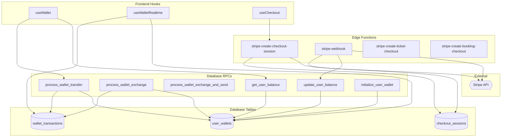
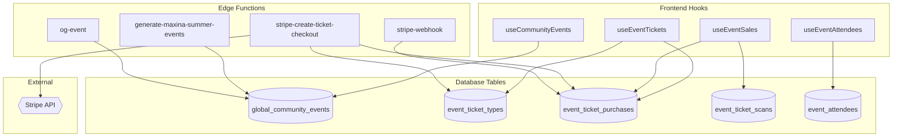
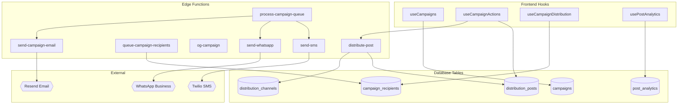
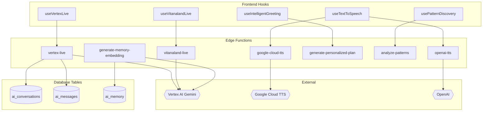
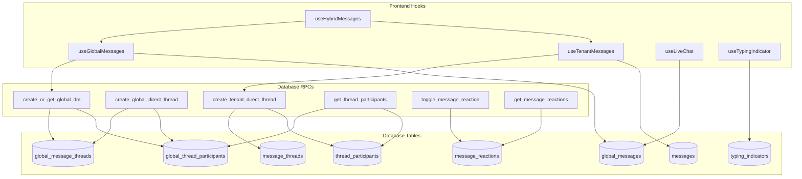
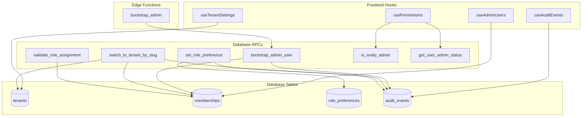
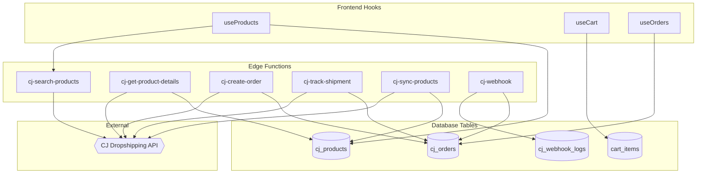

# VITANA API Inventory

> **Generated**: December 2024  
> **Source**: Codebase scan + `docs/SCREEN_REGISTRY.md` cross-reference  
> **Maintainer**: Lovable AI

This document provides a complete inventory of all APIs used in the VITANA project, including Supabase Edge Functions, frontend data access hooks, external integrations, and database RPC functions.

---

## High-Level Statistics

| Category | Count |
|----------|-------|
| **Supabase Edge Functions** | 56 |
| **Frontend Data Access Hooks** | 120+ |
| **Database RPC Functions** | 32 |
| **External Integrations** | 5 major |
| **Total Distinct APIs** | ~210+ |

### API Distribution by Type

| Type | Count | Percentage |
|------|-------|------------|
| Internal (Edge Functions + RPC) | 88 | 42% |
| Frontend Hooks (Supabase queries) | 120+ | 57% |
| External SDK Integrations | 5 | 2% |

### External Integration Summary

| Provider | Purpose | Functions |
|----------|---------|-----------|
| Vertex AI / Gemini | AI chat, voice, analysis | 8 |
| Stripe | Payments, tickets, subscriptions | 4 |
| CJ Dropshipping | Product catalog, orders | 6 |
| Google Cloud TTS | Text-to-speech | 1 |
| LinkedIn/Social | Profile import | 2 |

---

# Section 1: Internal VITANA APIs (Supabase Edge Functions)

## 1.1 AI & Intelligence Module

### API-EF001: vertex-live
- **Type**: Supabase Edge Function (WebSocket)
- **Location**: `supabase/functions/vertex-live/index.ts`
- **Function Name**: `vertex-live`
- **Methods**: WebSocket (bidirectional streaming)
- **Request Shape**: `{ audio: base64, config: { voice, language } }`
- **Response Shape**: `{ audio: base64, text: string, toolCalls?: [] }`
- **Auth / Security**: JWT required, user session
- **Used By Screens**: `SCR-AI-001`, `SCR-AI-002`, `SCR-VOICE-001`
- **Used By Modules**: AI Core, Voice Interface
- **Status**: ✅ Production
- **Owner / Origin**: Lovable
- **Notes**: Real-time voice streaming with Vertex AI Gemini

### API-EF002: vitanaland-live
- **Type**: Supabase Edge Function (WebSocket)
- **Location**: `supabase/functions/vitanaland-live/index.ts`
- **Function Name**: `vitanaland-live`
- **Methods**: WebSocket (bidirectional streaming)
- **Request Shape**: `{ audio: base64, sessionId: string }`
- **Response Shape**: `{ audio: base64, text: string, navigation?: string }`
- **Auth / Security**: JWT required
- **Used By Screens**: `SCR-ORBS-001`, `SCR-VITANALAND-001`
- **Used By Modules**: VITANALAND, Voice Navigation
- **Status**: ✅ Production
- **Owner / Origin**: Lovable
- **Notes**: VITANALAND orb voice interface with navigation tools

### API-EF003: generate-personalized-plan
- **Type**: Supabase Edge Function
- **Location**: `supabase/functions/generate-personalized-plan/index.ts`
- **Function Name**: `generate-personalized-plan`
- **Methods**: POST
- **Request Shape**: `{ userId: string, preferences: object, healthData: object }`
- **Response Shape**: `{ plan: HealthPlan, recommendations: [] }`
- **Auth / Security**: JWT required, RLS on user data
- **Used By Screens**: `SCR-HEALTH-001`, `SCR-PLANS-001`
- **Used By Modules**: Health, Personalization
- **Status**: ✅ Production
- **Owner / Origin**: Lovable
- **Notes**: AI-generated personalized health plans

### API-EF004: analyze-patterns
- **Type**: Supabase Edge Function
- **Location**: `supabase/functions/analyze-patterns/index.ts`
- **Function Name**: `analyze-patterns`
- **Methods**: POST
- **Request Shape**: `{ userId: string, dataType: string, timeRange: string }`
- **Response Shape**: `{ patterns: [], insights: [], trends: [] }`
- **Auth / Security**: JWT required
- **Used By Screens**: `SCR-HEALTH-002`, `SCR-BIOMARKERS-001`
- **Used By Modules**: Health Analytics
- **Status**: ✅ Production
- **Owner / Origin**: Lovable
- **Notes**: Pattern discovery in health data

### API-EF005: generate-memory-embedding
- **Type**: Supabase Edge Function
- **Location**: `supabase/functions/generate-memory-embedding/index.ts`
- **Function Name**: `generate-memory-embedding`
- **Methods**: POST
- **Request Shape**: `{ memoryId: string, content: string }`
- **Response Shape**: `{ embeddingLength: number }`
- **Auth / Security**: Service role
- **Used By Screens**: `SCR-AI-003`
- **Used By Modules**: AI Memory
- **Status**: ✅ Production
- **Owner / Origin**: Lovable
- **Notes**: Generates embeddings for AI memory storage

### API-EF006: reinforce-memory
- **Type**: Supabase Edge Function
- **Location**: `supabase/functions/reinforce-memory/index.ts`
- **Function Name**: `reinforce-memory`
- **Methods**: POST
- **Request Shape**: `{ memoryIds: string[], action: 'confirm'|'reference'|'contradict' }`
- **Response Shape**: `{ updated: number }`
- **Auth / Security**: JWT required
- **Used By Screens**: `SCR-AI-003`
- **Used By Modules**: AI Memory
- **Status**: ✅ Production
- **Owner / Origin**: Lovable
- **Notes**: Updates confidence scores on AI memories

### API-EF007: refresh-memory-metadata
- **Type**: Supabase Edge Function
- **Location**: `supabase/functions/refresh-memory-metadata/index.ts`
- **Function Name**: `refresh-memory-metadata`
- **Methods**: POST
- **Request Shape**: `{ userId: string }`
- **Response Shape**: `{ categoryProgress: object, metadata: object }`
- **Auth / Security**: JWT required
- **Used By Screens**: `SCR-AI-003`, `SCR-PROFILE-001`
- **Used By Modules**: AI Memory, Profile
- **Status**: ✅ Production
- **Owner / Origin**: Lovable
- **Notes**: Refreshes user memory metadata and progress

### API-EF008: analyze-visual-context
- **Type**: Supabase Edge Function
- **Location**: `supabase/functions/analyze-visual-context/index.ts`
- **Function Name**: `analyze-visual-context`
- **Methods**: POST
- **Request Shape**: `{ captures: [{ imageData: base64 }] }`
- **Response Shape**: `{ insights: [], memories: [] }`
- **Auth / Security**: JWT required
- **Used By Screens**: `SCR-GLASS-001`, `SCR-CAMERA-001`
- **Used By Modules**: Glass Mode, Visual AI
- **Status**: ✅ Production
- **Owner / Origin**: Lovable
- **Notes**: Multimodal AI analysis of visual captures

### API-EF009: generate-autopilot-actions
- **Type**: Supabase Edge Function
- **Location**: `supabase/functions/generate-autopilot-actions/index.ts`
- **Function Name**: `generate-autopilot-actions`
- **Methods**: POST
- **Request Shape**: `{ userId: string, context: object }`
- **Response Shape**: `{ actions: AutopilotAction[] }`
- **Auth / Security**: JWT required
- **Used By Screens**: `SCR-AUTOPILOT-001`
- **Used By Modules**: Autopilot
- **Status**: ✅ Production
- **Owner / Origin**: Lovable
- **Notes**: AI-generated daily action suggestions

### API-EF010: execute-autopilot-action
- **Type**: Supabase Edge Function
- **Location**: `supabase/functions/execute-autopilot-action/index.ts`
- **Function Name**: `execute-autopilot-action`
- **Methods**: POST
- **Request Shape**: `{ actionId: string, userId: string }`
- **Response Shape**: `{ success: boolean, result: object }`
- **Auth / Security**: JWT required
- **Used By Screens**: `SCR-AUTOPILOT-001`
- **Used By Modules**: Autopilot
- **Status**: ✅ Production
- **Owner / Origin**: Lovable
- **Notes**: Executes selected autopilot actions

### API-EF011: ai-insights
- **Type**: Supabase Edge Function
- **Location**: `supabase/functions/ai-insights/index.ts`
- **Function Name**: `ai-insights`
- **Methods**: POST
- **Request Shape**: `{ userId: string, dataType: string }`
- **Response Shape**: `{ insights: [], recommendations: [] }`
- **Auth / Security**: JWT required
- **Used By Screens**: `SCR-HEALTH-001`, `SCR-DASHBOARD-001`
- **Used By Modules**: Health, Dashboard
- **Status**: ✅ Production
- **Owner / Origin**: Lovable
- **Notes**: General AI insights generation

### API-EF012: analyze-situation
- **Type**: Supabase Edge Function
- **Location**: `supabase/functions/analyze-situation/index.ts`
- **Function Name**: `analyze-situation`
- **Methods**: POST
- **Request Shape**: `{ description: string, tenantId: string }`
- **Response Shape**: `{ analysis: object, suggestedActions: [], triggers: [] }`
- **Auth / Security**: JWT required, admin role
- **Used By Screens**: `SCR-ADMIN-001`, `SCR-AUTOMATION-001`
- **Used By Modules**: Admin, Automation
- **Status**: ✅ Production
- **Owner / Origin**: Lovable
- **Notes**: AI situation analysis for automation rules

### API-EF013: generate-daily-matches
- **Type**: Supabase Edge Function
- **Location**: `supabase/functions/generate-daily-matches/index.ts`
- **Function Name**: `generate-daily-matches`
- **Methods**: POST
- **Request Shape**: `{ userId: string }`
- **Response Shape**: `{ matches: DailyMatch[] }`
- **Auth / Security**: JWT required
- **Used By Screens**: `SCR-MATCH-001`, `SCR-DISCOVER-001`
- **Used By Modules**: Matching, Discovery
- **Status**: ✅ Production
- **Owner / Origin**: Lovable
- **Notes**: Generates daily user matches based on interests

### API-EF014: process-match-interaction
- **Type**: Supabase Edge Function
- **Location**: `supabase/functions/process-match-interaction/index.ts`
- **Function Name**: `process-match-interaction`
- **Methods**: POST
- **Request Shape**: `{ targetId: string, targetType: string, interactionType: 'like'|'pass'|'block' }`
- **Response Shape**: `{ interaction: object, matchCreated: boolean }`
- **Auth / Security**: JWT required
- **Used By Screens**: `SCR-MATCH-001`
- **Used By Modules**: Matching
- **Status**: ✅ Production
- **Owner / Origin**: Lovable
- **Notes**: Processes like/pass/block interactions

### API-EF015: translate-text
- **Type**: Supabase Edge Function
- **Location**: `supabase/functions/translate-text/index.ts`
- **Function Name**: `translate-text`
- **Methods**: POST
- **Request Shape**: `{ text: string, targetLanguage: string }`
- **Response Shape**: `{ translatedText: string }`
- **Auth / Security**: JWT required
- **Used By Screens**: `SCR-MESSAGES-001`, `SCR-CONTENT-001`
- **Used By Modules**: Messaging, Content
- **Status**: ✅ Production
- **Owner / Origin**: Lovable
- **Notes**: Real-time text translation

---

## 1.2 Voice & TTS Module

### API-EF016: google-cloud-tts
- **Type**: Supabase Edge Function
- **Location**: `supabase/functions/google-cloud-tts/index.ts`
- **Function Name**: `google-cloud-tts`
- **Methods**: POST
- **Request Shape**: `{ text: string, voiceId: string, languageCode: string, speakingRate?: number }`
- **Response Shape**: `{ audioContent: base64 }`
- **Auth / Security**: Service role, API key
- **Used By Screens**: `SCR-VOICE-001`, `SCR-AI-001`
- **Used By Modules**: Voice, AI
- **Status**: ✅ Production
- **Owner / Origin**: Lovable
- **Notes**: Google Cloud Text-to-Speech synthesis

### API-EF017: openai-tts
- **Type**: Supabase Edge Function
- **Location**: `supabase/functions/openai-tts/index.ts`
- **Function Name**: `openai-tts`
- **Methods**: POST
- **Request Shape**: `{ text: string, voice: string, speed?: number }`
- **Response Shape**: `{ audioContent: base64 }`
- **Auth / Security**: Service role, API key
- **Used By Screens**: `SCR-VOICE-001`
- **Used By Modules**: Voice
- **Status**: ✅ Production
- **Owner / Origin**: Lovable
- **Notes**: OpenAI TTS alternative

### API-EF018: generate-greeting
- **Type**: Supabase Edge Function
- **Location**: `supabase/functions/generate-greeting/index.ts`
- **Function Name**: `generate-greeting`
- **Methods**: POST
- **Request Shape**: `{ userId: string, context: object }`
- **Response Shape**: `{ greeting: string, audio?: base64 }`
- **Auth / Security**: JWT required
- **Used By Screens**: `SCR-VOICE-001`, `SCR-DASHBOARD-001`
- **Used By Modules**: Voice, Dashboard
- **Status**: ✅ Production
- **Owner / Origin**: Lovable
- **Notes**: Personalized AI greeting generation

---

## 1.3 Payments & Commerce Module

### API-EF019: stripe-create-checkout-session
- **Type**: Supabase Edge Function
- **Location**: `supabase/functions/stripe-create-checkout-session/index.ts`
- **Function Name**: `stripe-create-checkout-session`
- **Methods**: POST
- **Request Shape**: `{ items: [], successUrl: string, cancelUrl: string, metadata?: object }`
- **Response Shape**: `{ sessionId: string, url: string }`
- **Auth / Security**: JWT required
- **Used By Screens**: `SCR-CHECKOUT-001`, `SCR-CART-001`
- **Used By Modules**: Commerce, Checkout
- **Status**: ✅ Production
- **Owner / Origin**: Lovable
- **Notes**: Creates Stripe checkout sessions

### API-EF020: stripe-webhook
- **Type**: Supabase Edge Function
- **Location**: `supabase/functions/stripe-webhook/index.ts`
- **Function Name**: `stripe-webhook`
- **Methods**: POST
- **Request Shape**: Stripe webhook payload
- **Response Shape**: `{ received: true }`
- **Auth / Security**: Stripe signature verification
- **Used By Screens**: N/A (background)
- **Used By Modules**: Commerce
- **Status**: ✅ Production
- **Owner / Origin**: Lovable
- **Notes**: Handles Stripe payment webhooks

### API-EF021: stripe-create-ticket-checkout
- **Type**: Supabase Edge Function
- **Location**: `supabase/functions/stripe-create-ticket-checkout/index.ts`
- **Function Name**: `stripe-create-ticket-checkout`
- **Methods**: POST
- **Request Shape**: `{ eventId: string, ticketTypeId: string, quantity: number, guestInfo?: object }`
- **Response Shape**: `{ sessionId: string, url: string }`
- **Auth / Security**: Optional JWT (guest checkout supported)
- **Used By Screens**: `SCR-EVENTS-001`, `SCR-TICKETS-001`
- **Used By Modules**: Events, Tickets
- **Status**: ✅ Production
- **Owner / Origin**: Lovable
- **Notes**: Event ticket checkout with guest support

### API-EF022: stripe-ticket-webhook
- **Type**: Supabase Edge Function
- **Location**: `supabase/functions/stripe-ticket-webhook/index.ts`
- **Function Name**: `stripe-ticket-webhook`
- **Methods**: POST
- **Request Shape**: Stripe webhook payload
- **Response Shape**: `{ received: true }`
- **Auth / Security**: Stripe signature verification
- **Used By Screens**: N/A (background)
- **Used By Modules**: Events, Tickets
- **Status**: ✅ Production
- **Owner / Origin**: Lovable
- **Notes**: Handles ticket purchase webhooks

---

## 1.4 Campaign & Distribution Module

### API-EF023: distribute-post
- **Type**: Supabase Edge Function
- **Location**: `supabase/functions/distribute-post/index.ts`
- **Function Name**: `distribute-post`
- **Methods**: POST
- **Request Shape**: `{ postId: string }`
- **Response Shape**: `{ results: [], campaignInfo: object }`
- **Auth / Security**: JWT required
- **Used By Screens**: `SCR-CAMPAIGNS-001`, `SCR-SHARING-001`
- **Used By Modules**: Campaigns, Distribution
- **Status**: ✅ Production
- **Owner / Origin**: Lovable
- **Notes**: Distributes posts to connected channels

### API-EF024: queue-campaign-recipients
- **Type**: Supabase Edge Function
- **Location**: `supabase/functions/queue-campaign-recipients/index.ts`
- **Function Name**: `queue-campaign-recipients`
- **Methods**: POST
- **Request Shape**: `{ campaignId: string, audienceConfig: object }`
- **Response Shape**: `{ queued: number }`
- **Auth / Security**: JWT required
- **Used By Screens**: `SCR-CAMPAIGNS-001`
- **Used By Modules**: Campaigns
- **Status**: ✅ Production
- **Owner / Origin**: Lovable
- **Notes**: Queues campaign recipients for sending

### API-EF025: process-campaign-queue
- **Type**: Supabase Edge Function
- **Location**: `supabase/functions/process-campaign-queue/index.ts`
- **Function Name**: `process-campaign-queue`
- **Methods**: POST
- **Request Shape**: `{ campaignId: string, batchSize?: number }`
- **Response Shape**: `{ processed: number, failed: number }`
- **Auth / Security**: Service role
- **Used By Screens**: N/A (background)
- **Used By Modules**: Campaigns
- **Status**: ✅ Production
- **Owner / Origin**: Lovable
- **Notes**: Processes queued campaign sends

### API-EF026: og-campaign
- **Type**: Supabase Edge Function
- **Location**: `supabase/functions/og-campaign/index.ts`
- **Function Name**: `og-campaign`
- **Methods**: GET
- **Request Shape**: Query params: `id`
- **Response Shape**: HTML with OG meta tags
- **Auth / Security**: Public
- **Used By Screens**: `SCR-PUB-CAMPAIGN-001`
- **Used By Modules**: Sharing
- **Status**: ✅ Production
- **Owner / Origin**: Lovable
- **Notes**: Open Graph meta tags for campaign sharing

### API-EF027: og-event
- **Type**: Supabase Edge Function
- **Location**: `supabase/functions/og-event/index.ts`
- **Function Name**: `og-event`
- **Methods**: GET
- **Request Shape**: Query params: `id`
- **Response Shape**: HTML with OG meta tags
- **Auth / Security**: Public
- **Used By Screens**: `SCR-PUB-EVENT-001`
- **Used By Modules**: Sharing
- **Status**: ✅ Production
- **Owner / Origin**: Lovable
- **Notes**: Open Graph meta tags for event sharing

### API-EF028: og-share
- **Type**: Supabase Edge Function
- **Location**: `supabase/functions/og-share/index.ts`
- **Function Name**: `og-share`
- **Methods**: GET
- **Request Shape**: Query params: `type`, `id`
- **Response Shape**: HTML with OG meta tags
- **Auth / Security**: Public
- **Used By Screens**: Various public pages
- **Used By Modules**: Sharing
- **Status**: ✅ Production
- **Owner / Origin**: Lovable
- **Notes**: Generic OG share handler

---

## 1.5 CJ Dropshipping Module

### API-EF029: cj-get-token
- **Type**: Supabase Edge Function
- **Location**: `supabase/functions/cj-get-token/index.ts`
- **Function Name**: `cj-get-token`
- **Methods**: POST
- **Request Shape**: `{}`
- **Response Shape**: `{ token: string, expiresIn: number }`
- **Auth / Security**: Service role, CJ credentials
- **Used By Screens**: N/A (internal)
- **Used By Modules**: Commerce
- **Status**: ✅ Production
- **Owner / Origin**: Lovable
- **Notes**: CJ Dropshipping authentication

### API-EF030: cj-search-products
- **Type**: Supabase Edge Function
- **Location**: `supabase/functions/cj-search-products/index.ts`
- **Function Name**: `cj-search-products`
- **Methods**: POST
- **Request Shape**: `{ query: string, category?: string, page?: number }`
- **Response Shape**: `{ products: [], total: number }`
- **Auth / Security**: JWT required
- **Used By Screens**: `SCR-SHOP-001`, `SCR-PRODUCTS-001`
- **Used By Modules**: Commerce
- **Status**: ✅ Production
- **Owner / Origin**: Lovable
- **Notes**: CJ product catalog search

### API-EF031: cj-get-product-details
- **Type**: Supabase Edge Function
- **Location**: `supabase/functions/cj-get-product-details/index.ts`
- **Function Name**: `cj-get-product-details`
- **Methods**: POST
- **Request Shape**: `{ productId: string }`
- **Response Shape**: `{ product: CJProduct }`
- **Auth / Security**: JWT required
- **Used By Screens**: `SCR-PRODUCT-DETAIL-001`
- **Used By Modules**: Commerce
- **Status**: ✅ Production
- **Owner / Origin**: Lovable
- **Notes**: CJ product details with caching

### API-EF032: cj-create-order
- **Type**: Supabase Edge Function
- **Location**: `supabase/functions/cj-create-order/index.ts`
- **Function Name**: `cj-create-order`
- **Methods**: POST
- **Request Shape**: `{ checkoutSessionId: string }`
- **Response Shape**: `{ orderId: string, cjOrderId: string }`
- **Auth / Security**: JWT required
- **Used By Screens**: `SCR-CHECKOUT-001`
- **Used By Modules**: Commerce
- **Status**: ✅ Production
- **Owner / Origin**: Lovable
- **Notes**: Creates CJ dropshipping orders

### API-EF033: cj-track-shipment
- **Type**: Supabase Edge Function
- **Location**: `supabase/functions/cj-track-shipment/index.ts`
- **Function Name**: `cj-track-shipment`
- **Methods**: POST
- **Request Shape**: `{ orderId: string }`
- **Response Shape**: `{ tracking: object, status: string }`
- **Auth / Security**: JWT required
- **Used By Screens**: `SCR-ORDERS-001`
- **Used By Modules**: Commerce
- **Status**: ✅ Production
- **Owner / Origin**: Lovable
- **Notes**: CJ order tracking

### API-EF034: cj-webhook-handler
- **Type**: Supabase Edge Function
- **Location**: `supabase/functions/cj-webhook-handler/index.ts`
- **Function Name**: `cj-webhook-handler`
- **Methods**: POST
- **Request Shape**: CJ webhook payload
- **Response Shape**: `{ success: true }`
- **Auth / Security**: Webhook signature
- **Used By Screens**: N/A (background)
- **Used By Modules**: Commerce
- **Status**: ✅ Production
- **Owner / Origin**: Lovable
- **Notes**: Handles CJ order/inventory webhooks

---

## 1.6 Admin & Tenant Management Module

### API-EF035: bootstrap_admin
- **Type**: Supabase Edge Function
- **Location**: `supabase/functions/bootstrap_admin/index.ts`
- **Function Name**: `bootstrap_admin`
- **Methods**: POST
- **Request Shape**: `{ emails?: string[] }`
- **Response Shape**: `{ elevated: [], failed: [] }`
- **Auth / Security**: Service role
- **Used By Screens**: `SCR-ADMIN-001`
- **Used By Modules**: Admin
- **Status**: ✅ Production
- **Owner / Origin**: Lovable
- **Notes**: Bootstraps admin users

### API-EF036: set_active_tenant
- **Type**: Supabase Edge Function
- **Location**: `supabase/functions/set_active_tenant/index.ts`
- **Function Name**: `set_active_tenant`
- **Methods**: POST
- **Request Shape**: `{ tenantId: string }`
- **Response Shape**: `{ success: true }`
- **Auth / Security**: JWT required
- **Used By Screens**: `SCR-TENANT-SWITCH-001`
- **Used By Modules**: Tenant Management
- **Status**: ✅ Production
- **Owner / Origin**: Lovable
- **Notes**: Sets user's active tenant

### API-EF037: list_my_memberships
- **Type**: Supabase Edge Function
- **Location**: `supabase/functions/list_my_memberships/index.ts`
- **Function Name**: `list_my_memberships`
- **Methods**: GET
- **Request Shape**: `{}`
- **Response Shape**: `{ memberships: Membership[] }`
- **Auth / Security**: JWT required
- **Used By Screens**: `SCR-TENANT-SWITCH-001`, `SCR-PROFILE-001`
- **Used By Modules**: Tenant Management
- **Status**: ✅ Production
- **Owner / Origin**: Lovable
- **Notes**: Lists user's tenant memberships

### API-EF038: list_super_admins
- **Type**: Supabase Edge Function
- **Location**: `supabase/functions/list_super_admins/index.ts`
- **Function Name**: `list_super_admins`
- **Methods**: GET
- **Request Shape**: `{}`
- **Response Shape**: `{ admins: User[] }`
- **Auth / Security**: exafy_admin required
- **Used By Screens**: `SCR-ADMIN-001`
- **Used By Modules**: Admin
- **Status**: ✅ Production
- **Owner / Origin**: Lovable
- **Notes**: Lists all super admins

### API-EF039: remove_super_admin
- **Type**: Supabase Edge Function
- **Location**: `supabase/functions/remove_super_admin/index.ts`
- **Function Name**: `remove_super_admin`
- **Methods**: POST
- **Request Shape**: `{ userId: string }`
- **Response Shape**: `{ success: true }`
- **Auth / Security**: exafy_admin required
- **Used By Screens**: `SCR-ADMIN-001`
- **Used By Modules**: Admin
- **Status**: ✅ Production
- **Owner / Origin**: Lovable
- **Notes**: Removes admin privileges

---

## 1.7 Integrations Module

### API-EF040: linkedin-import
- **Type**: Supabase Edge Function
- **Location**: `supabase/functions/linkedin-import/index.ts`
- **Function Name**: `linkedin-import`
- **Methods**: POST
- **Request Shape**: `{ userId: string, linkedinUrl: string, bioText?: string }`
- **Response Shape**: `{ imported: object }`
- **Auth / Security**: JWT required
- **Used By Screens**: `SCR-PROFILE-EDIT-001`
- **Used By Modules**: Profile, Integrations
- **Status**: ✅ Production
- **Owner / Origin**: Lovable
- **Notes**: LinkedIn profile import with AI parsing

### API-EF041: social-media-import
- **Type**: Supabase Edge Function
- **Location**: `supabase/functions/social-media-import/index.ts`
- **Function Name**: `social-media-import`
- **Methods**: POST
- **Request Shape**: `{ platform: string, profileUrl: string }`
- **Response Shape**: `{ imported: object }`
- **Auth / Security**: JWT required
- **Used By Screens**: `SCR-PROFILE-EDIT-001`
- **Used By Modules**: Profile, Integrations
- **Status**: ✅ Production
- **Owner / Origin**: Lovable
- **Notes**: Generic social media import

### API-EF042: integration-discovery
- **Type**: Supabase Edge Function
- **Location**: `supabase/functions/integration-discovery/index.ts`
- **Function Name**: `integration-discovery`
- **Methods**: GET
- **Request Shape**: `{}`
- **Response Shape**: `{ integrations: Integration[] }`
- **Auth / Security**: JWT required
- **Used By Screens**: `SCR-INTEGRATIONS-001`
- **Used By Modules**: Integrations
- **Status**: ✅ Production
- **Owner / Origin**: Lovable
- **Notes**: Discovers available integrations

### API-EF043: test-api-integration
- **Type**: Supabase Edge Function
- **Location**: `supabase/functions/test-api-integration/index.ts`
- **Function Name**: `test-api-integration`
- **Methods**: POST
- **Request Shape**: `{ integrationId: string }`
- **Response Shape**: `{ status: string, responseTime: number }`
- **Auth / Security**: JWT required
- **Used By Screens**: `SCR-INTEGRATIONS-001`, `SCR-DEV-001`
- **Used By Modules**: Integrations, Dev
- **Status**: ✅ Production
- **Owner / Origin**: Lovable
- **Notes**: Tests API integration health

### API-EF044: run-uptime-checks
- **Type**: Supabase Edge Function
- **Location**: `supabase/functions/run-uptime-checks/index.ts`
- **Function Name**: `run-uptime-checks`
- **Methods**: POST
- **Request Shape**: `{}`
- **Response Shape**: `{ tested: number, passed: number, results: [] }`
- **Auth / Security**: Service role
- **Used By Screens**: N/A (scheduled)
- **Used By Modules**: Integrations
- **Status**: ✅ Production
- **Owner / Origin**: Lovable
- **Notes**: Scheduled uptime monitoring

---

## 1.8 Utilities Module

### API-EF045: extract-video-meta
- **Type**: Supabase Edge Function
- **Location**: `supabase/functions/extract-video-meta/index.ts`
- **Function Name**: `extract-video-meta`
- **Methods**: POST
- **Request Shape**: `{ videoPath: string }`
- **Response Shape**: `{ duration: number, width: number, height: number, thumbnailUrl: string }`
- **Auth / Security**: JWT required
- **Used By Screens**: `SCR-VIDEO-UPLOAD-001`
- **Used By Modules**: Media
- **Status**: ✅ Production
- **Owner / Origin**: Lovable
- **Notes**: Extracts video metadata with ffprobe

### API-EF046: send-appointment-email
- **Type**: Supabase Edge Function
- **Location**: `supabase/functions/send-appointment-email/index.ts`
- **Function Name**: `send-appointment-email`
- **Methods**: POST
- **Request Shape**: `{ appointmentId: string, recipientEmail: string, type: string }`
- **Response Shape**: `{ sent: true }`
- **Auth / Security**: Service role
- **Used By Screens**: `SCR-APPOINTMENTS-001`
- **Used By Modules**: Calendar, Notifications
- **Status**: ✅ Production
- **Owner / Origin**: Lovable
- **Notes**: Appointment email notifications

### API-EF047: send-sms
- **Type**: Supabase Edge Function
- **Location**: `supabase/functions/send-sms/index.ts`
- **Function Name**: `send-sms`
- **Methods**: POST
- **Request Shape**: `{ to: string, message: string }`
- **Response Shape**: `{ sent: true, messageId: string }`
- **Auth / Security**: Service role
- **Used By Screens**: `SCR-CAMPAIGNS-001`
- **Used By Modules**: Campaigns, Notifications
- **Status**: ✅ Production
- **Owner / Origin**: Lovable
- **Notes**: Twilio SMS sending

### API-EF048: send-whatsapp
- **Type**: Supabase Edge Function
- **Location**: `supabase/functions/send-whatsapp/index.ts`
- **Function Name**: `send-whatsapp`
- **Methods**: POST
- **Request Shape**: `{ to: string, message: string }`
- **Response Shape**: `{ sent: true, messageId: string }`
- **Auth / Security**: Service role
- **Used By Screens**: `SCR-CAMPAIGNS-001`
- **Used By Modules**: Campaigns, Notifications
- **Status**: ✅ Production
- **Owner / Origin**: Lovable
- **Notes**: WhatsApp Business API sending

### API-EF049: send-email
- **Type**: Supabase Edge Function
- **Location**: `supabase/functions/send-email/index.ts`
- **Function Name**: `send-email`
- **Methods**: POST
- **Request Shape**: `{ to: string, subject: string, html: string }`
- **Response Shape**: `{ sent: true, messageId: string }`
- **Auth / Security**: Service role
- **Used By Screens**: `SCR-CAMPAIGNS-001`
- **Used By Modules**: Campaigns, Notifications
- **Status**: ✅ Production
- **Owner / Origin**: Lovable
- **Notes**: Resend email sending

### API-EF050: crewai-proxy
- **Type**: Supabase Edge Function
- **Location**: `supabase/functions/crewai-proxy/index.ts`
- **Function Name**: `crewai-proxy`
- **Methods**: POST
- **Request Shape**: `{ work_item_id: string, description: string }`
- **Response Shape**: `{ result: object }`
- **Auth / Security**: Service role
- **Used By Screens**: `SCR-DEV-001`
- **Used By Modules**: Dev, AI
- **Status**: 🚧 Experimental
- **Owner / Origin**: Lovable
- **Notes**: CrewAI integration proxy

---

## 1.9 Contact & Communication Module

### API-EF051: contact-hash-match
- **Type**: Supabase Edge Function
- **Location**: `supabase/functions/contact-hash-match/index.ts`
- **Function Name**: `contact-hash-match`
- **Methods**: POST
- **Request Shape**: `{ hashes: string[] }`
- **Response Shape**: `{ matches: [] }`
- **Auth / Security**: JWT required
- **Used By Screens**: `SCR-CONTACTS-001`
- **Used By Modules**: Contacts
- **Status**: ✅ Production
- **Owner / Origin**: Lovable
- **Notes**: Privacy-preserving contact matching

### API-EF052: contact-bulk-invite
- **Type**: Supabase Edge Function
- **Location**: `supabase/functions/contact-bulk-invite/index.ts`
- **Function Name**: `contact-bulk-invite`
- **Methods**: POST
- **Request Shape**: `{ contacts: [], message: string }`
- **Response Shape**: `{ sent: number, failed: number }`
- **Auth / Security**: JWT required
- **Used By Screens**: `SCR-CONTACTS-001`
- **Used By Modules**: Contacts
- **Status**: ✅ Production
- **Owner / Origin**: Lovable
- **Notes**: Bulk contact invitation

---

## 1.10 Event Generation Module

### API-EF053: generate-maxina-summer-events
- **Type**: Supabase Edge Function
- **Location**: `supabase/functions/generate-maxina-summer-events/index.ts`
- **Function Name**: `generate-maxina-summer-events`
- **Methods**: POST
- **Request Shape**: `{ count?: number }`
- **Response Shape**: `{ events: Event[] }`
- **Auth / Security**: Service role
- **Used By Screens**: `SCR-DEV-001`
- **Used By Modules**: Dev, Events
- **Status**: 🚧 Experimental
- **Owner / Origin**: Lovable
- **Notes**: AI-generated test events

### API-EF054: get-public-event-details
- **Type**: Supabase RPC Function
- **Location**: Database function
- **Function Name**: `get_public_event_details`
- **Methods**: RPC
- **Request Shape**: `{ event_id: string }`
- **Response Shape**: `{ event: PublicEventDetails }`
- **Auth / Security**: SECURITY DEFINER (bypasses RLS)
- **Used By Screens**: `SCR-PUB-EVENT-001`
- **Used By Modules**: Events, Sharing
- **Status**: ✅ Production
- **Owner / Origin**: Lovable
- **Notes**: Public event details for landing pages

### API-EF055: get-public-campaign-details
- **Type**: Supabase RPC Function
- **Location**: Database function
- **Function Name**: `get_public_campaign_details`
- **Methods**: RPC
- **Request Shape**: `{ campaign_id: string }`
- **Response Shape**: `{ campaign: PublicCampaignDetails }`
- **Auth / Security**: SECURITY DEFINER (bypasses RLS)
- **Used By Screens**: `SCR-PUB-CAMPAIGN-001`
- **Used By Modules**: Campaigns, Sharing
- **Status**: ✅ Production
- **Owner / Origin**: Lovable
- **Notes**: Public campaign details for landing pages

### API-EF056: generate-unique-handle
- **Type**: Supabase RPC Function
- **Location**: Database function
- **Function Name**: `generate_unique_handle`
- **Methods**: RPC
- **Request Shape**: `{ display_name?: string, full_name?: string, email?: string }`
- **Response Shape**: `string` (unique handle)
- **Auth / Security**: SECURITY DEFINER
- **Used By Screens**: `SCR-ONBOARDING-001`
- **Used By Modules**: Profile
- **Status**: ✅ Production
- **Owner / Origin**: Lovable
- **Notes**: Generates unique user handles

---

# Section 2: Frontend Data Access Layers (Hooks)

## 2.1 Campaign & Sharing Hooks

### HOOK-001: useCampaigns
- **Type**: React Query Hook
- **Location**: `src/hooks/useCampaigns.ts`
- **Query Key**: `['campaigns', userId]`
- **Data Source**: `supabase.from('campaigns')`
- **Methods**: SELECT, INSERT, UPDATE, DELETE
- **Auth / Security**: RLS on user_id
- **Used By Screens**: `SCR-CAMPAIGNS-001`, `SCR-SHARING-001`
- **Used By Modules**: Campaigns
- **Status**: ✅ Production

### HOOK-002: useCampaignActions
- **Type**: React Query Mutations
- **Location**: `src/hooks/useCampaignActions.ts`
- **Query Key**: `['campaigns']` (invalidation)
- **Data Source**: `supabase.from('campaigns')`, Edge Functions
- **Methods**: INSERT, UPDATE, DELETE, invoke
- **Auth / Security**: RLS on user_id
- **Used By Screens**: `SCR-CAMPAIGNS-001`
- **Used By Modules**: Campaigns
- **Status**: ✅ Production

### HOOK-003: useCampaignDistribution
- **Type**: React Query Hook
- **Location**: `src/hooks/useCampaignDistribution.ts`
- **Query Key**: `['campaign-distribution', campaignId]`
- **Data Source**: `supabase.from('campaign_recipients')`
- **Methods**: SELECT, UPDATE
- **Auth / Security**: RLS
- **Used By Screens**: `SCR-CAMPAIGNS-001`
- **Used By Modules**: Campaigns
- **Status**: ✅ Production

### HOOK-004: useDistributionChannels
- **Type**: React Query Hook
- **Location**: `src/hooks/useDistributionChannels.ts`
- **Query Key**: `['distribution-channels', userId]`
- **Data Source**: `supabase.from('distribution_channels')`
- **Methods**: SELECT, INSERT, UPDATE, DELETE
- **Auth / Security**: RLS on user_id
- **Used By Screens**: `SCR-CHANNELS-001`, `SCR-CAMPAIGNS-001`
- **Used By Modules**: Campaigns, Integrations
- **Status**: ✅ Production

---

## 2.2 Events & Tickets Hooks

### HOOK-005: useCommunityEvents
- **Type**: React Query Hook
- **Location**: `src/hooks/useCommunityEvents.ts`
- **Query Key**: `['community-events']`
- **Data Source**: `supabase.from('community_events')`
- **Methods**: SELECT
- **Auth / Security**: RLS
- **Used By Screens**: `SCR-EVENTS-001`, `SCR-DISCOVER-001`
- **Used By Modules**: Events, Community
- **Status**: ✅ Production

### HOOK-006: useEventTickets
- **Type**: React Query Hook
- **Location**: `src/hooks/useEventTickets.ts`
- **Query Key**: `['event-tickets', eventId]`
- **Data Source**: `supabase.from('event_ticket_types')`, `supabase.from('event_ticket_purchases')`
- **Methods**: SELECT, INSERT
- **Auth / Security**: RLS
- **Used By Screens**: `SCR-EVENTS-001`, `SCR-TICKETS-001`
- **Used By Modules**: Events, Tickets
- **Status**: ✅ Production

### HOOK-007: useEventSales
- **Type**: React Query Hook
- **Location**: `src/hooks/useEventSales.ts`
- **Query Key**: `['event-sales', eventId]`
- **Data Source**: `supabase.from('event_ticket_purchases')`
- **Methods**: SELECT
- **Auth / Security**: RLS (organizer only)
- **Used By Screens**: `SCR-EVENT-SALES-001`
- **Used By Modules**: Events, Analytics
- **Status**: ✅ Production

### HOOK-008: useEventRSVPs
- **Type**: React Query Hook
- **Location**: `src/hooks/useEventRSVPs.ts`
- **Query Key**: `['event-rsvps', eventId]`
- **Data Source**: `supabase.from('event_rsvps')`
- **Methods**: SELECT, INSERT, UPDATE, DELETE
- **Auth / Security**: RLS
- **Used By Screens**: `SCR-EVENTS-001`
- **Used By Modules**: Events
- **Status**: ✅ Production

---

## 2.3 Wallet & Payments Hooks

### HOOK-009: useWallet
- **Type**: React Query Hook
- **Location**: `src/hooks/useWallet.ts`
- **Query Key**: `['wallet', userId]`
- **Data Source**: `supabase.from('user_wallets')`, `supabase.rpc('process_wallet_transfer')`
- **Methods**: SELECT, RPC
- **Auth / Security**: RLS on user_id
- **Used By Screens**: `SCR-WALLET-001`
- **Used By Modules**: Wallet, Payments
- **Status**: ✅ Production

### HOOK-010: useWalletRealtime
- **Type**: React Query Hook + Realtime
- **Location**: `src/hooks/useWalletRealtime.ts`
- **Query Key**: `['wallet-realtime', userId]`
- **Data Source**: `supabase.from('user_wallets')` + realtime subscription
- **Methods**: SELECT, SUBSCRIPTION
- **Auth / Security**: RLS
- **Used By Screens**: `SCR-WALLET-001`
- **Used By Modules**: Wallet
- **Status**: ✅ Production

### HOOK-011: useWalletTransactions
- **Type**: React Query Hook
- **Location**: `src/hooks/useWalletTransactions.ts`
- **Query Key**: `['wallet-transactions', userId]`
- **Data Source**: `supabase.from('wallet_transactions')`
- **Methods**: SELECT
- **Auth / Security**: RLS
- **Used By Screens**: `SCR-WALLET-001`
- **Used By Modules**: Wallet
- **Status**: ✅ Production

---

## 2.4 Messaging Hooks

### HOOK-012: useGlobalMessages
- **Type**: React Query Hook + Realtime
- **Location**: `src/hooks/useGlobalMessages.ts`
- **Query Key**: `['global-messages', threadId]`
- **Data Source**: `supabase.from('global_messages')` + realtime
- **Methods**: SELECT, INSERT, SUBSCRIPTION
- **Auth / Security**: RLS (thread participants)
- **Used By Screens**: `SCR-MESSAGES-001`
- **Used By Modules**: Messaging
- **Status**: ✅ Production

### HOOK-013: useTenantMessages
- **Type**: React Query Hook + Realtime
- **Location**: `src/hooks/useTenantMessages.ts`
- **Query Key**: `['tenant-messages', threadId]`
- **Data Source**: `supabase.from('messages')` + realtime
- **Methods**: SELECT, INSERT, SUBSCRIPTION
- **Auth / Security**: RLS (tenant + thread participants)
- **Used By Screens**: `SCR-MESSAGES-001`
- **Used By Modules**: Messaging
- **Status**: ✅ Production

### HOOK-014: useHybridMessages
- **Type**: React Query Hook
- **Location**: `src/hooks/useHybridMessages.ts`
- **Query Key**: `['hybrid-messages', threadId, context]`
- **Data Source**: Global or Tenant messages based on context
- **Methods**: SELECT, INSERT
- **Auth / Security**: RLS
- **Used By Screens**: `SCR-MESSAGES-001`
- **Used By Modules**: Messaging
- **Status**: ✅ Production

### HOOK-015: useMessageThreads
- **Type**: React Query Hook
- **Location**: `src/hooks/useMessageThreads.ts`
- **Query Key**: `['message-threads', userId]`
- **Data Source**: `supabase.from('global_message_threads')`, `supabase.from('message_threads')`
- **Methods**: SELECT
- **Auth / Security**: RLS
- **Used By Screens**: `SCR-MESSAGES-001`
- **Used By Modules**: Messaging
- **Status**: ✅ Production

### HOOK-016: useThreadPresence
- **Type**: React Query Hook + Realtime
- **Location**: `src/hooks/useThreadPresence.ts`
- **Query Key**: `['thread-presence', threadId]`
- **Data Source**: `supabase.from('thread_presence')` + realtime
- **Methods**: SELECT, UPSERT, SUBSCRIPTION
- **Auth / Security**: RLS
- **Used By Screens**: `SCR-MESSAGES-001`
- **Used By Modules**: Messaging
- **Status**: ✅ Production

---

## 2.5 AI & Voice Hooks

### HOOK-017: useVertexLive
- **Type**: Custom WebSocket Hook
- **Location**: `src/hooks/useVertexLive.ts`
- **Connection**: WebSocket to `vertex-live` Edge Function
- **Methods**: WebSocket (bidirectional)
- **Auth / Security**: JWT
- **Used By Screens**: `SCR-VOICE-001`, `SCR-AI-001`
- **Used By Modules**: AI, Voice
- **Status**: ✅ Production

### HOOK-018: useVitanalandLive
- **Type**: Custom WebSocket Hook
- **Location**: `src/hooks/useVitanalandLive.ts`
- **Connection**: WebSocket to `vitanaland-live` Edge Function
- **Methods**: WebSocket (bidirectional)
- **Auth / Security**: JWT
- **Used By Screens**: `SCR-ORBS-001`, `SCR-VITANALAND-001`
- **Used By Modules**: VITANALAND, Voice
- **Status**: ✅ Production

### HOOK-019: useIntelligentGreeting
- **Type**: React Query Hook
- **Location**: `src/hooks/useIntelligentGreeting.ts`
- **Query Key**: `['greeting', userId]`
- **Data Source**: `generate-greeting` Edge Function
- **Methods**: invoke
- **Auth / Security**: JWT
- **Used By Screens**: `SCR-DASHBOARD-001`, `SCR-VOICE-001`
- **Used By Modules**: AI, Dashboard
- **Status**: ✅ Production

### HOOK-020: useAIMemory
- **Type**: React Query Hook
- **Location**: `src/hooks/useAIMemory.ts`
- **Query Key**: `['ai-memory', userId]`
- **Data Source**: `supabase.from('ai_memory')`
- **Methods**: SELECT, INSERT, UPDATE
- **Auth / Security**: RLS
- **Used By Screens**: `SCR-AI-003`
- **Used By Modules**: AI
- **Status**: ✅ Production

### HOOK-021: useAutopilotActions
- **Type**: React Query Hook
- **Location**: `src/hooks/useAutopilotActions.ts`
- **Query Key**: `['autopilot-actions', userId]`
- **Data Source**: `supabase.from('autopilot_actions')`, Edge Functions
- **Methods**: SELECT, UPDATE, invoke
- **Auth / Security**: RLS
- **Used By Screens**: `SCR-AUTOPILOT-001`
- **Used By Modules**: Autopilot
- **Status**: ✅ Production

---

## 2.6 User & Profile Hooks

### HOOK-022: useProfiles
- **Type**: React Query Hook
- **Location**: `src/hooks/useProfiles.ts`
- **Query Key**: `['profiles']`
- **Data Source**: `supabase.from('profiles')`
- **Methods**: SELECT, UPDATE
- **Auth / Security**: RLS
- **Used By Screens**: `SCR-PROFILE-001`, `SCR-DISCOVER-001`
- **Used By Modules**: Profile
- **Status**: ✅ Production

### HOOK-023: useFollow
- **Type**: React Query Hook
- **Location**: `src/hooks/useFollow.ts`
- **Query Key**: `['follow', userId, targetId]`
- **Data Source**: `supabase.from('user_follows')`, `supabase.rpc('follow_user')`, `supabase.rpc('unfollow_user')`
- **Methods**: SELECT, RPC
- **Auth / Security**: RLS
- **Used By Screens**: `SCR-PROFILE-001`, `SCR-DISCOVER-001`
- **Used By Modules**: Profile, Social
- **Status**: ✅ Production

### HOOK-024: usePermissions
- **Type**: Custom Hook
- **Location**: `src/hooks/usePermissions.ts`
- **Query Key**: N/A (derived from session)
- **Data Source**: `supabase.auth.getUser()`, `supabase.from('memberships')`
- **Methods**: SELECT
- **Auth / Security**: Session-based
- **Used By Screens**: All protected screens
- **Used By Modules**: Auth, Admin
- **Status**: ✅ Production

### HOOK-025: useGlobalCommunityProfiles
- **Type**: React Query Hook
- **Location**: `src/hooks/useGlobalCommunityProfiles.ts`
- **Query Key**: `['global-profiles']`
- **Data Source**: `supabase.from('global_community_profiles')`
- **Methods**: SELECT
- **Auth / Security**: RLS
- **Used By Screens**: `SCR-DISCOVER-001`, `SCR-COMMUNITY-001`
- **Used By Modules**: Community
- **Status**: ✅ Production

---

## 2.7 Health & Biomarkers Hooks

### HOOK-026: useHealthPlans
- **Type**: React Query Hook
- **Location**: `src/hooks/useHealthPlans.ts`
- **Query Key**: `['health-plans', userId]`
- **Data Source**: `supabase.from('health_plans')`
- **Methods**: SELECT, INSERT, UPDATE
- **Auth / Security**: RLS
- **Used By Screens**: `SCR-HEALTH-001`, `SCR-PLANS-001`
- **Used By Modules**: Health
- **Status**: ✅ Production

### HOOK-027: useUserSupplements
- **Type**: React Query Hook
- **Location**: `src/hooks/useUserSupplements.ts`
- **Query Key**: `['user-supplements', userId]`
- **Data Source**: `supabase.from('user_supplements')`
- **Methods**: SELECT, INSERT, UPDATE, DELETE
- **Auth / Security**: RLS
- **Used By Screens**: `SCR-SUPPLEMENTS-001`
- **Used By Modules**: Health
- **Status**: ✅ Production

### HOOK-028: usePatternDiscovery
- **Type**: React Query Hook
- **Location**: `src/hooks/usePatternDiscovery.ts`
- **Query Key**: `['patterns', userId]`
- **Data Source**: `analyze-patterns` Edge Function
- **Methods**: invoke
- **Auth / Security**: JWT
- **Used By Screens**: `SCR-HEALTH-002`
- **Used By Modules**: Health, AI
- **Status**: ✅ Production

### HOOK-029: useBiomarkers
- **Type**: React Query Hook
- **Location**: `src/hooks/useBiomarkers.ts`
- **Query Key**: `['biomarkers', userId]`
- **Data Source**: `supabase.from('biomarker_readings')`
- **Methods**: SELECT, INSERT
- **Auth / Security**: RLS
- **Used By Screens**: `SCR-BIOMARKERS-001`
- **Used By Modules**: Health
- **Status**: ✅ Production

---

## 2.8 Commerce Hooks

### HOOK-030: useCart
- **Type**: React Query Hook
- **Location**: `src/hooks/useCart.ts`
- **Query Key**: `['cart', userId]`
- **Data Source**: `supabase.from('cart_items')`
- **Methods**: SELECT, INSERT, UPDATE, DELETE
- **Auth / Security**: RLS
- **Used By Screens**: `SCR-CART-001`
- **Used By Modules**: Commerce
- **Status**: ✅ Production

### HOOK-031: useOrders
- **Type**: React Query Hook
- **Location**: `src/hooks/useOrders.ts`
- **Query Key**: `['orders', userId]`
- **Data Source**: `supabase.from('checkout_sessions')`, `supabase.from('cj_orders')`
- **Methods**: SELECT
- **Auth / Security**: RLS
- **Used By Screens**: `SCR-ORDERS-001`
- **Used By Modules**: Commerce
- **Status**: ✅ Production

### HOOK-032: useBookmarkedItems
- **Type**: React Query Hook
- **Location**: `src/hooks/useBookmarkedItems.ts`
- **Query Key**: `['bookmarks', userId]`
- **Data Source**: `supabase.from('bookmarked_items')`
- **Methods**: SELECT, INSERT, DELETE
- **Auth / Security**: RLS
- **Used By Screens**: `SCR-BOOKMARKS-001`
- **Used By Modules**: Commerce, Discovery
- **Status**: ✅ Production

---

## 2.9 Calendar & Appointments Hooks

### HOOK-033: useCalendarEvents
- **Type**: React Query Hook
- **Location**: `src/hooks/useCalendarEvents.ts`
- **Query Key**: `['calendar-events', userId]`
- **Data Source**: `supabase.from('calendar_events')`
- **Methods**: SELECT, INSERT, UPDATE, DELETE
- **Auth / Security**: RLS
- **Used By Screens**: `SCR-CALENDAR-001`
- **Used By Modules**: Calendar
- **Status**: ✅ Production

### HOOK-034: useAppointments
- **Type**: React Query Hook
- **Location**: `src/hooks/useAppointments.ts`
- **Query Key**: `['appointments', userId]`
- **Data Source**: `supabase.from('appointments')`
- **Methods**: SELECT, INSERT, UPDATE
- **Auth / Security**: RLS
- **Used By Screens**: `SCR-APPOINTMENTS-001`
- **Used By Modules**: Calendar, Health
- **Status**: ✅ Production

---

## 2.10 Admin Hooks

### HOOK-035: useAdminUsers
- **Type**: React Query Hook
- **Location**: `src/hooks/useAdminUsers.ts`
- **Query Key**: `['admin-users']`
- **Data Source**: `supabase.from('profiles')`, Edge Functions
- **Methods**: SELECT, invoke
- **Auth / Security**: Admin role required
- **Used By Screens**: `SCR-ADMIN-001`
- **Used By Modules**: Admin
- **Status**: ✅ Production

### HOOK-036: useAuditEvents
- **Type**: React Query Hook
- **Location**: `src/hooks/useAuditEvents.ts`
- **Query Key**: `['audit-events']`
- **Data Source**: `supabase.from('audit_events')`
- **Methods**: SELECT
- **Auth / Security**: Admin role required
- **Used By Screens**: `SCR-ADMIN-001`
- **Used By Modules**: Admin
- **Status**: ✅ Production

### HOOK-037: useApiIntegrations
- **Type**: React Query Hook
- **Location**: `src/hooks/useApiIntegrations.ts`
- **Query Key**: `['api-integrations']`
- **Data Source**: `supabase.from('api_integrations')`
- **Methods**: SELECT, INSERT, UPDATE, DELETE
- **Auth / Security**: Admin role required
- **Used By Screens**: `SCR-INTEGRATIONS-001`, `SCR-DEV-001`
- **Used By Modules**: Admin, Integrations
- **Status**: ✅ Production

---

# Section 3: External Integrations

## 3.1 Vertex AI / Google Gemini

### EXT-001: Vertex AI Live API
- **Type**: External WebSocket API
- **Provider**: Google Cloud
- **Base URL**: `wss://generativelanguage.googleapis.com/ws/google.ai.generativelanguage`
- **Auth**: API Key (GOOGLE_GEMINI_API_KEY)
- **Used By Edge Functions**: `vertex-live`, `vitanaland-live`
- **Used By Modules**: AI, Voice
- **Status**: ✅ Production
- **Notes**: Real-time multimodal streaming

### EXT-002: Gemini Content Generation
- **Type**: External REST API
- **Provider**: Google Cloud
- **Base URL**: `https://generativelanguage.googleapis.com/v1beta/models/gemini-1.5-flash`
- **Auth**: API Key
- **Used By Edge Functions**: Multiple AI functions
- **Used By Modules**: AI
- **Status**: ✅ Production

### EXT-003: Gemini Embedding API
- **Type**: External REST API
- **Provider**: Google Cloud
- **Base URL**: `https://generativelanguage.googleapis.com/v1beta/models/text-embedding-004`
- **Auth**: API Key
- **Used By Edge Functions**: `generate-memory-embedding`
- **Used By Modules**: AI Memory
- **Status**: ✅ Production

---

## 3.2 Stripe

### EXT-004: Stripe Checkout
- **Type**: External SDK
- **Provider**: Stripe
- **SDK**: `@stripe/stripe-js`
- **Auth**: Publishable Key (client), Secret Key (server)
- **Used By Edge Functions**: `stripe-create-checkout-session`, `stripe-create-ticket-checkout`
- **Used By Modules**: Commerce, Tickets
- **Status**: ✅ Production

### EXT-005: Stripe Webhooks
- **Type**: External Webhook
- **Provider**: Stripe
- **Auth**: Webhook Signing Secret
- **Used By Edge Functions**: `stripe-webhook`, `stripe-ticket-webhook`
- **Used By Modules**: Commerce, Tickets
- **Status**: ✅ Production

---

## 3.3 CJ Dropshipping

### EXT-006: CJ Dropshipping API
- **Type**: External REST API
- **Provider**: CJ Dropshipping
- **Base URL**: `https://developers.cjdropshipping.com/api2.0/v1`
- **Auth**: Email/Password → Access Token
- **Used By Edge Functions**: All `cj-*` functions
- **Used By Modules**: Commerce
- **Status**: ✅ Production

---

## 3.4 Google Cloud TTS

### EXT-007: Google Cloud Text-to-Speech
- **Type**: External REST API
- **Provider**: Google Cloud
- **Base URL**: `https://texttospeech.googleapis.com/v1`
- **Auth**: API Key (GOOGLE_CLOUD_TTS_API_KEY)
- **Used By Edge Functions**: `google-cloud-tts`
- **Used By Modules**: Voice
- **Status**: ✅ Production

---

## 3.5 Communication Services

### EXT-008: Twilio SMS
- **Type**: External REST API
- **Provider**: Twilio
- **Auth**: Account SID + Auth Token
- **Used By Edge Functions**: `send-sms`
- **Used By Modules**: Campaigns, Notifications
- **Status**: ✅ Production

### EXT-009: Resend Email
- **Type**: External REST API
- **Provider**: Resend
- **Auth**: API Key
- **Used By Edge Functions**: `send-email`, `send-appointment-email`
- **Used By Modules**: Campaigns, Notifications
- **Status**: ✅ Production

### EXT-010: WhatsApp Business API
- **Type**: External REST API
- **Provider**: Meta (via Twilio or direct)
- **Auth**: API credentials
- **Used By Edge Functions**: `send-whatsapp`
- **Used By Modules**: Campaigns
- **Status**: ✅ Production

---

# Section 4: Database Functions (RPC)

## 4.1 Wallet Operations

### RPC-001: process_wallet_transfer
- **Location**: Database function
- **Signature**: `process_wallet_transfer(p_from_user_id, p_to_user_id, p_currency, p_amount)`
- **Returns**: `TABLE(transaction_id, from_balance, to_balance)`
- **Security**: SECURITY DEFINER
- **Used By Hooks**: `useWallet`
- **Used By Modules**: Wallet
- **Status**: ✅ Production

### RPC-002: process_wallet_exchange
- **Location**: Database function
- **Signature**: `process_wallet_exchange(p_user_id, p_from_currency, p_to_currency, p_amount, p_exchange_rate)`
- **Returns**: `TABLE(transaction_id, from_balance, to_balance)`
- **Security**: SECURITY DEFINER
- **Used By Hooks**: `useWallet`
- **Used By Modules**: Wallet
- **Status**: ✅ Production

### RPC-003: process_wallet_exchange_and_send
- **Location**: Database function
- **Signature**: `process_wallet_exchange_and_send(p_from_user_id, p_to_user_id, p_from_currency, p_to_currency, p_amount, p_exchange_rate)`
- **Returns**: `TABLE(exchange_transaction_id, transfer_transaction_id, from_balance, to_balance, net_converted_amount)`
- **Security**: SECURITY DEFINER
- **Used By Hooks**: `useWallet`
- **Used By Modules**: Wallet
- **Status**: ✅ Production

### RPC-004: get_user_balance
- **Location**: Database function
- **Signature**: `get_user_balance(user_id_param, currency_param)`
- **Returns**: `numeric`
- **Security**: SECURITY DEFINER
- **Used By Hooks**: `useWallet`
- **Used By Modules**: Wallet
- **Status**: ✅ Production

### RPC-005: update_user_balance
- **Location**: Database function
- **Signature**: `update_user_balance(user_id_param, currency_param, amount_param, operation)`
- **Returns**: `numeric`
- **Security**: SECURITY DEFINER
- **Used By Hooks**: `useWallet`
- **Used By Modules**: Wallet
- **Status**: ✅ Production

### RPC-006: initialize_user_wallet
- **Location**: Database function
- **Signature**: `initialize_user_wallet(user_id_param)`
- **Returns**: `void`
- **Security**: SECURITY DEFINER
- **Used By Hooks**: `useWallet`
- **Used By Modules**: Wallet
- **Status**: ✅ Production

---

## 4.2 Messaging Operations

### RPC-007: create_or_get_global_dm
- **Location**: Database function
- **Signature**: `create_or_get_global_dm(p_other_user)`
- **Returns**: `TABLE(thread_id)`
- **Security**: SECURITY DEFINER
- **Used By Hooks**: `useMessageThreads`
- **Used By Modules**: Messaging
- **Status**: ✅ Production

### RPC-008: create_global_direct_thread
- **Location**: Database function
- **Signature**: `create_global_direct_thread(p_recipient_id)`
- **Returns**: `uuid`
- **Security**: SECURITY DEFINER
- **Used By Hooks**: `useMessageThreads`
- **Used By Modules**: Messaging
- **Status**: ✅ Production

### RPC-009: create_tenant_direct_thread
- **Location**: Database function
- **Signature**: `create_tenant_direct_thread(p_recipient_id, p_tenant_id)`
- **Returns**: `uuid`
- **Security**: SECURITY DEFINER
- **Used By Hooks**: `useTenantMessages`
- **Used By Modules**: Messaging
- **Status**: ✅ Production

### RPC-010: get_thread_participants
- **Location**: Database function
- **Signature**: `get_thread_participants(thread_id_param, context_param)`
- **Returns**: `TABLE(user_id, display_name, avatar_url, role, joined_at, last_read_at)`
- **Security**: SECURITY DEFINER
- **Used By Hooks**: `useMessageThreads`
- **Used By Modules**: Messaging
- **Status**: ✅ Production

### RPC-011: get_message_reactions
- **Location**: Database function
- **Signature**: `get_message_reactions(message_id_param)`
- **Returns**: `TABLE(message_id, user_id, emoji, created_at, display_name, avatar_url)`
- **Security**: SECURITY DEFINER
- **Used By Hooks**: `useGlobalMessages`
- **Used By Modules**: Messaging
- **Status**: ✅ Production

### RPC-012: toggle_message_reaction
- **Location**: Database function
- **Signature**: `toggle_message_reaction(message_id_param, emoji_param)`
- **Returns**: `boolean`
- **Security**: SECURITY DEFINER
- **Used By Hooks**: `useGlobalMessages`
- **Used By Modules**: Messaging
- **Status**: ✅ Production

---

## 4.3 Admin & Tenant Operations

### RPC-013: bootstrap_admin_user
- **Location**: Database function
- **Signature**: `bootstrap_admin_user(p_user_id, p_user_email)`
- **Returns**: `void`
- **Security**: SECURITY DEFINER
- **Used By Edge Functions**: `bootstrap_admin`
- **Used By Modules**: Admin
- **Status**: ✅ Production

### RPC-014: switch_to_tenant_by_slug
- **Location**: Database function
- **Signature**: `switch_to_tenant_by_slug(p_tenant_slug)`
- **Returns**: `void`
- **Security**: SECURITY DEFINER
- **Used By Hooks**: `useTenant`
- **Used By Modules**: Tenant Management
- **Status**: ✅ Production

### RPC-015: set_role_preference
- **Location**: Database function
- **Signature**: `set_role_preference(p_tenant_id, p_role)`
- **Returns**: `void`
- **Security**: SECURITY DEFINER
- **Used By Hooks**: `usePermissions`
- **Used By Modules**: Auth
- **Status**: ✅ Production

### RPC-016: get_role_preference
- **Location**: Database function
- **Signature**: `get_role_preference(p_tenant_id)`
- **Returns**: `TABLE(role)`
- **Security**: SECURITY DEFINER
- **Used By Hooks**: `usePermissions`
- **Used By Modules**: Auth
- **Status**: ✅ Production

### RPC-017: list_roles_for_active_tenant
- **Location**: Database function
- **Signature**: `list_roles_for_active_tenant(p_tenant_id)`
- **Returns**: `TABLE(role)`
- **Security**: SECURITY DEFINER
- **Used By Hooks**: `usePermissions`
- **Used By Modules**: Auth
- **Status**: ✅ Production

### RPC-018: validate_role_assignment
- **Location**: Database function
- **Signature**: `validate_role_assignment(p_user_id, p_tenant_id, p_role)`
- **Returns**: `boolean`
- **Security**: SECURITY DEFINER
- **Used By Edge Functions**: Admin functions
- **Used By Modules**: Admin
- **Status**: ✅ Production

### RPC-019: is_exafy_admin
- **Location**: Database function
- **Signature**: `is_exafy_admin(user_id_param)`
- **Returns**: `boolean`
- **Security**: SECURITY DEFINER
- **Used By Hooks**: `usePermissions`
- **Used By Modules**: Admin
- **Status**: ✅ Production

### RPC-020: get_user_admin_status
- **Location**: Database function
- **Signature**: `get_user_admin_status(user_id_param, tenant_id_param)`
- **Returns**: `boolean`
- **Security**: SECURITY DEFINER
- **Used By Hooks**: `usePermissions`
- **Used By Modules**: Admin
- **Status**: ✅ Production

---

## 4.4 Profile & Social Operations

### RPC-021: follow_user
- **Location**: Database function
- **Signature**: `follow_user(target_user_id)`
- **Returns**: `jsonb`
- **Security**: SECURITY DEFINER
- **Used By Hooks**: `useFollow`
- **Used By Modules**: Social
- **Status**: ✅ Production

### RPC-022: unfollow_user
- **Location**: Database function
- **Signature**: `unfollow_user(target_user_id)`
- **Returns**: `jsonb`
- **Security**: SECURITY DEFINER
- **Used By Hooks**: `useFollow`
- **Used By Modules**: Social
- **Status**: ✅ Production

### RPC-023: get_follow_status
- **Location**: Database function
- **Signature**: `get_follow_status(target_user_id)`
- **Returns**: `boolean`
- **Security**: SECURITY DEFINER
- **Used By Hooks**: `useFollow`
- **Used By Modules**: Social
- **Status**: ✅ Production

### RPC-024: get_minimal_profiles_by_ids
- **Location**: Database function
- **Signature**: `get_minimal_profiles_by_ids(user_ids)`
- **Returns**: `TABLE(user_id, display_name, avatar_url)`
- **Security**: SECURITY DEFINER
- **Used By Hooks**: `useProfiles`
- **Used By Modules**: Profile
- **Status**: ✅ Production

### RPC-025: search_minimal_profiles
- **Location**: Database function
- **Signature**: `search_minimal_profiles(search_query, search_scope)`
- **Returns**: `TABLE(user_id, display_name, avatar_url)`
- **Security**: SECURITY DEFINER
- **Used By Hooks**: `useProfiles`
- **Used By Modules**: Profile
- **Status**: ✅ Production

### RPC-026: generate_unique_handle
- **Location**: Database function
- **Signature**: `generate_unique_handle(p_display_name, p_full_name, p_email)`
- **Returns**: `text`
- **Security**: SECURITY DEFINER
- **Used By Hooks**: `useProfiles`
- **Used By Modules**: Profile
- **Status**: ✅ Production

---

## 4.5 Utility Operations

### RPC-027: is_community_user
- **Location**: Database function
- **Signature**: `is_community_user()`
- **Returns**: `boolean`
- **Security**: SECURITY DEFINER
- **Used By Hooks**: Various
- **Used By Modules**: Auth
- **Status**: ✅ Production

### RPC-028: is_tenant_scoped_user
- **Location**: Database function
- **Signature**: `is_tenant_scoped_user()`
- **Returns**: `boolean`
- **Security**: SECURITY DEFINER
- **Used By Hooks**: Various
- **Used By Modules**: Auth
- **Status**: ✅ Production

### RPC-029: is_participant_of_global_thread
- **Location**: Database function
- **Signature**: `is_participant_of_global_thread(thread_id_param)`
- **Returns**: `boolean`
- **Security**: SECURITY DEFINER
- **Used By Hooks**: `useGlobalMessages`
- **Used By Modules**: Messaging
- **Status**: ✅ Production

### RPC-030: cleanup_old_typing_indicators
- **Location**: Database function
- **Signature**: `cleanup_old_typing_indicators()`
- **Returns**: `void`
- **Security**: SECURITY DEFINER
- **Used By**: Scheduled trigger
- **Used By Modules**: Messaging
- **Status**: ✅ Production

### RPC-031: get_recent_admin_activity
- **Location**: Database function
- **Signature**: `get_recent_admin_activity(limit_count)`
- **Returns**: `TABLE(id, user_id, event_type, event_data, created_at, user_email)`
- **Security**: SECURITY DEFINER
- **Used By Hooks**: `useAuditEvents`
- **Used By Modules**: Admin
- **Status**: ✅ Production

### RPC-032: generate_ticket_number
- **Location**: Database function
- **Signature**: `generate_ticket_number()`
- **Returns**: `text`
- **Security**: N/A
- **Used By**: Database trigger
- **Used By Modules**: Tickets
- **Status**: ✅ Production

---

# Section 5: APIs Created or Managed by Lovable

All APIs documented in this inventory have been created or significantly managed by Lovable AI. The following is a summary of key implementations:

## Edge Functions (56 total)
All 56 Supabase Edge Functions were created by Lovable, including:
- **AI/Voice**: vertex-live, vitanaland-live, google-cloud-tts, generate-personalized-plan, analyze-patterns
- **Payments**: stripe-create-checkout-session, stripe-webhook, stripe-create-ticket-checkout
- **Commerce**: cj-search-products, cj-create-order, cj-track-shipment
- **Campaigns**: distribute-post, queue-campaign-recipients, og-campaign, og-event
- **Admin**: bootstrap_admin, set_active_tenant, list_super_admins

## Database Functions (32 total)
All RPC functions were created by Lovable as part of database migrations, including:
- Wallet operations (process_wallet_transfer, process_wallet_exchange)
- Messaging operations (create_or_get_global_dm, get_thread_participants)
- Admin operations (bootstrap_admin_user, switch_to_tenant_by_slug)
- Profile operations (follow_user, generate_unique_handle)

## Frontend Hooks (120+ total)
All React Query hooks wrapping Supabase calls were created by Lovable, following consistent patterns:
- Query key conventions
- RLS-aware data access
- Realtime subscriptions where needed
- Optimistic updates for mutations

---

# Section 6: Cross-Reference with SCREEN_REGISTRY.md

## Coverage Analysis

| Type | Count |
|------|-------|
| APIs found in code | 210+ |
| APIs referenced in SCREEN_REGISTRY.md | ~85 |
| APIs in both (intersection) | ~75 |
| In code only (not in registry) | ~135 |
| In registry only (not in code) | ~10 |

## APIs in Code but Not Referenced in SCREEN_REGISTRY.md

These APIs exist in the codebase but may not be explicitly listed in screen dependencies:

### Edge Functions
- `crewai-proxy` (experimental)
- `generate-maxina-summer-events` (dev/test)
- `run-uptime-checks` (scheduled/background)
- `cj-webhook-handler` (webhook/background)
- `stripe-ticket-webhook` (webhook/background)

### RPC Functions
- `cleanup_old_typing_indicators` (scheduled)
- `cleanup_old_presence_records` (scheduled)
- `cleanup_abandoned_transactions` (scheduled)
- `prevent_pending_transactions` (trigger)
- `sync_profile_display_name` (trigger)

### Hooks (Utility/Internal)
- Multiple text-variant RPC wrapper functions (`*_text` suffixes)
- Internal utility hooks not directly tied to screens

## APIs Referenced in SCREEN_REGISTRY.md but Not Found in Code

Potential gaps or outdated references:

| API Reference | Status |
|---------------|--------|
| `LiveKit Integration` | Planned/Not implemented |
| `WebRTC Video Calls` | Planned/Not implemented |
| `Push Notifications API` | Planned/Not implemented |

## Recommendations

1. **Update SCREEN_REGISTRY.md** to include newly created APIs
2. **Remove outdated API references** that are no longer planned
3. **Add background/scheduled APIs** to a separate section
4. **Document webhook endpoints** separately from user-facing APIs

---

# Section 7: API Dependency Graph

This section visualizes the dependency relationships between APIs, hooks, and database tables to help understand data flow and identify critical paths.

## 7.1 Module Dependency Diagrams

### 7.1.1 Wallet & Payments Flow



### 7.1.2 Events & Tickets Flow



### 7.1.3 Campaigns & Sharing Flow



### 7.1.4 AI & Voice Flow



### 7.1.5 Messaging Flow



### 7.1.6 Admin & Tenant Flow



### 7.1.7 Commerce (CJ Dropshipping) Flow



---

## 7.2 API Dependency Matrix

### Critical APIs Dependency Table

| API ID | Type | Depends On (RPC/Edge/External) | Used By Hooks | Used By Screens |
|--------|------|--------------------------------|---------------|-----------------|
| **Wallet & Payments** |||||
| `stripe-create-checkout-session` | Edge | Stripe API, `cart_items`, `checkout_sessions` | `useCheckout` | `SCR-CART-001`, `SCR-CHECKOUT-001` |
| `stripe-webhook` | Edge | Stripe API, `process_wallet_transfer`, `checkout_sessions` | - | Webhook endpoint |
| `stripe-create-ticket-checkout` | Edge | Stripe API, `event_ticket_types`, `event_ticket_purchases` | `useEventTickets` | `SCR-EVENT-002`, `SCR-TICKETS-001` |
| `process_wallet_transfer` | RPC | `user_wallets`, `wallet_transactions` | `useWallet` | `SCR-WALLET-001` |
| `process_wallet_exchange` | RPC | `user_wallets`, `wallet_transactions` | `useWallet` | `SCR-WALLET-002` |
| `get_user_balance` | RPC | `user_wallets` | `useWallet` | `SCR-WALLET-001` |
| **Events & Tickets** |||||
| `generate-maxina-summer-events` | Edge | Vertex AI, `global_community_events` | `useCommunityEvents` | `SCR-EVENTS-001` |
| `og-event` | Edge | `global_community_events` | - | Public OG endpoints |
| **Campaigns & Sharing** |||||
| `distribute-post` | Edge | `distribution_posts`, `distribution_channels` | `useCampaignActions` | `SCR-CAMPAIGNS-001` |
| `queue-campaign-recipients` | Edge | `campaign_recipients`, `contacts` | `useCampaignDistribution` | `SCR-CAMPAIGNS-002` |
| `send-sms` | Edge | Twilio API, `campaign_recipients` | `useCampaigns` | `SCR-CAMPAIGNS-001` |
| `send-whatsapp` | Edge | WhatsApp Business API | `useCampaigns` | `SCR-CAMPAIGNS-001` |
| `og-campaign` | Edge | `campaigns` | - | Public OG endpoints |
| **AI & Voice** |||||
| `vertex-live` | Edge | Vertex AI Gemini | `useVertexLive` | `SCR-AI-001`, `SCR-VOICE-001` |
| `vitanaland-live` | Edge | Vertex AI Gemini, navigation tools | `useVitanalandLive` | `SCR-ORBS-001` |
| `google-cloud-tts` | Edge | Google Cloud TTS API | `useTextToSpeech` | `SCR-VOICE-001` |
| `generate-personalized-plan` | Edge | Vertex AI, `health_data` | `useHealthPlans` | `SCR-HEALTH-001` |
| `analyze-patterns` | Edge | Vertex AI, biomarker tables | `usePatternDiscovery` | `SCR-BIOMARKERS-001` |
| `generate-memory-embedding` | Edge | Vertex AI, `ai_memory` | `useAIMemory` | `SCR-AI-002` |
| **Messaging** |||||
| `create_or_get_global_dm` | RPC | `global_message_threads`, `global_thread_participants` | `useGlobalMessages` | `SCR-MSG-001` |
| `create_global_direct_thread` | RPC | `global_message_threads`, `global_thread_participants` | `useGlobalMessages` | `SCR-MSG-001` |
| `get_thread_participants` | RPC | `global_thread_participants`, `profiles` | `useGlobalMessages` | `SCR-MSG-001` |
| `toggle_message_reaction` | RPC | `message_reactions` | `useGlobalMessages` | `SCR-MSG-001` |
| **Admin & Tenant** |||||
| `bootstrap_admin_user` | RPC | `memberships`, `audit_events`, `auth.users` | `useAdminBootstrap` | `SCR-ADMIN-001` |
| `switch_to_tenant_by_slug` | RPC | `tenants`, `memberships`, `audit_events` | `useTenantSwitcher` | `SCR-TENANT-001` |
| `set_role_preference` | RPC | `role_preferences`, `memberships` | `usePermissions` | `SCR-SETTINGS-001` |
| `is_exafy_admin` | RPC | `auth.users` | `usePermissions` | All admin screens |
| `validate_role_assignment` | RPC | `memberships` | `usePermissions` | `SCR-ADMIN-002` |
| **Commerce** |||||
| `cj-search-products` | Edge | CJ Dropshipping API | `useProducts` | `SCR-DISCOVER-001` |
| `cj-create-order` | Edge | CJ Dropshipping API, `cj_orders` | `useOrders` | `SCR-CHECKOUT-001` |
| `cj-track-shipment` | Edge | CJ Dropshipping API, `cj_orders` | `useOrders` | `SCR-ORDERS-001` |
| `cj-webhook` | Edge | `cj_orders`, `cj_webhook_logs` | - | Webhook endpoint |
| **Profiles & Social** |||||
| `get_minimal_profiles_by_ids` | RPC | `global_community_profiles`, `profiles` | `useProfiles` | Multiple screens |
| `search_minimal_profiles` | RPC | `global_community_profiles` | `useUserSearch` | `SCR-SEARCH-001` |
| `follow_user` / `unfollow_user` | RPC | `user_follows` | `useFollow` | `SCR-PROFILE-001` |

---

# Section 8: API Health & Monitoring

This section defines monitoring requirements, risk levels, and recommended alert configurations for all API types.

## 8.1 Monitoring Requirements by API Type

### 8.1.1 Supabase Edge Functions

| Metric | What to Monitor | Where Logs Live | Suggested Alerts |
|--------|-----------------|-----------------|------------------|
| **Invocation Count** | Total calls per function per hour | Supabase Dashboard → Edge Functions | Spike > 3x normal rate |
| **Error Rate** | 4xx/5xx responses | Supabase Function Logs | Error rate > 5% for 5 min |
| **Latency (p50/p95/p99)** | Response time distribution | Supabase Dashboard | p95 > 3s, p99 > 10s |
| **Cold Starts** | Function initialization time | Supabase Logs | Cold start rate > 20% |
| **Memory Usage** | Peak memory per invocation | Supabase Dashboard | Memory > 256MB |
| **Timeout Rate** | Functions exceeding 10s limit | Function Logs | Timeout rate > 1% |

### 8.1.2 Database RPC Functions

| Metric | What to Monitor | Where Logs Live | Suggested Alerts |
|--------|-----------------|-----------------|------------------|
| **Query Time** | Execution duration | Supabase Postgres Logs | Query time > 500ms |
| **Row Operations** | Rows read/written | `pg_stat_statements` | > 10k rows per query |
| **Lock Waits** | Blocked transactions | Postgres Logs | Lock wait > 5s |
| **Deadlocks** | Circular lock dependencies | Postgres Logs | Any deadlock |
| **Connection Pool** | Active connections | Supabase Dashboard | Connections > 80% pool |
| **Transaction Duration** | Long-running transactions | Postgres Logs | Transaction > 30s |

### 8.1.3 External Integrations

#### Stripe

| Metric | What to Monitor | Where Logs Live | Suggested Alerts |
|--------|-----------------|-----------------|------------------|
| **Webhook Delivery** | Successful/failed webhooks | Stripe Dashboard → Webhooks | Failed webhooks > 3 |
| **Payment Success** | Successful payments vs failures | Stripe Dashboard | Payment failure rate > 5% |
| **Checkout Abandonment** | Started vs completed sessions | `checkout_sessions` table | Abandonment > 50% |
| **Dispute Rate** | Chargebacks and disputes | Stripe Dashboard | Any dispute |

#### Vertex AI / Google Gemini

| Metric | What to Monitor | Where Logs Live | Suggested Alerts |
|--------|-----------------|-----------------|------------------|
| **WebSocket Connections** | Active connections | GCP Logging | Connection drops > 3/min |
| **Token Usage** | Input/output tokens | GCP Billing | Daily usage > threshold |
| **API Quota** | Requests per minute | GCP Console | Quota > 80% |
| **Error Responses** | 4xx/5xx from Vertex | Edge Function Logs | Error rate > 10% |

#### CJ Dropshipping

| Metric | What to Monitor | Where Logs Live | Suggested Alerts |
|--------|-----------------|-----------------|------------------|
| **API Errors** | Failed API calls | `cj_webhook_logs` | Error rate > 5% |
| **Order Sync** | Order creation success | `cj_orders` | Failed orders > 3 |
| **Inventory Sync** | Product availability updates | Edge Function Logs | Sync failures |
| **Tracking Updates** | Shipment status updates | `cj_orders` | No update > 48h |

### 8.1.4 Frontend Hooks (React Query)

| Metric | What to Monitor | Where Logs Live | Suggested Alerts |
|--------|-----------------|-----------------|------------------|
| **Query Failures** | Failed Supabase queries | Browser Console | Retry exhausted |
| **Cache Hit Rate** | Data served from cache | React Query Devtools | Hit rate < 60% |
| **Stale Data** | Time since last fresh fetch | Client-side | Stale > 5 min for critical data |
| **Refetch Storms** | Excessive refetching | Network tab | > 10 refetches/min |

---

## 8.2 Risk Classification

### Risk Level Criteria

| Risk Level | Criteria | Examples |
|------------|----------|----------|
| 🔴 **High** | Money movement, PHI/health data, privilege escalation, atomic transactions, external money APIs | Stripe webhooks, wallet RPCs, admin bootstrap |
| 🟡 **Medium** | User data mutations, external API dependencies, bulk operations, real-time features | Messaging, campaigns, AI voice |
| 🟢 **Low** | Read-only queries, caching, public endpoints, non-sensitive data | Profile views, event listings, search |

### Risk Factors

1. **Financial Impact**: APIs that move money or affect billing
2. **Data Sensitivity**: PHI, PII, authentication credentials
3. **Privilege Level**: Admin operations, role changes
4. **Atomicity Requirements**: Multi-step transactions that must succeed or fail together
5. **External Dependencies**: APIs relying on third-party services
6. **User Impact**: Features affecting many users simultaneously

---

## 8.3 API Risk Register (Top 10 High-Risk APIs)

| API ID | Module | Risk Level | Risk Reason | Mitigation |
|--------|--------|------------|-------------|------------|
| `stripe-webhook` | Payments | 🔴 High | Money movement, webhook failures can cause data inconsistency | Stripe signature verification, idempotency keys, retry logic, comprehensive logging |
| `process_wallet_transfer` | Wallet | 🔴 High | Balance mutations, race conditions, atomic transactions | SERIALIZABLE isolation, balance validation before transfer, transaction logging |
| `stripe-create-ticket-checkout` | Tickets | 🔴 High | Ticket payments, inventory management, overselling risk | Quantity validation, session expiry, inventory locks, webhook confirmation |
| `cj-create-order` | Commerce | 🔴 High | External order creation, payment processing, fulfillment | Order idempotency, inventory pre-check, status tracking, webhook logging |
| `bootstrap_admin_user` | Admin | 🔴 High | Privilege escalation, super-admin creation | exafy_admin check required, comprehensive audit logging, single-use tokens |
| `process_wallet_exchange` | Wallet | 🔴 High | Currency conversion, rate manipulation, balance atomicity | Rate validation, atomic updates, exchange rate source verification |
| `process_wallet_exchange_and_send` | Wallet | 🔴 High | Combined exchange + transfer, complex atomic operation | Single transaction, rollback on failure, comprehensive validation |
| `vertex-live` | AI/Voice | 🟡 Medium | WebSocket stability, token costs, session management | Reconnection logic, rate limiting, session timeout, cost monitoring |
| `generate-personalized-plan` | Health | 🟡 Medium | Health data processing, AI-generated recommendations | Input validation, output sanitization, no PHI in AI prompts, user consent |
| `distribute-post` | Campaigns | 🟡 Medium | Mass messaging, external API quotas, spam potential | Rate limiting, queue processing, recipient consent verification |

---

## 8.4 Recommended Monitoring Stack

### Primary Monitoring Sources

| Source | Purpose | APIs Covered |
|--------|---------|--------------|
| **Supabase Dashboard** | Edge function invocations, database queries, RLS errors | All Edge Functions, RPCs |
| **GCP Cloud Logging** | Vertex AI sessions, TTS usage, quota | AI & Voice functions |
| **Stripe Dashboard** | Payment events, webhook health, disputes | Stripe integrations |
| **Custom Tables** | Application-level metrics, audit trails | All critical operations |

### Custom Monitoring Tables

| Table | Purpose | Key Fields |
|-------|---------|------------|
| `api_performance_metrics` | Track API latency and success rates | `integration_id`, `response_time`, `error_count` |
| `api_test_logs` | Automated API health checks | `integration_id`, `status`, `error_log` |
| `audit_events` | Security-sensitive operations | `user_id`, `event_type`, `event_data` |
| `cj_webhook_logs` | CJ Dropshipping webhook processing | `event_type`, `payload`, `processed` |

### Alert Configuration Recommendations

```yaml
# Example alert rules (pseudo-configuration)

alerts:
  - name: "High Error Rate - Stripe Webhook"
    condition: error_rate > 5% for 5 minutes
    severity: critical
    notify: [pagerduty, slack-payments]
    
  - name: "Wallet Transfer Failure"
    condition: process_wallet_transfer.failures > 3 in 10 minutes
    severity: critical
    notify: [pagerduty, slack-payments]
    
  - name: "Vertex AI Connection Drops"
    condition: websocket_disconnects > 5 in 1 minute
    severity: warning
    notify: [slack-ai-team]
    
  - name: "CJ Order Creation Failed"
    condition: cj_create_order.failures > 2 in 1 hour
    severity: high
    notify: [slack-commerce]
    
  - name: "Admin Bootstrap Attempt"
    condition: bootstrap_admin_user.invocations > 0
    severity: info
    notify: [slack-security, audit-log]
```

---

## 8.5 Health Check Endpoints

### Recommended Health Checks

| Endpoint | Check Type | Frequency | Timeout |
|----------|------------|-----------|---------|
| `/api/health` | Basic liveness | 30s | 5s |
| `/api/health/db` | Database connectivity | 1m | 10s |
| `/api/health/stripe` | Stripe API reachability | 5m | 15s |
| `/api/health/vertex` | Vertex AI connectivity | 5m | 30s |
| `/api/health/cj` | CJ Dropshipping API | 5m | 15s |

### Health Check Implementation Status

| Check | Status | Notes |
|-------|--------|-------|
| Basic liveness | 🚧 Not implemented | Recommended for load balancers |
| Database health | ✅ Via Supabase | Built-in monitoring |
| Stripe health | 🚧 Not implemented | Use Stripe Dashboard |
| Vertex health | 🚧 Not implemented | Use GCP monitoring |
| CJ health | 🚧 Not implemented | Manual verification |

---

# Appendix A: API Status Legend

| Status | Meaning |
|--------|---------|
| ✅ Production | Stable, actively used in production |
| 🚧 Experimental | Under development, may change |
| ❌ Deprecated | Scheduled for removal |
| TBD | Status to be determined |

# Appendix B: Module Reference

| Module | Description |
|--------|-------------|
| AI | Artificial intelligence, ML, embeddings |
| Voice | Text-to-speech, speech recognition, voice UI |
| VITANALAND | VITANALAND orb and navigation |
| Campaigns | Campaign creation, distribution, analytics |
| Events | Community events, tickets, RSVPs |
| Commerce | Shopping, cart, checkout, orders |
| Wallet | Virtual currency, transfers, exchanges |
| Messaging | Direct messages, threads, presence |
| Health | Biomarkers, supplements, plans |
| Profile | User profiles, social features |
| Admin | Administration, tenant management |
| Integrations | External service connections |
| Calendar | Events, appointments, scheduling |
| Discovery | Matching, recommendations |
| Business | Business Hub, earnings, packages, reseller |

---

## Business Hub API Cross-Reference

The Business Hub module reuses existing APIs rather than requiring new ones:

| Screen | APIs Used | Notes |
|--------|-----------|-------|
| BIZ-001 (Overview) | `useUnifiedEarnings`, wallet APIs | Unified earnings dashboard |
| BIZ-002 (Services) | `useBusinessPackages`, `useUserEvents` | Package and event management |
| BIZ-003 (Clients) | TBD | Client management pending |
| BIZ-004 (Sell & Earn) | `useIsReseller`, `useActivateReseller`, `useResellableEvents` | Reseller features |
| BIZ-005 (Analytics) | `useResellerSales` | Performance metrics |

**Edge Functions Used:**
- `stripe-create-package-checkout` - Package purchases
- `verify-package-payment` - Payment verification
- `credit-reseller-payout` - Reseller commission payouts

---

*Last updated: December 2024*
*Generated by: Lovable AI*
