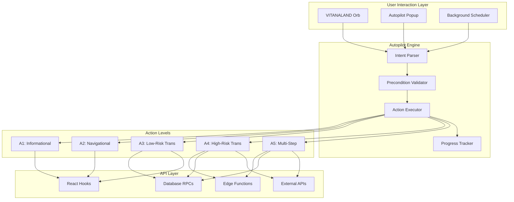
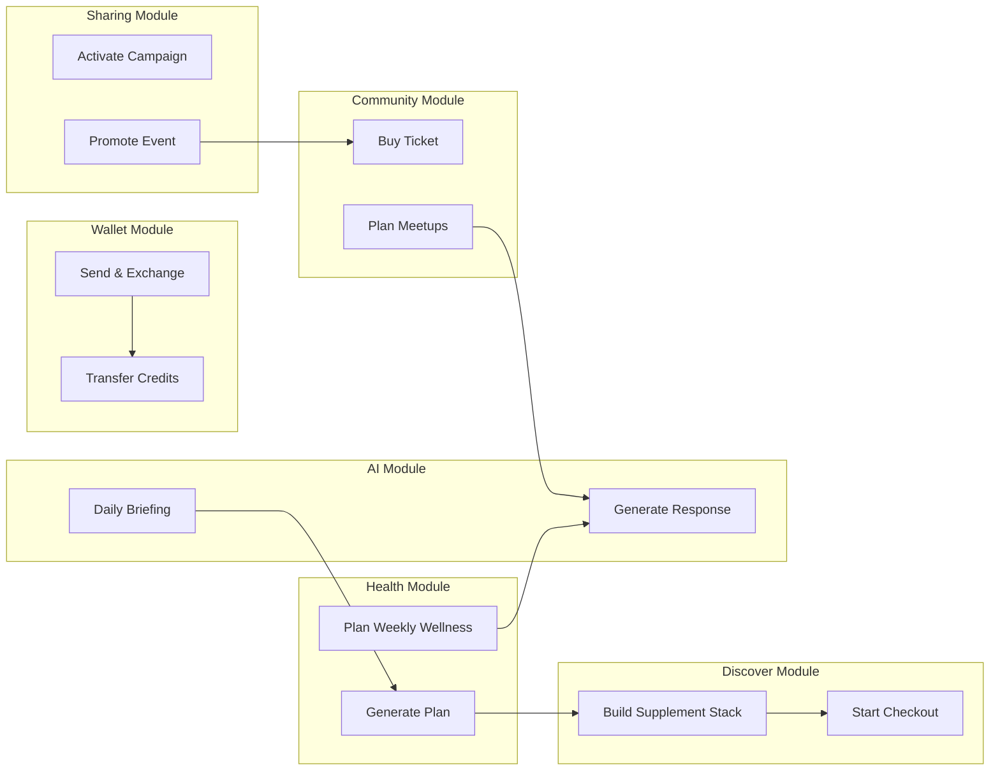
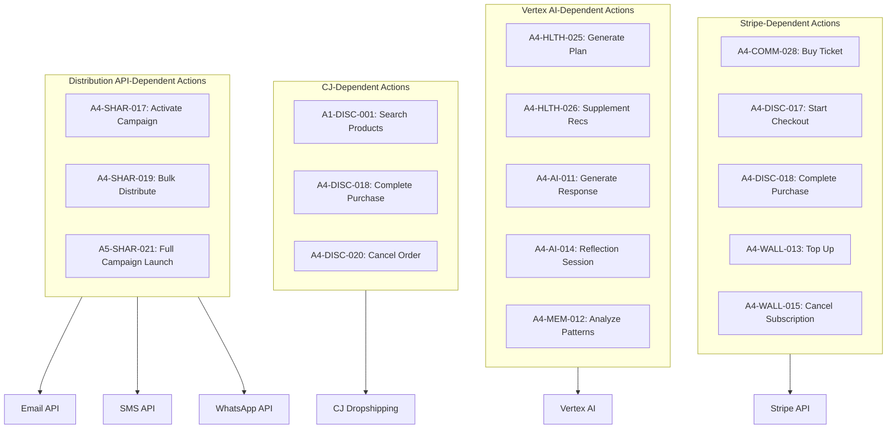
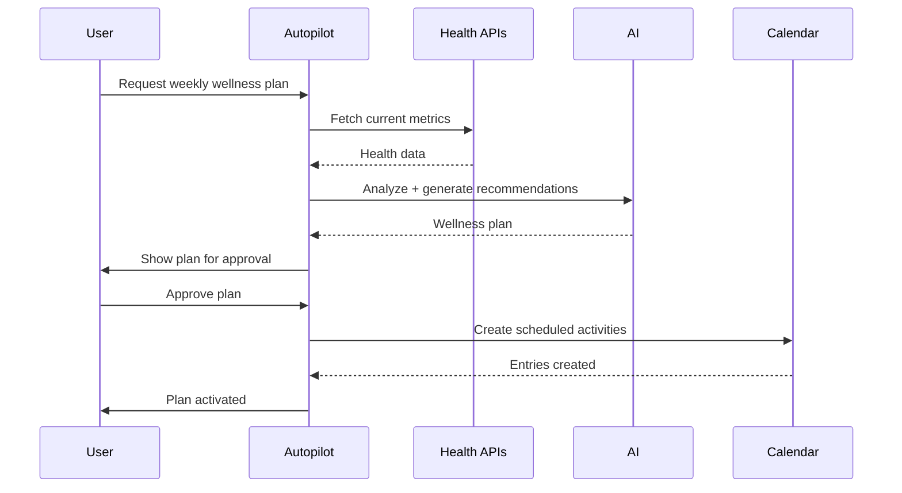
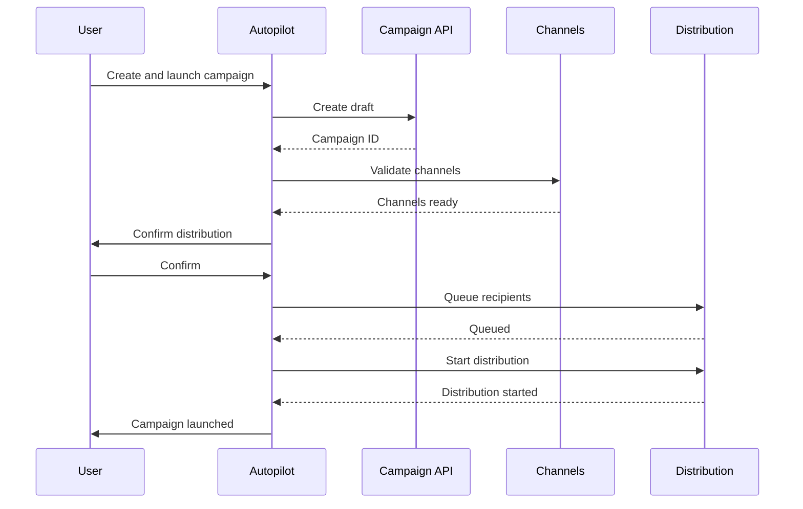

# VITANA Autopilot Capabilities Model

> **Document Version**: 1.0.0  
> **Last Updated**: 2024-12-08  
> **Status**: Complete  
> **Scope**: Full Autopilot action taxonomy, API mappings, and safety rules

---

## Table of Contents

1. [Introduction](#1-introduction)
2. [Capability Classification Levels (A1–A5)](#2-capability-classification-levels-a1a5)
3. [Core Autopilot Capabilities by Module](#3-core-autopilot-capabilities-by-module)
4. [Action Definitions (Complete Action Catalog)](#4-action-definitions-complete-action-catalog)
5. [Capability-to-API Mapping](#5-capability-to-api-mapping)
6. [Capability-to-Screen Mapping](#6-capability-to-screen-mapping)
7. [Preconditions, Required Data, and Permissions](#7-preconditions-required-data-and-permissions)
8. [Tenant-Specific Behavior](#8-tenant-specific-behavior-maxina-alkalma-earthlings)
9. [Risk Classification and Safety Rules](#9-risk-classification-and-safety-rules)
10. [Background Automation vs On-Demand Autopilot](#10-background-automation-vs-on-demand-autopilot)
11. [Appendix A: API Requirements per Action](#appendix-a-api-requirements-per-action)
12. [Appendix B: Dependency Graph for Autopilot Actions](#appendix-b-dependency-graph-for-autopilot-actions)

---

## 1. Introduction

### 1.1 Purpose

The VITANA Autopilot system is an AI-powered automation layer that enables intelligent task execution across the platform. It operates as a proactive assistant that can:

- **Retrieve information** and summarize complex data
- **Navigate users** through the application seamlessly
- **Execute transactions** on behalf of users (with appropriate safeguards)
- **Orchestrate multi-step workflows** across modules
- **Learn and adapt** to user preferences over time

### 1.2 Architecture Overview

```
┌─────────────────────────────────────────────────────────────────┐
│                    VITANA Autopilot System                       │
├─────────────────────────────────────────────────────────────────┤
│  ┌─────────────┐  ┌─────────────┐  ┌─────────────────────────┐  │
│  │ VITANALAND  │  │  Autopilot  │  │   Background            │  │
│  │    Orb      │──│   Engine    │──│   Scheduler             │  │
│  │  (Voice)    │  │  (Actions)  │  │   (Cron Jobs)           │  │
│  └─────────────┘  └─────────────┘  └─────────────────────────┘  │
│         │               │                    │                   │
│         ▼               ▼                    ▼                   │
│  ┌─────────────────────────────────────────────────────────────┐│
│  │                   Action Executor                            ││
│  │  ┌──────────┐ ┌──────────┐ ┌──────────┐ ┌──────────────────┐││
│  │  │   A1     │ │   A2     │ │  A3/A4   │ │       A5         │││
│  │  │  Info    │ │  Nav     │ │  Trans   │ │   Multi-Step     │││
│  │  └──────────┘ └──────────┘ └──────────┘ └──────────────────┘││
│  └─────────────────────────────────────────────────────────────┘│
│         │               │                    │                   │
│         ▼               ▼                    ▼                   │
│  ┌─────────────────────────────────────────────────────────────┐│
│  │                  API Layer (Edge + RPC + Hooks)              ││
│  └─────────────────────────────────────────────────────────────┘│
└─────────────────────────────────────────────────────────────────┘
```

### 1.3 Integration Points

| Component | Integration Type | Description |
|-----------|------------------|-------------|
| VITANALAND Orb | Voice Commands | Natural language action triggers |
| Autopilot Popup | UI Selection | User selects from suggested actions |
| Background Scheduler | Cron-based | Automated recurring actions |
| AI Chat | Conversational | Context-aware action suggestions |
| Settings Panel | Configuration | User preferences for autopilot behavior |

### 1.4 Current Autopilot Categories

Based on the existing `AutopilotCategory` type:

| Category | Description | Primary Use Cases |
|----------|-------------|-------------------|
| `health` | Health and wellness actions | Biomarkers, trackers, AI plans |
| `community` | Social and community actions | Events, groups, connections |
| `media` | Content and media actions | Posts, videos, live streams |
| `discover` | Discovery and commerce | Products, services, recommendations |
| `calendar` | Scheduling and time-based | Events, reminders, appointments |

---

## 2. Capability Classification Levels (A1–A5)

### 2.1 Level Definitions

#### A1 – Informational (Read-Only)

**Definition**: Actions that retrieve, summarize, or display information without any data mutations.

| Aspect | Description |
|--------|-------------|
| **Risk Level** | 🟢 Low |
| **User Confirmation** | Not required |
| **API Operations** | SELECT queries, GET requests |
| **Data Mutation** | None |
| **Examples** | "Show my upcoming events", "What's my wallet balance?", "List my subscriptions" |

**Characteristics**:
- Pure read operations
- No side effects
- Can execute without any confirmation
- Results displayed in UI or spoken via voice

#### A2 – Navigational (UI Control)

**Definition**: Actions that move the user through the application interface without modifying data.

| Aspect | Description |
|--------|-------------|
| **Risk Level** | 🟢 Low |
| **User Confirmation** | Not required |
| **API Operations** | None (frontend-only) |
| **Data Mutation** | None |
| **Examples** | "Take me to Hydration Tracker", "Open Wallet", "Go to My Events" |

**Characteristics**:
- Frontend navigation only
- Uses `react-router-dom` navigate
- May trigger toast notifications
- Can open dialogs, sheets, or overlays

#### A3 – Transactional (Low-Risk)

**Definition**: Actions that perform safe data mutations without financial or clinical impact.

| Aspect | Description |
|--------|-------------|
| **Risk Level** | 🟡 Medium |
| **User Confirmation** | Recommended but not required |
| **API Operations** | INSERT, UPDATE (non-critical) |
| **Data Mutation** | User's own data only |
| **Examples** | "Create a campaign draft", "Join this event", "Follow this user" |

**Characteristics**:
- Affects only the current user's data
- Easily reversible
- No financial transactions
- No external API calls with side effects

#### A4 – Transactional (High-Risk)

**Definition**: Actions involving payments, wallet operations, clinical data, or external API calls with real-world consequences.

| Aspect | Description |
|--------|-------------|
| **Risk Level** | 🔴 High |
| **User Confirmation** | **Required** |
| **API Operations** | Financial RPCs, external APIs |
| **Data Mutation** | Critical data, money movement |
| **Examples** | "Buy this ticket", "Transfer 100 credits", "Update my biomarkers" |

**Characteristics**:
- Involves money movement
- Affects PHI (Protected Health Information)
- Calls external paid APIs (Stripe, Twilio)
- Requires explicit double confirmation
- Full audit logging

#### A5 – Autonomous Multi-Step Workflows

**Definition**: Complex tasks requiring orchestration of multiple actions across APIs and screens.

| Aspect | Description |
|--------|-------------|
| **Risk Level** | 🔴 High (cumulative) |
| **User Confirmation** | **Required at start and key checkpoints** |
| **API Operations** | Multiple, sequenced |
| **Data Mutation** | Multiple entities |
| **Examples** | "Plan my week of wellness", "Generate supplement plan and add to cart" |

**Characteristics**:
- Multiple API calls in sequence
- May span multiple modules
- Requires workflow state management
- Progress tracking and rollback capability
- Can be paused/resumed

### 2.2 Level Comparison Matrix

| Aspect | A1 | A2 | A3 | A4 | A5 |
|--------|----|----|----|----|----| 
| **Data Read** | ✅ | ❌ | ✅ | ✅ | ✅ |
| **Data Write** | ❌ | ❌ | ✅ | ✅ | ✅ |
| **Navigation** | ❌ | ✅ | ❌ | ❌ | ✅ |
| **Money/PHI** | ❌ | ❌ | ❌ | ✅ | ✅ |
| **Multi-Step** | ❌ | ❌ | ❌ | ❌ | ✅ |
| **Confirmation** | ❌ | ❌ | Optional | Required | Required |
| **Audit Log** | Optional | Optional | Recommended | Required | Required |
| **Rollback** | N/A | N/A | Simple | Complex | Managed |

### 2.3 Decision Tree for Level Assignment

```
START: New Action Request
       │
       ▼
┌──────────────────────┐
│ Does it modify data? │
└──────────────────────┘
       │
   No ─┼─ Yes
       │      │
       ▼      ▼
┌──────────┐  ┌────────────────────────┐
│ A1 or A2 │  │ Does it involve money, │
└──────────┘  │ PHI, or external APIs? │
       │      └────────────────────────┘
       ▼              │
┌─────────────┐   No ─┼─ Yes
│ Navigation? │       │      │
└─────────────┘       ▼      ▼
   │              ┌──────┐  ┌────────────────┐
Yes─┼─No          │  A3  │  │ Multiple steps │
   │   │          └──────┘  │  required?     │
   ▼   ▼                    └────────────────┘
┌────┐ ┌────┐                    │
│ A2 │ │ A1 │              No ───┼─── Yes
└────┘ └────┘                    │       │
                                 ▼       ▼
                              ┌────┐  ┌────┐
                              │ A4 │  │ A5 │
                              └────┘  └────┘
```

---

## 3. Core Autopilot Capabilities by Module

### 3.1 Community Module

| ID | Capability | Level | Description |
|----|------------|-------|-------------|
| COMM-001 | Discover People | A1 | Find users by interests, location, archetype |
| COMM-002 | Discover Events | A1 | List upcoming community events |
| COMM-003 | Discover Groups | A1 | Find groups by category or interest |
| COMM-004 | View Event Details | A1 | Get full event information |
| COMM-005 | View User Profile | A1 | Display another user's public profile |
| COMM-006 | Navigate to Events | A2 | Go to Events & Meetups screen |
| COMM-007 | Navigate to Groups | A2 | Go to Collectives screen |
| COMM-008 | Open Event Drawer | A2 | Open event detail side drawer |
| COMM-009 | Open Profile Preview | A2 | Show profile quick preview dialog |
| COMM-010 | Follow User | A3 | Add user to following list |
| COMM-011 | Unfollow User | A3 | Remove user from following list |
| COMM-012 | Join Event (Free) | A3 | RSVP to a free event |
| COMM-013 | Leave Event | A3 | Cancel RSVP |
| COMM-014 | Join Group | A3 | Become member of a group |
| COMM-015 | Leave Group | A3 | Exit group membership |
| COMM-016 | Create Event | A3 | Create new community event |
| COMM-017 | Update Event | A3 | Modify existing event |
| COMM-018 | Delete Event | A3 | Remove event (owner only) |
| COMM-019 | Send Connection Request | A3 | Request connection with user |
| COMM-020 | Accept Connection | A3 | Accept pending connection request |
| COMM-021 | Decline Connection | A3 | Decline connection request |
| COMM-022 | Start Direct Message | A3 | Create DM thread with user |
| COMM-023 | Send Message | A3 | Send message in thread |
| COMM-024 | React to Message | A3 | Add emoji reaction |
| COMM-025 | Join Live Room | A3 | Enter active live stream |
| COMM-026 | Create Live Room | A3 | Start new live stream |
| COMM-027 | End Live Room | A3 | Close live stream (host only) |
| COMM-028 | Buy Event Ticket | A4 | Purchase paid event ticket |
| COMM-029 | Request Ticket Refund | A4 | Initiate refund process |
| COMM-030 | Plan Weekly Meetups | A5 | AI-suggested meetup schedule |

### 3.2 Discover Module

| ID | Capability | Level | Description |
|----|------------|-------|-------------|
| DISC-001 | Search Products | A1 | Find products by query |
| DISC-002 | Search Services | A1 | Find services by category |
| DISC-003 | View Product Details | A1 | Get full product information |
| DISC-004 | Compare Products | A1 | Side-by-side product comparison |
| DISC-005 | View Cart | A1 | Display current cart contents |
| DISC-006 | View Order History | A1 | List past orders |
| DISC-007 | Navigate to Shop | A2 | Go to products screen |
| DISC-008 | Navigate to Services | A2 | Go to services screen |
| DISC-009 | Navigate to Cart | A2 | Go to cart screen |
| DISC-010 | Open Product Detail | A2 | Open product detail drawer |
| DISC-011 | Add to Cart | A3 | Add item to shopping cart |
| DISC-012 | Update Cart Quantity | A3 | Change item quantity in cart |
| DISC-013 | Remove from Cart | A3 | Remove item from cart |
| DISC-014 | Add to Wishlist | A3 | Bookmark product for later |
| DISC-015 | Remove from Wishlist | A3 | Remove from bookmarks |
| DISC-016 | Apply Coupon | A3 | Add discount code to cart |
| DISC-017 | Start Checkout | A4 | Begin checkout process |
| DISC-018 | Complete Purchase | A4 | Finalize payment |
| DISC-019 | Book Service | A4 | Reserve and pay for service |
| DISC-020 | Cancel Order | A4 | Cancel pending order |
| DISC-021 | Request Refund | A4 | Initiate order refund |
| DISC-022 | Build Supplement Stack | A5 | AI-generated supplement plan + cart |
| DISC-023 | Reorder Previous | A5 | Duplicate past order to cart + checkout |

### 3.3 Health Module

| ID | Capability | Level | Description |
|----|------------|-------|-------------|
| HLTH-001 | View Biomarkers | A1 | Display current biomarker values |
| HLTH-002 | View Health Insights | A1 | Show AI-generated health insights |
| HLTH-003 | View Hydration Stats | A1 | Display hydration tracking data |
| HLTH-004 | View Sleep Stats | A1 | Display sleep tracking data |
| HLTH-005 | View Activity Stats | A1 | Display steps/activity data |
| HLTH-006 | View AI Plans | A1 | List active health plans |
| HLTH-007 | View Plan History | A1 | Show past plans and adherence |
| HLTH-008 | View Vitana Index | A1 | Display overall health score |
| HLTH-009 | Navigate to Health Dashboard | A2 | Go to main health screen |
| HLTH-010 | Navigate to Hydration | A2 | Go to hydration tracker |
| HLTH-011 | Navigate to Sleep | A2 | Go to sleep tracker |
| HLTH-012 | Navigate to Biomarkers | A2 | Go to biomarker detail |
| HLTH-013 | Log Hydration | A3 | Record water intake |
| HLTH-014 | Log Sleep | A3 | Record sleep session |
| HLTH-015 | Log Activity | A3 | Record exercise/steps |
| HLTH-016 | Log Meal | A3 | Record food intake |
| HLTH-017 | Set Health Goal | A3 | Create new health target |
| HLTH-018 | Update Health Goal | A3 | Modify existing goal |
| HLTH-019 | Complete Plan Task | A3 | Mark plan item complete |
| HLTH-020 | Start AI Plan | A3 | Activate new AI-generated plan |
| HLTH-021 | Pause AI Plan | A3 | Temporarily stop plan |
| HLTH-022 | Update Biomarkers | A4 | Record new biomarker values |
| HLTH-023 | Connect Wearable | A4 | Link health device |
| HLTH-024 | Sync Wearable Data | A4 | Pull data from connected device |
| HLTH-025 | Generate Personalized Plan | A4 | Create AI health plan (uses AI credits) |
| HLTH-026 | Generate Supplement Recs | A4 | AI supplement recommendations |
| HLTH-027 | Request Health Report | A4 | Generate exportable health report |
| HLTH-028 | Plan Weekly Wellness | A5 | Full week wellness schedule |
| HLTH-029 | Optimize Sleep Schedule | A5 | AI-optimized sleep routine + reminders |
| HLTH-030 | Full Health Assessment | A5 | Comprehensive health analysis + plans |

### 3.4 Sharing Module

| ID | Capability | Level | Description |
|----|------------|-------|-------------|
| SHAR-001 | View Campaigns | A1 | List all campaigns |
| SHAR-002 | View Campaign Details | A1 | Get campaign information |
| SHAR-003 | View Campaign Analytics | A1 | Display campaign performance |
| SHAR-004 | View Connected Channels | A1 | List connected social accounts |
| SHAR-005 | Navigate to Campaigns | A2 | Go to campaign manager |
| SHAR-006 | Navigate to Distribution | A2 | Go to distribution screen |
| SHAR-007 | Open Campaign Editor | A2 | Open campaign dialog |
| SHAR-008 | Create Campaign Draft | A3 | Create new campaign |
| SHAR-009 | Update Campaign | A3 | Modify existing campaign |
| SHAR-010 | Delete Campaign | A3 | Remove campaign |
| SHAR-011 | Duplicate Campaign | A3 | Clone existing campaign |
| SHAR-012 | Generate Message Draft | A3 | AI-generated campaign copy |
| SHAR-013 | Generate CTA Copy | A3 | AI-generated call-to-action |
| SHAR-014 | Schedule Campaign | A3 | Set future distribution time |
| SHAR-015 | Connect Social Channel | A4 | Link social media account |
| SHAR-016 | Disconnect Channel | A4 | Remove social connection |
| SHAR-017 | Activate Campaign | A4 | Start campaign distribution |
| SHAR-018 | Send Test Message | A4 | Send preview to self |
| SHAR-019 | Bulk Distribute | A4 | Send to all recipients |
| SHAR-020 | Pause Distribution | A4 | Stop active distribution |
| SHAR-021 | Full Campaign Launch | A5 | Create + schedule + distribute |
| SHAR-022 | Promote Event | A5 | Event → Campaign → Distribution |

### 3.5 Wallet Module

| ID | Capability | Level | Description |
|----|------------|-------|-------------|
| WALL-001 | View Balances | A1 | Display all currency balances |
| WALL-002 | View Transaction History | A1 | List past transactions |
| WALL-003 | View Subscriptions | A1 | List active subscriptions |
| WALL-004 | View Reward History | A1 | Display earned rewards |
| WALL-005 | View Exchange Rates | A1 | Current currency rates |
| WALL-006 | Navigate to Wallet | A2 | Go to wallet main screen |
| WALL-007 | Navigate to Transactions | A2 | Go to transaction history |
| WALL-008 | Navigate to Subscriptions | A2 | Go to subscription management |
| WALL-009 | Open Send Dialog | A2 | Open transfer dialog |
| WALL-010 | Open Exchange Dialog | A2 | Open currency exchange dialog |
| WALL-011 | Transfer Credits | A4 | Send credits to another user |
| WALL-012 | Exchange Currency | A4 | Convert between currencies |
| WALL-013 | Top Up Balance | A4 | Add funds via Stripe |
| WALL-014 | Withdraw Funds | A4 | Request payout |
| WALL-015 | Cancel Subscription | A4 | End active subscription |
| WALL-016 | Upgrade Subscription | A4 | Change to higher tier |
| WALL-017 | Downgrade Subscription | A4 | Change to lower tier |
| WALL-018 | Claim Reward | A4 | Redeem earned reward |
| WALL-019 | Send and Exchange | A5 | Convert + transfer in one flow |
| WALL-020 | Setup Auto-Top-Up | A5 | Configure automatic balance refill |

### 3.6 Business Hub Module

| ID | Capability | Level | Description |
|----|------------|-------|-------------|
| BIZ-001 | View Business Overview | A1 | Display business dashboard with KPIs |
| BIZ-002 | View Earnings History | A1 | List earnings transactions |
| BIZ-003 | View Services | A1 | List user's services and packages |
| BIZ-004 | View Events | A1 | List user's created events |
| BIZ-005 | View Packages | A1 | List user's service packages |
| BIZ-006 | View Clients | A1 | List active clients |
| BIZ-007 | View Inventory | A1 | List resellable events in inventory |
| BIZ-008 | View Promotions | A1 | List reseller campaigns |
| BIZ-009 | View Business Analytics | A1 | Display performance metrics |
| BIZ-010 | Navigate to Business Hub | A2 | Go to Business Hub Overview |
| BIZ-011 | Navigate to Services | A2 | Go to Services tab |
| BIZ-012 | Navigate to Clients | A2 | Go to Clients tab |
| BIZ-013 | Navigate to Sell & Earn | A2 | Go to Sell & Earn tab |
| BIZ-014 | Navigate to Analytics | A2 | Go to Analytics tab |
| BIZ-015 | Create Service | A3 | Create new service offering |
| BIZ-016 | Create Package | A3 | Create service bundle |
| BIZ-017 | Update Package | A3 | Modify existing package |
| BIZ-018 | Delete Package | A3 | Remove package |
| BIZ-019 | Create Business Event | A3 | Create event with ticket sales |
| BIZ-020 | Add to Inventory | A3 | Add event to reseller inventory |
| BIZ-021 | Create Promotion | A3 | Create reseller campaign |
| BIZ-022 | Activate Reseller Mode | A3 | Enable reseller capabilities |
| BIZ-023 | Transfer to Wallet | A4 | Process reseller payout to wallet |
| BIZ-024 | Full Business Setup | A5 | Create service + package + event flow |

### 3.7 AI Module

| ID | Capability | Level | Description |
|----|------------|-------|-------------|
| AI-001 | View AI Memory | A1 | Display stored AI memories |
| AI-002 | View AI Insights | A1 | Show AI-generated insights |
| AI-003 | View Conversation History | A1 | Display past AI conversations |
| AI-004 | Navigate to AI Settings | A2 | Go to AI preferences |
| AI-005 | Open VITANALAND Orb | A2 | Expand voice interface |
| AI-006 | Start Voice Session | A3 | Begin voice interaction |
| AI-007 | End Voice Session | A3 | Close voice interface |
| AI-008 | Send Chat Message | A3 | Send text to AI |
| AI-009 | Create AI Memory | A3 | Store fact in AI memory |
| AI-010 | Delete AI Memory | A3 | Remove stored memory |
| AI-011 | Generate Response | A4 | AI generates reply (uses credits) |
| AI-012 | Analyze Image | A4 | AI image analysis (uses credits) |
| AI-013 | Analyze Document | A4 | AI document parsing (uses credits) |
| AI-014 | Start Reflection Session | A4 | Guided self-reflection (uses credits) |
| AI-015 | Generate Content | A4 | AI content generation |
| AI-016 | Full AI Consultation | A5 | Multi-turn conversation + recommendations |
| AI-017 | Daily AI Briefing | A5 | Personalized morning summary |

### 3.7 Memory Module

| ID | Capability | Level | Description |
|----|------------|-------|-------------|
| MEM-001 | View Diary Entries | A1 | List past diary entries |
| MEM-002 | View Life Events | A1 | Display recorded life events |
| MEM-003 | Search Memories | A1 | Find entries by keyword |
| MEM-004 | Navigate to Diary | A2 | Go to diary screen |
| MEM-005 | Open Diary Entry | A2 | View specific entry |
| MEM-006 | Create Diary Entry | A3 | Record new diary entry |
| MEM-007 | Update Diary Entry | A3 | Edit existing entry |
| MEM-008 | Delete Diary Entry | A3 | Remove entry |
| MEM-009 | Add Life Event | A3 | Record significant event |
| MEM-010 | Tag Memory | A3 | Add tags to entry |
| MEM-011 | Voice Diary Entry | A4 | Record via voice (uses TTS) |
| MEM-012 | Analyze Patterns | A4 | AI pattern recognition (uses credits) |
| MEM-013 | Weekly Memory Digest | A5 | AI-summarized week + insights |

### 3.8 Admin + Dev Module

| ID | Capability | Level | Description |
|----|------------|-------|-------------|
| ADMN-001 | View Audit Logs | A1 | Display system audit trail |
| ADMN-002 | View API Status | A1 | Check API health status |
| ADMN-003 | View User List | A1 | List tenant users |
| ADMN-004 | View Permissions | A1 | Display role permissions |
| ADMN-005 | View Tenant Settings | A1 | Display tenant configuration |
| ADMN-006 | Navigate to Admin | A2 | Go to admin dashboard |
| ADMN-007 | Navigate to Dev Hub | A2 | Go to developer console |
| ADMN-008 | Open User Detail | A2 | View specific user |
| ADMN-009 | Switch Tenant | A3 | Change active tenant |
| ADMN-010 | Update Tenant Settings | A3 | Modify tenant config |
| ADMN-011 | Create Automation Rule | A3 | Add new automation |
| ADMN-012 | Update Automation Rule | A3 | Modify automation |
| ADMN-013 | Delete Automation Rule | A3 | Remove automation |
| ADMN-014 | Bootstrap Admin User | A4 | Grant admin privileges |
| ADMN-015 | Revoke Admin | A4 | Remove admin privileges |
| ADMN-016 | Update User Role | A4 | Change user's role |
| ADMN-017 | Ban User | A4 | Block user access |
| ADMN-018 | Unban User | A4 | Restore user access |
| ADMN-019 | Trigger Bulk Action | A4 | Mass user operations |
| ADMN-020 | System Health Check | A5 | Full system diagnostics |

### 3.9 Settings Module

| ID | Capability | Level | Description |
|----|------------|-------|-------------|
| SETT-001 | View Profile Settings | A1 | Display user settings |
| SETT-002 | View Privacy Settings | A1 | Display privacy config |
| SETT-003 | View Notification Settings | A1 | Display notification prefs |
| SETT-004 | View Autopilot Settings | A1 | Display autopilot config |
| SETT-005 | Navigate to Settings | A2 | Go to settings screen |
| SETT-006 | Navigate to Privacy | A2 | Go to privacy settings |
| SETT-007 | Update Profile | A3 | Modify profile data |
| SETT-008 | Update Privacy | A3 | Change privacy settings |
| SETT-009 | Update Notifications | A3 | Change notification prefs |
| SETT-010 | Update Autopilot | A3 | Change autopilot settings |
| SETT-011 | Enable 2FA | A4 | Enable two-factor auth |
| SETT-012 | Disable 2FA | A4 | Disable two-factor auth |
| SETT-013 | Delete Account | A4 | Permanently delete account |
| SETT-014 | Export Data | A4 | Download personal data |
| SETT-015 | Import Contacts | A4 | Bulk contact import |

---

## 4. Action Definitions (Complete Action Catalog)

### 4.1 Community Module Actions

---

#### A1-COMM-001: Discover People

- **Capability Level**: A1 (Informational)
- **Description**: Search and retrieve user profiles based on interests, location, archetype, or other filters.
- **Primary APIs Used**: 
  - Hook: `useUserDiscovery`
  - RPC: `search_minimal_profiles`
  - Table: `global_community_profiles`
- **Screens Used**: COMM-002 (People Discovery)
- **Permissions Required**: `community` role or higher
- **Inputs**: 
  - `query` (string, optional): Search term
  - `filters` (object, optional): Filter criteria
- **Outputs**: Array of user profile summaries
- **Error Cases**: No matching users, rate limiting
- **Safety Rules**: None (read-only)

---

#### A1-COMM-002: Discover Events

- **Capability Level**: A1 (Informational)
- **Description**: Retrieve list of upcoming community events with optional filters.
- **Primary APIs Used**:
  - Hook: `useCommunityEvents`
  - Table: `global_community_events`
- **Screens Used**: COMM-001 (Events & Meetups)
- **Permissions Required**: `community` role
- **Inputs**:
  - `category` (string, optional): Event category filter
  - `dateRange` (object, optional): Start/end date filter
  - `location` (string, optional): Location filter
- **Outputs**: Array of event summaries
- **Error Cases**: No events found
- **Safety Rules**: None (read-only)

---

#### A1-COMM-003: Discover Groups

- **Capability Level**: A1 (Informational)
- **Description**: Find community groups (collectives) by category or interest.
- **Primary APIs Used**:
  - Hook: `useCollectives`
  - Table: `collectives`
- **Screens Used**: COMM-003 (Collectives)
- **Permissions Required**: `community` role
- **Inputs**:
  - `category` (string, optional): Group category
  - `query` (string, optional): Search term
- **Outputs**: Array of group summaries
- **Error Cases**: No groups found
- **Safety Rules**: None (read-only)

---

#### A1-COMM-004: View Event Details

- **Capability Level**: A1 (Informational)
- **Description**: Retrieve full information about a specific event.
- **Primary APIs Used**:
  - Hook: `useCommunityEvents`
  - Table: `global_community_events`, `event_ticket_types`
- **Screens Used**: COMM-001 (Events), Event Detail Drawer
- **Permissions Required**: `community` role
- **Inputs**:
  - `eventId` (uuid, required): Event identifier
- **Outputs**: Complete event object with tickets
- **Error Cases**: Event not found, event deleted
- **Safety Rules**: None (read-only)

---

#### A1-COMM-005: View User Profile

- **Capability Level**: A1 (Informational)
- **Description**: Display another user's public profile information.
- **Primary APIs Used**:
  - Hook: `useGlobalCommunityProfile`
  - RPC: `get_minimal_profiles_by_ids`
  - Table: `global_community_profiles`, `profiles`
- **Screens Used**: COMM-002 (People), Profile Preview Dialog
- **Permissions Required**: `community` role
- **Inputs**:
  - `userId` (uuid, required): Target user ID
- **Outputs**: Public profile data
- **Error Cases**: User not found, profile hidden
- **Safety Rules**: Respects user privacy settings

---

#### A2-COMM-006: Navigate to Events

- **Capability Level**: A2 (Navigational)
- **Description**: Navigate user to the Events & Meetups screen.
- **Primary APIs Used**: None (frontend only)
- **Screens Used**: COMM-001 (Events & Meetups)
- **Permissions Required**: None
- **Inputs**: None
- **Outputs**: Navigation confirmation
- **Error Cases**: None
- **Safety Rules**: None

---

#### A2-COMM-007: Navigate to Groups

- **Capability Level**: A2 (Navigational)
- **Description**: Navigate user to the Collectives screen.
- **Primary APIs Used**: None (frontend only)
- **Screens Used**: COMM-003 (Collectives)
- **Permissions Required**: None
- **Inputs**: None
- **Outputs**: Navigation confirmation
- **Error Cases**: None
- **Safety Rules**: None

---

#### A2-COMM-008: Open Event Drawer

- **Capability Level**: A2 (Navigational)
- **Description**: Open the event detail side drawer for a specific event.
- **Primary APIs Used**: None (frontend only)
- **Screens Used**: COMM-001 (Events), MeetupDetailsDrawer
- **Permissions Required**: None
- **Inputs**:
  - `eventId` (uuid, required): Event to display
- **Outputs**: Drawer opened confirmation
- **Error Cases**: Event not found
- **Safety Rules**: None

---

#### A2-COMM-009: Open Profile Preview

- **Capability Level**: A2 (Navigational)
- **Description**: Show profile quick preview dialog for a user.
- **Primary APIs Used**: None (frontend only)
- **Screens Used**: ProfilePreviewSheet
- **Permissions Required**: None
- **Inputs**:
  - `userId` (uuid, required): User to preview
- **Outputs**: Dialog opened confirmation
- **Error Cases**: User not found
- **Safety Rules**: None

---

#### A3-COMM-010: Follow User

- **Capability Level**: A3 (Transactional, Low-Risk)
- **Description**: Add a user to the current user's following list.
- **Primary APIs Used**:
  - RPC: `follow_user`
  - Table: `user_follows`
- **Screens Used**: COMM-002 (People), Profile screens
- **Permissions Required**: `community` role
- **Inputs**:
  - `targetUserId` (uuid, required): User to follow
- **Outputs**: Success confirmation
- **Error Cases**: Already following, user blocked, self-follow attempt
- **Safety Rules**: Cannot follow blocked users

---

#### A3-COMM-011: Unfollow User

- **Capability Level**: A3 (Transactional, Low-Risk)
- **Description**: Remove a user from the following list.
- **Primary APIs Used**:
  - RPC: `unfollow_user`
  - Table: `user_follows`
- **Screens Used**: COMM-002 (People), Profile screens
- **Permissions Required**: `community` role
- **Inputs**:
  - `targetUserId` (uuid, required): User to unfollow
- **Outputs**: Success confirmation
- **Error Cases**: Not currently following
- **Safety Rules**: None

---

#### A3-COMM-012: Join Event (Free)

- **Capability Level**: A3 (Transactional, Low-Risk)
- **Description**: RSVP to a free community event.
- **Primary APIs Used**:
  - Hook: `useEventAttendance`
  - Table: `event_attendees`
- **Screens Used**: COMM-001 (Events), Event Drawer
- **Permissions Required**: `community` role
- **Inputs**:
  - `eventId` (uuid, required): Event to join
- **Outputs**: Attendance confirmation
- **Error Cases**: Event full, event past, already attending
- **Safety Rules**: Check event capacity

---

#### A3-COMM-013: Leave Event

- **Capability Level**: A3 (Transactional, Low-Risk)
- **Description**: Cancel RSVP from an event.
- **Primary APIs Used**:
  - Hook: `useEventAttendance`
  - Table: `event_attendees`
- **Screens Used**: COMM-001 (Events)
- **Permissions Required**: `community` role
- **Inputs**:
  - `eventId` (uuid, required): Event to leave
- **Outputs**: Cancellation confirmation
- **Error Cases**: Not attending, event already started
- **Safety Rules**: None

---

#### A3-COMM-014: Join Group

- **Capability Level**: A3 (Transactional, Low-Risk)
- **Description**: Become a member of a community group.
- **Primary APIs Used**:
  - Hook: `useCollectiveMembership`
  - Table: `collective_members`
- **Screens Used**: COMM-003 (Collectives)
- **Permissions Required**: `community` role
- **Inputs**:
  - `groupId` (uuid, required): Group to join
- **Outputs**: Membership confirmation
- **Error Cases**: Group full, private group, already member
- **Safety Rules**: Respect group privacy settings

---

#### A3-COMM-015: Leave Group

- **Capability Level**: A3 (Transactional, Low-Risk)
- **Description**: Exit group membership.
- **Primary APIs Used**:
  - Hook: `useCollectiveMembership`
  - Table: `collective_members`
- **Screens Used**: COMM-003 (Collectives)
- **Permissions Required**: `community` role
- **Inputs**:
  - `groupId` (uuid, required): Group to leave
- **Outputs**: Exit confirmation
- **Error Cases**: Not a member, last admin leaving
- **Safety Rules**: Cannot leave if only admin

---

#### A3-COMM-016: Create Event

- **Capability Level**: A3 (Transactional, Low-Risk)
- **Description**: Create a new community event.
- **Primary APIs Used**:
  - Hook: `useCreateEvent`
  - Table: `global_community_events`
- **Screens Used**: COMM-001 (Events), Event Creation Dialog
- **Permissions Required**: `community` role
- **Inputs**:
  - `title` (string, required): Event name
  - `description` (string, optional): Event description
  - `startTime` (datetime, required): Event start
  - `endTime` (datetime, optional): Event end
  - `location` (string, optional): Event location
  - `imageUrl` (string, optional): Cover image
- **Outputs**: New event ID
- **Error Cases**: Validation errors, rate limiting
- **Safety Rules**: Rate limit: max 10 events/day

---

#### A3-COMM-017: Update Event

- **Capability Level**: A3 (Transactional, Low-Risk)
- **Description**: Modify an existing event's details.
- **Primary APIs Used**:
  - Hook: `useUpdateEvent`
  - Table: `global_community_events`
- **Screens Used**: COMM-001 (Events), Event Edit Dialog
- **Permissions Required**: Event creator or co-creator
- **Inputs**:
  - `eventId` (uuid, required): Event to update
  - `updates` (object, required): Fields to update
- **Outputs**: Updated event confirmation
- **Error Cases**: Not authorized, event not found
- **Safety Rules**: Only creator/co-creators can edit

---

#### A3-COMM-018: Delete Event

- **Capability Level**: A3 (Transactional, Low-Risk)
- **Description**: Remove an event (owner only).
- **Primary APIs Used**:
  - Hook: `useDeleteEvent`
  - Table: `global_community_events`
- **Screens Used**: COMM-001 (Events)
- **Permissions Required**: Event creator only
- **Inputs**:
  - `eventId` (uuid, required): Event to delete
- **Outputs**: Deletion confirmation
- **Error Cases**: Not authorized, has ticket sales
- **Safety Rules**: Cannot delete events with sold tickets

---

#### A3-COMM-019: Send Connection Request

- **Capability Level**: A3 (Transactional, Low-Risk)
- **Description**: Send a connection request to another user.
- **Primary APIs Used**:
  - Table: `connection_requests`
- **Screens Used**: COMM-002 (People), Profile screens
- **Permissions Required**: `community` role
- **Inputs**:
  - `targetUserId` (uuid, required): User to connect with
  - `message` (string, optional): Request message
- **Outputs**: Request sent confirmation
- **Error Cases**: Already connected, request pending, user blocked
- **Safety Rules**: Rate limit: max 20 requests/day

---

#### A3-COMM-020: Accept Connection

- **Capability Level**: A3 (Transactional, Low-Risk)
- **Description**: Accept a pending connection request.
- **Primary APIs Used**:
  - Table: `connection_requests`, `user_connections`
- **Screens Used**: Notifications, COMM-002
- **Permissions Required**: `community` role
- **Inputs**:
  - `requestId` (uuid, required): Request to accept
- **Outputs**: Connection established confirmation
- **Error Cases**: Request expired, request not found
- **Safety Rules**: None

---

#### A3-COMM-021: Decline Connection

- **Capability Level**: A3 (Transactional, Low-Risk)
- **Description**: Decline a pending connection request.
- **Primary APIs Used**:
  - Table: `connection_requests`
- **Screens Used**: Notifications
- **Permissions Required**: `community` role
- **Inputs**:
  - `requestId` (uuid, required): Request to decline
- **Outputs**: Decline confirmation
- **Error Cases**: Request not found
- **Safety Rules**: None

---

#### A3-COMM-022: Start Direct Message

- **Capability Level**: A3 (Transactional, Low-Risk)
- **Description**: Create a new direct message thread with a user.
- **Primary APIs Used**:
  - RPC: `create_global_direct_thread`, `create_or_get_global_dm`
  - Table: `global_message_threads`, `global_thread_participants`
- **Screens Used**: COMM-006 (Messaging)
- **Permissions Required**: `community` role
- **Inputs**:
  - `recipientId` (uuid, required): User to message
- **Outputs**: Thread ID
- **Error Cases**: User blocked, messaging disabled
- **Safety Rules**: Respects block list

---

#### A3-COMM-023: Send Message

- **Capability Level**: A3 (Transactional, Low-Risk)
- **Description**: Send a message in an existing thread.
- **Primary APIs Used**:
  - Hook: `useSendGlobalMessage`
  - Table: `global_messages`
- **Screens Used**: COMM-006 (Messaging), Thread View
- **Permissions Required**: Thread participant
- **Inputs**:
  - `threadId` (uuid, required): Target thread
  - `content` (string, required): Message content
  - `attachments` (array, optional): Media attachments
- **Outputs**: Message ID
- **Error Cases**: Thread not found, not participant, content too long
- **Safety Rules**: Content length limit, rate limiting

---

#### A3-COMM-024: React to Message

- **Capability Level**: A3 (Transactional, Low-Risk)
- **Description**: Add an emoji reaction to a message.
- **Primary APIs Used**:
  - RPC: `toggle_message_reaction`
  - Table: `message_reactions`
- **Screens Used**: COMM-006 (Messaging)
- **Permissions Required**: Thread participant
- **Inputs**:
  - `messageId` (uuid, required): Message to react to
  - `emoji` (string, required): Emoji reaction
- **Outputs**: Reaction toggled confirmation
- **Error Cases**: Message not found, not participant
- **Safety Rules**: None

---

#### A3-COMM-025: Join Live Room

- **Capability Level**: A3 (Transactional, Low-Risk)
- **Description**: Enter an active live stream room.
- **Primary APIs Used**:
  - Hook: `useLiveRoom`
  - Table: `community_live_streams`
- **Screens Used**: COMM-005 (Live Rooms)
- **Permissions Required**: `community` role
- **Inputs**:
  - `roomId` (uuid, required): Room to join
- **Outputs**: Join confirmation, WebRTC credentials
- **Error Cases**: Room full, room ended, access denied
- **Safety Rules**: Respect room access level

---

#### A3-COMM-026: Create Live Room

- **Capability Level**: A3 (Transactional, Low-Risk)
- **Description**: Start a new live stream room.
- **Primary APIs Used**:
  - Hook: `useCreateLiveRoom`
  - Table: `community_live_streams`
- **Screens Used**: COMM-005 (Live Rooms)
- **Permissions Required**: `community` role
- **Inputs**:
  - `title` (string, required): Room title
  - `description` (string, optional): Room description
  - `accessLevel` (string, optional): public/private/followers
- **Outputs**: Room ID, stream credentials
- **Error Cases**: Rate limiting, concurrent room limit
- **Safety Rules**: Max 1 concurrent room per user

---

#### A3-COMM-027: End Live Room

- **Capability Level**: A3 (Transactional, Low-Risk)
- **Description**: Close an active live stream (host only).
- **Primary APIs Used**:
  - Hook: `useEndLiveRoom`
  - Table: `community_live_streams`
- **Screens Used**: COMM-005 (Live Rooms)
- **Permissions Required**: Room host
- **Inputs**:
  - `roomId` (uuid, required): Room to end
- **Outputs**: End confirmation
- **Error Cases**: Not host, room already ended
- **Safety Rules**: Only host can end

---

#### A4-COMM-028: Buy Event Ticket

- **Capability Level**: A4 (Transactional, High-Risk)
- **Description**: Purchase a paid ticket for an event via Stripe.
- **Primary APIs Used**:
  - Edge: `stripe-create-ticket-checkout`
  - Table: `event_ticket_purchases`, `event_ticket_types`
  - External: Stripe
- **Screens Used**: COMM-001 (Events), Event Drawer, Checkout Popup
- **Permissions Required**: `community` role, authenticated
- **Inputs**:
  - `eventId` (uuid, required): Target event
  - `ticketTypeId` (uuid, required): Ticket tier
  - `quantity` (number, required): Number of tickets
  - `buyerName` (string, required): Purchaser name
  - `buyerEmail` (string, required): Purchaser email
- **Outputs**: Ticket purchase record, QR code
- **Error Cases**: Sold out, payment failed, invalid ticket type
- **Safety Rules**: 
  - Requires explicit user confirmation
  - Payment processed via Stripe
  - Generates unique QR code
  - Full audit logging

---

#### A4-COMM-029: Request Ticket Refund

- **Capability Level**: A4 (Transactional, High-Risk)
- **Description**: Initiate refund process for a purchased ticket.
- **Primary APIs Used**:
  - Edge: `stripe-webhook` (refund processing)
  - Table: `event_ticket_purchases`
  - External: Stripe
- **Screens Used**: My Orders, Event Drawer
- **Permissions Required**: Ticket owner
- **Inputs**:
  - `purchaseId` (uuid, required): Purchase to refund
  - `reason` (string, optional): Refund reason
- **Outputs**: Refund request confirmation
- **Error Cases**: Event already occurred, refund window passed
- **Safety Rules**:
  - Requires explicit confirmation
  - Subject to refund policy
  - Full audit logging

---

#### A5-COMM-030: Plan Weekly Meetups

- **Capability Level**: A5 (Autonomous Multi-Step)
- **Description**: AI-suggested weekly meetup schedule based on interests and calendar.
- **Primary APIs Used**:
  - Edge: `generate-autopilot-actions`
  - Hooks: `useCommunityEvents`, `useCalendarEvents`
  - Tables: `global_community_events`, `calendar_events`, `event_recommendations`
- **Screens Used**: COMM-001 (Events), Calendar
- **Permissions Required**: `community` role
- **Inputs**:
  - `preferences` (object, optional): Category preferences
  - `availability` (array, optional): Available time slots
- **Outputs**: Suggested meetup schedule, calendar entries created
- **Steps**:
  1. Analyze user interests and past attendance
  2. Query upcoming events matching preferences
  3. Check calendar for conflicts
  4. Generate optimal schedule
  5. Create calendar reminders
- **Error Cases**: No matching events, calendar sync failed
- **Safety Rules**:
  - Requires confirmation before adding to calendar
  - Does not auto-RSVP without confirmation

---

### 4.2 Discover Module Actions

---

#### A1-DISC-001: Search Products

- **Capability Level**: A1 (Informational)
- **Description**: Search for products by query, category, or filters.
- **Primary APIs Used**:
  - Edge: `cj-search-products`
  - Hook: `useProducts`
  - Table: `cj_products`
- **Screens Used**: DISC-001 (Products)
- **Permissions Required**: None (public)
- **Inputs**:
  - `query` (string, optional): Search term
  - `category` (string, optional): Product category
  - `priceRange` (object, optional): Min/max price
- **Outputs**: Array of product results
- **Error Cases**: No results, API error
- **Safety Rules**: None (read-only)

---

#### A1-DISC-002: Search Services

- **Capability Level**: A1 (Informational)
- **Description**: Find available services by category or provider.
- **Primary APIs Used**:
  - Hook: `useServices`
  - Table: `services`
- **Screens Used**: DISC-002 (Services)
- **Permissions Required**: None (public)
- **Inputs**:
  - `category` (string, optional): Service category
  - `location` (string, optional): Location filter
- **Outputs**: Array of service results
- **Error Cases**: No results
- **Safety Rules**: None (read-only)

---

#### A1-DISC-003: View Product Details

- **Capability Level**: A1 (Informational)
- **Description**: Get complete information about a specific product.
- **Primary APIs Used**:
  - Edge: `cj-get-product-details`
  - Table: `cj_products`
- **Screens Used**: DISC-001 (Products), Product Drawer
- **Permissions Required**: None (public)
- **Inputs**:
  - `productId` (string, required): Product identifier
- **Outputs**: Complete product object
- **Error Cases**: Product not found, out of stock
- **Safety Rules**: None (read-only)

---

#### A1-DISC-004: Compare Products

- **Capability Level**: A1 (Informational)
- **Description**: Side-by-side comparison of multiple products.
- **Primary APIs Used**:
  - Hook: `useProducts`
  - Table: `cj_products`
- **Screens Used**: DISC-001 (Products), Compare View
- **Permissions Required**: None (public)
- **Inputs**:
  - `productIds` (array, required): Products to compare (max 4)
- **Outputs**: Comparison data structure
- **Error Cases**: Products not found
- **Safety Rules**: Max 4 products per comparison

---

#### A1-DISC-005: View Cart

- **Capability Level**: A1 (Informational)
- **Description**: Display current shopping cart contents.
- **Primary APIs Used**:
  - Hook: `useCart`
  - Table: `cart_items`
- **Screens Used**: DISC-003 (Cart)
- **Permissions Required**: Authenticated
- **Inputs**: None
- **Outputs**: Cart contents with totals
- **Error Cases**: Empty cart
- **Safety Rules**: None (read-only)

---

#### A1-DISC-006: View Order History

- **Capability Level**: A1 (Informational)
- **Description**: List user's past orders.
- **Primary APIs Used**:
  - Hook: `useOrders`
  - Tables: `checkout_sessions`, `cj_orders`
- **Screens Used**: DISC-004 (Orders)
- **Permissions Required**: Authenticated
- **Inputs**:
  - `status` (string, optional): Filter by status
  - `dateRange` (object, optional): Date filter
- **Outputs**: Array of order summaries
- **Error Cases**: No orders found
- **Safety Rules**: None (read-only)

---

#### A2-DISC-007: Navigate to Shop

- **Capability Level**: A2 (Navigational)
- **Description**: Navigate to the products screen.
- **Primary APIs Used**: None
- **Screens Used**: DISC-001 (Products)
- **Permissions Required**: None
- **Inputs**: None
- **Outputs**: Navigation confirmation
- **Error Cases**: None
- **Safety Rules**: None

---

#### A2-DISC-008: Navigate to Services

- **Capability Level**: A2 (Navigational)
- **Description**: Navigate to the services screen.
- **Primary APIs Used**: None
- **Screens Used**: DISC-002 (Services)
- **Permissions Required**: None
- **Inputs**: None
- **Outputs**: Navigation confirmation
- **Error Cases**: None
- **Safety Rules**: None

---

#### A2-DISC-009: Navigate to Cart

- **Capability Level**: A2 (Navigational)
- **Description**: Navigate to the shopping cart screen.
- **Primary APIs Used**: None
- **Screens Used**: DISC-003 (Cart)
- **Permissions Required**: Authenticated
- **Inputs**: None
- **Outputs**: Navigation confirmation
- **Error Cases**: None
- **Safety Rules**: None

---

#### A2-DISC-010: Open Product Detail

- **Capability Level**: A2 (Navigational)
- **Description**: Open product detail drawer for a specific product.
- **Primary APIs Used**: None
- **Screens Used**: DISC-001 (Products), Product Drawer
- **Permissions Required**: None
- **Inputs**:
  - `productId` (string, required): Product to display
- **Outputs**: Drawer opened confirmation
- **Error Cases**: Product not found
- **Safety Rules**: None

---

#### A3-DISC-011: Add to Cart

- **Capability Level**: A3 (Transactional, Low-Risk)
- **Description**: Add a product to the shopping cart.
- **Primary APIs Used**:
  - Hook: `useCart`
  - Table: `cart_items`
- **Screens Used**: DISC-001 (Products), DISC-003 (Cart)
- **Permissions Required**: Authenticated
- **Inputs**:
  - `productId` (string, required): Product to add
  - `quantity` (number, optional): Quantity (default: 1)
  - `variant` (object, optional): Product variant
- **Outputs**: Updated cart
- **Error Cases**: Out of stock, max quantity exceeded
- **Safety Rules**: Check inventory availability

---

#### A3-DISC-012: Update Cart Quantity

- **Capability Level**: A3 (Transactional, Low-Risk)
- **Description**: Change the quantity of an item in the cart.
- **Primary APIs Used**:
  - Hook: `useCart`
  - Table: `cart_items`
- **Screens Used**: DISC-003 (Cart)
- **Permissions Required**: Authenticated
- **Inputs**:
  - `itemId` (uuid, required): Cart item to update
  - `quantity` (number, required): New quantity
- **Outputs**: Updated cart
- **Error Cases**: Item not found, quantity exceeds stock
- **Safety Rules**: Check inventory availability

---

#### A3-DISC-013: Remove from Cart

- **Capability Level**: A3 (Transactional, Low-Risk)
- **Description**: Remove an item from the shopping cart.
- **Primary APIs Used**:
  - Hook: `useCart`
  - Table: `cart_items`
- **Screens Used**: DISC-003 (Cart)
- **Permissions Required**: Authenticated
- **Inputs**:
  - `itemId` (uuid, required): Cart item to remove
- **Outputs**: Updated cart
- **Error Cases**: Item not found
- **Safety Rules**: None

---

#### A3-DISC-014: Add to Wishlist

- **Capability Level**: A3 (Transactional, Low-Risk)
- **Description**: Bookmark a product for later.
- **Primary APIs Used**:
  - Hook: `useBookmarks`
  - Table: `bookmarked_items`
- **Screens Used**: DISC-001 (Products)
- **Permissions Required**: Authenticated
- **Inputs**:
  - `productId` (string, required): Product to bookmark
- **Outputs**: Bookmark confirmation
- **Error Cases**: Already bookmarked
- **Safety Rules**: None

---

#### A3-DISC-015: Remove from Wishlist

- **Capability Level**: A3 (Transactional, Low-Risk)
- **Description**: Remove a product from bookmarks.
- **Primary APIs Used**:
  - Hook: `useBookmarks`
  - Table: `bookmarked_items`
- **Screens Used**: DISC-001 (Products), Wishlist
- **Permissions Required**: Authenticated
- **Inputs**:
  - `productId` (string, required): Product to remove
- **Outputs**: Removal confirmation
- **Error Cases**: Not bookmarked
- **Safety Rules**: None

---

#### A3-DISC-016: Apply Coupon

- **Capability Level**: A3 (Transactional, Low-Risk)
- **Description**: Add a discount code to the cart.
- **Primary APIs Used**:
  - Edge: `validate-coupon`
  - Table: `cart_items`
- **Screens Used**: DISC-003 (Cart), Checkout
- **Permissions Required**: Authenticated
- **Inputs**:
  - `couponCode` (string, required): Discount code
- **Outputs**: Discount applied, updated totals
- **Error Cases**: Invalid code, expired, already used
- **Safety Rules**: Validate coupon server-side

---

#### A4-DISC-017: Start Checkout

- **Capability Level**: A4 (Transactional, High-Risk)
- **Description**: Begin the checkout process for cart items.
- **Primary APIs Used**:
  - Edge: `stripe-create-checkout-session`
  - Table: `checkout_sessions`, `cart_items`
  - External: Stripe
- **Screens Used**: DISC-003 (Cart), Checkout Popup
- **Permissions Required**: Authenticated
- **Inputs**:
  - `shippingAddress` (object, optional): Delivery address
- **Outputs**: Stripe checkout session URL
- **Error Cases**: Cart empty, items unavailable, address invalid
- **Safety Rules**:
  - Requires explicit user confirmation
  - Validates inventory before checkout

---

#### A4-DISC-018: Complete Purchase

- **Capability Level**: A4 (Transactional, High-Risk)
- **Description**: Finalize payment and create order.
- **Primary APIs Used**:
  - Edge: `stripe-webhook`, `cj-create-order`
  - Tables: `checkout_sessions`, `cj_orders`
  - External: Stripe, CJ Dropshipping
- **Screens Used**: Checkout, Order Confirmation
- **Permissions Required**: Authenticated
- **Inputs**:
  - `sessionId` (string, required): Stripe session ID
- **Outputs**: Order confirmation, order ID
- **Error Cases**: Payment failed, inventory changed
- **Safety Rules**:
  - Payment via Stripe only
  - Idempotent order creation
  - Full audit logging

---

#### A4-DISC-019: Book Service

- **Capability Level**: A4 (Transactional, High-Risk)
- **Description**: Reserve and pay for a service.
- **Primary APIs Used**:
  - Edge: `stripe-create-checkout-session`
  - Tables: `service_bookings`, `checkout_sessions`
  - External: Stripe
- **Screens Used**: DISC-002 (Services), Booking Modal
- **Permissions Required**: Authenticated
- **Inputs**:
  - `serviceId` (uuid, required): Service to book
  - `date` (datetime, required): Appointment time
  - `duration` (number, optional): Service duration
- **Outputs**: Booking confirmation
- **Error Cases**: Time slot unavailable, payment failed
- **Safety Rules**:
  - Requires explicit confirmation
  - Payment via Stripe

---

#### A4-DISC-020: Cancel Order

- **Capability Level**: A4 (Transactional, High-Risk)
- **Description**: Cancel a pending order.
- **Primary APIs Used**:
  - Edge: `cj-cancel-order`
  - Table: `cj_orders`
  - External: CJ Dropshipping
- **Screens Used**: DISC-004 (Orders)
- **Permissions Required**: Order owner
- **Inputs**:
  - `orderId` (uuid, required): Order to cancel
- **Outputs**: Cancellation confirmation
- **Error Cases**: Order already shipped, non-cancellable
- **Safety Rules**:
  - Requires explicit confirmation
  - Subject to cancellation policy

---

#### A4-DISC-021: Request Refund

- **Capability Level**: A4 (Transactional, High-Risk)
- **Description**: Initiate a refund for an order.
- **Primary APIs Used**:
  - Edge: `stripe-webhook`
  - Tables: `cj_orders`, `checkout_sessions`
  - External: Stripe
- **Screens Used**: DISC-004 (Orders)
- **Permissions Required**: Order owner
- **Inputs**:
  - `orderId` (uuid, required): Order to refund
  - `reason` (string, required): Refund reason
  - `items` (array, optional): Specific items to refund
- **Outputs**: Refund request confirmation
- **Error Cases**: Refund window passed, non-refundable
- **Safety Rules**:
  - Requires explicit confirmation
  - Subject to refund policy
  - Full audit logging

---

#### A5-DISC-022: Build Supplement Stack

- **Capability Level**: A5 (Autonomous Multi-Step)
- **Description**: AI-generated personalized supplement plan added to cart.
- **Primary APIs Used**:
  - Edge: `generate-personalized-plan`, `cj-search-products`
  - Hooks: `useProducts`, `useCart`
  - Tables: `ai_plans`, `cj_products`, `cart_items`
- **Screens Used**: Health Dashboard, DISC-001 (Products), DISC-003 (Cart)
- **Permissions Required**: `community` role
- **Inputs**:
  - `healthGoals` (array, optional): Target health goals
  - `budget` (number, optional): Maximum budget
  - `preferences` (object, optional): Dietary restrictions
- **Outputs**: Recommended supplements in cart
- **Steps**:
  1. Analyze user health data and goals
  2. Generate AI supplement recommendations
  3. Search for matching products
  4. Filter by budget and preferences
  5. Add selected items to cart
- **Error Cases**: No matching products, AI generation failed
- **Safety Rules**:
  - Requires confirmation before adding to cart
  - Does not auto-checkout
  - Uses AI credits

---

#### A5-DISC-023: Reorder Previous

- **Capability Level**: A5 (Autonomous Multi-Step)
- **Description**: Duplicate a past order to cart and optionally checkout.
- **Primary APIs Used**:
  - Hooks: `useOrders`, `useCart`
  - Tables: `cj_orders`, `cart_items`
- **Screens Used**: DISC-004 (Orders), DISC-003 (Cart)
- **Permissions Required**: Authenticated
- **Inputs**:
  - `orderId` (uuid, required): Previous order to reorder
  - `autoCheckout` (boolean, optional): Proceed to checkout
- **Outputs**: Cart populated with previous order items
- **Steps**:
  1. Fetch previous order details
  2. Check current inventory availability
  3. Add available items to cart
  4. Notify about unavailable items
  5. Optionally start checkout
- **Error Cases**: Products discontinued, out of stock
- **Safety Rules**:
  - Requires confirmation for checkout
  - Warns about price changes

---

### 4.3 Health Module Actions

---

#### A1-HLTH-001: View Biomarkers

- **Capability Level**: A1 (Informational)
- **Description**: Display current biomarker values and trends.
- **Primary APIs Used**:
  - Hook: `useBiomarkerData`
  - Table: `biomarker_entries`
- **Screens Used**: HLTH-001 (Health Dashboard), Biomarker Details
- **Permissions Required**: Authenticated (own data)
- **Inputs**:
  - `category` (string, optional): Biomarker category filter
  - `dateRange` (object, optional): Time period
- **Outputs**: Biomarker data with history
- **Error Cases**: No data available
- **Safety Rules**: User can only view own data

---

#### A1-HLTH-002: View Health Insights

- **Capability Level**: A1 (Informational)
- **Description**: Display AI-generated health insights and recommendations.
- **Primary APIs Used**:
  - Hook: `useHealthInsights`
  - Table: `health_insights`
- **Screens Used**: HLTH-001 (Health Dashboard)
- **Permissions Required**: Authenticated
- **Inputs**: None
- **Outputs**: Array of insight cards
- **Error Cases**: No insights generated
- **Safety Rules**: None (read-only)

---

#### A1-HLTH-003: View Hydration Stats

- **Capability Level**: A1 (Informational)
- **Description**: Display hydration tracking data and goals.
- **Primary APIs Used**:
  - Hook: `useHydrationData`
  - Table: `hydration_logs`
- **Screens Used**: HLTH-002 (Hydration Tracker)
- **Permissions Required**: Authenticated
- **Inputs**:
  - `date` (date, optional): Specific date
- **Outputs**: Hydration stats for period
- **Error Cases**: No data for date
- **Safety Rules**: None (read-only)

---

#### A1-HLTH-004: View Sleep Stats

- **Capability Level**: A1 (Informational)
- **Description**: Display sleep tracking data and quality metrics.
- **Primary APIs Used**:
  - Hook: `useSleepData`
  - Table: `sleep_sessions`
- **Screens Used**: HLTH-003 (Sleep Tracker)
- **Permissions Required**: Authenticated
- **Inputs**:
  - `dateRange` (object, optional): Time period
- **Outputs**: Sleep statistics
- **Error Cases**: No data available
- **Safety Rules**: None (read-only)

---

#### A1-HLTH-005: View Activity Stats

- **Capability Level**: A1 (Informational)
- **Description**: Display steps, exercise, and activity data.
- **Primary APIs Used**:
  - Hook: `useActivityData`
  - Table: `activity_logs`
- **Screens Used**: HLTH-004 (Activity Tracker)
- **Permissions Required**: Authenticated
- **Inputs**:
  - `type` (string, optional): Activity type filter
- **Outputs**: Activity statistics
- **Error Cases**: No data available
- **Safety Rules**: None (read-only)

---

#### A1-HLTH-006: View AI Plans

- **Capability Level**: A1 (Informational)
- **Description**: List active and past AI-generated health plans.
- **Primary APIs Used**:
  - Hook: `useAIPlans`
  - Table: `ai_plans`
- **Screens Used**: HLTH-001 (Health Dashboard), Plans View
- **Permissions Required**: Authenticated
- **Inputs**:
  - `status` (string, optional): active/completed/paused
- **Outputs**: Array of plan summaries
- **Error Cases**: No plans found
- **Safety Rules**: None (read-only)

---

#### A1-HLTH-007: View Plan History

- **Capability Level**: A1 (Informational)
- **Description**: Display past plans and adherence metrics.
- **Primary APIs Used**:
  - Hooks: `useAIPlans`, `usePlanAdherence`
  - Tables: `ai_plans`, `plan_adherence_logs`
- **Screens Used**: Plans View, History Tab
- **Permissions Required**: Authenticated
- **Inputs**:
  - `planId` (uuid, optional): Specific plan
- **Outputs**: Plan history with adherence
- **Error Cases**: No history available
- **Safety Rules**: None (read-only)

---

#### A1-HLTH-008: View Vitana Index

- **Capability Level**: A1 (Informational)
- **Description**: Display overall health/wellness score.
- **Primary APIs Used**:
  - Hook: `useVitanaIndex`
  - RPC: Calculated from multiple sources
- **Screens Used**: HLTH-001 (Health Dashboard), Profile
- **Permissions Required**: Authenticated
- **Inputs**: None
- **Outputs**: Vitana Index score and breakdown
- **Error Cases**: Insufficient data for calculation
- **Safety Rules**: None (read-only)

---

#### A2-HLTH-009: Navigate to Health Dashboard

- **Capability Level**: A2 (Navigational)
- **Description**: Navigate to the main health dashboard.
- **Primary APIs Used**: None
- **Screens Used**: HLTH-001 (Health Dashboard)
- **Permissions Required**: None
- **Inputs**: None
- **Outputs**: Navigation confirmation
- **Error Cases**: None
- **Safety Rules**: None

---

#### A2-HLTH-010: Navigate to Hydration

- **Capability Level**: A2 (Navigational)
- **Description**: Navigate to the hydration tracker.
- **Primary APIs Used**: None
- **Screens Used**: HLTH-002 (Hydration Tracker)
- **Permissions Required**: None
- **Inputs**: None
- **Outputs**: Navigation confirmation
- **Error Cases**: None
- **Safety Rules**: None

---

#### A2-HLTH-011: Navigate to Sleep

- **Capability Level**: A2 (Navigational)
- **Description**: Navigate to the sleep tracker.
- **Primary APIs Used**: None
- **Screens Used**: HLTH-003 (Sleep Tracker)
- **Permissions Required**: None
- **Inputs**: None
- **Outputs**: Navigation confirmation
- **Error Cases**: None
- **Safety Rules**: None

---

#### A2-HLTH-012: Navigate to Biomarkers

- **Capability Level**: A2 (Navigational)
- **Description**: Navigate to biomarker detail view.
- **Primary APIs Used**: None
- **Screens Used**: Biomarker Details
- **Permissions Required**: None
- **Inputs**:
  - `biomarkerId` (string, optional): Specific biomarker
- **Outputs**: Navigation confirmation
- **Error Cases**: None
- **Safety Rules**: None

---

#### A3-HLTH-013: Log Hydration

- **Capability Level**: A3 (Transactional, Low-Risk)
- **Description**: Record water intake.
- **Primary APIs Used**:
  - Hook: `useLogHydration`
  - Table: `hydration_logs`
- **Screens Used**: HLTH-002 (Hydration Tracker)
- **Permissions Required**: Authenticated
- **Inputs**:
  - `amount` (number, required): Amount in ml
  - `type` (string, optional): Water/tea/coffee/etc
  - `timestamp` (datetime, optional): When consumed
- **Outputs**: Log confirmation
- **Error Cases**: Invalid amount
- **Safety Rules**: Reasonable limits (50-5000ml)

---

#### A3-HLTH-014: Log Sleep

- **Capability Level**: A3 (Transactional, Low-Risk)
- **Description**: Record a sleep session.
- **Primary APIs Used**:
  - Hook: `useLogSleep`
  - Table: `sleep_sessions`
- **Screens Used**: HLTH-003 (Sleep Tracker)
- **Permissions Required**: Authenticated
- **Inputs**:
  - `startTime` (datetime, required): Sleep start
  - `endTime` (datetime, required): Wake time
  - `quality` (number, optional): Quality rating 1-5
- **Outputs**: Log confirmation
- **Error Cases**: Invalid time range, overlapping session
- **Safety Rules**: Max 24 hours per session

---

#### A3-HLTH-015: Log Activity

- **Capability Level**: A3 (Transactional, Low-Risk)
- **Description**: Record exercise or activity.
- **Primary APIs Used**:
  - Hook: `useLogActivity`
  - Table: `activity_logs`
- **Screens Used**: HLTH-004 (Activity Tracker)
- **Permissions Required**: Authenticated
- **Inputs**:
  - `type` (string, required): Activity type
  - `duration` (number, required): Minutes
  - `intensity` (string, optional): low/medium/high
  - `calories` (number, optional): Estimated calories
- **Outputs**: Log confirmation
- **Error Cases**: Invalid activity type
- **Safety Rules**: Reasonable limits

---

#### A3-HLTH-016: Log Meal

- **Capability Level**: A3 (Transactional, Low-Risk)
- **Description**: Record food intake.
- **Primary APIs Used**:
  - Hook: `useLogMeal`
  - Table: `meal_logs`
- **Screens Used**: HLTH-005 (Nutrition Tracker)
- **Permissions Required**: Authenticated
- **Inputs**:
  - `mealType` (string, required): breakfast/lunch/dinner/snack
  - `items` (array, required): Food items
  - `calories` (number, optional): Total calories
- **Outputs**: Log confirmation
- **Error Cases**: Empty meal items
- **Safety Rules**: None

---

#### A3-HLTH-017: Set Health Goal

- **Capability Level**: A3 (Transactional, Low-Risk)
- **Description**: Create a new health target.
- **Primary APIs Used**:
  - Hook: `useHealthGoals`
  - Table: `health_goals`
- **Screens Used**: HLTH-001 (Health Dashboard), Goals View
- **Permissions Required**: Authenticated
- **Inputs**:
  - `type` (string, required): Goal type
  - `target` (number, required): Target value
  - `deadline` (date, optional): Target date
- **Outputs**: Goal ID
- **Error Cases**: Invalid goal type, unrealistic target
- **Safety Rules**: Validate reasonable targets

---

#### A3-HLTH-018: Update Health Goal

- **Capability Level**: A3 (Transactional, Low-Risk)
- **Description**: Modify an existing health goal.
- **Primary APIs Used**:
  - Hook: `useHealthGoals`
  - Table: `health_goals`
- **Screens Used**: Goals View
- **Permissions Required**: Goal owner
- **Inputs**:
  - `goalId` (uuid, required): Goal to update
  - `updates` (object, required): Fields to update
- **Outputs**: Updated goal
- **Error Cases**: Goal not found, invalid updates
- **Safety Rules**: Cannot modify completed goals

---

#### A3-HLTH-019: Complete Plan Task

- **Capability Level**: A3 (Transactional, Low-Risk)
- **Description**: Mark a plan item as completed.
- **Primary APIs Used**:
  - Hook: `usePlanAdherence`
  - Table: `plan_adherence_logs`
- **Screens Used**: Plans View, Daily Tasks
- **Permissions Required**: Plan owner
- **Inputs**:
  - `planId` (uuid, required): Parent plan
  - `taskId` (uuid, required): Task to complete
  - `notes` (string, optional): Completion notes
- **Outputs**: Completion confirmation
- **Error Cases**: Task not found, already completed
- **Safety Rules**: None

---

#### A3-HLTH-020: Start AI Plan

- **Capability Level**: A3 (Transactional, Low-Risk)
- **Description**: Activate a new AI-generated plan.
- **Primary APIs Used**:
  - Hook: `useAIPlans`
  - Table: `ai_plans`
- **Screens Used**: Plans View
- **Permissions Required**: Authenticated
- **Inputs**:
  - `planId` (uuid, required): Plan to activate
- **Outputs**: Activation confirmation
- **Error Cases**: Plan not found, conflicting active plan
- **Safety Rules**: Limit concurrent active plans

---

#### A3-HLTH-021: Pause AI Plan

- **Capability Level**: A3 (Transactional, Low-Risk)
- **Description**: Temporarily pause an active plan.
- **Primary APIs Used**:
  - Hook: `useAIPlans`
  - Table: `ai_plans`
- **Screens Used**: Plans View
- **Permissions Required**: Plan owner
- **Inputs**:
  - `planId` (uuid, required): Plan to pause
  - `reason` (string, optional): Pause reason
- **Outputs**: Pause confirmation
- **Error Cases**: Plan not active
- **Safety Rules**: None

---

#### A4-HLTH-022: Update Biomarkers

- **Capability Level**: A4 (Transactional, High-Risk)
- **Description**: Record new biomarker values (PHI data).
- **Primary APIs Used**:
  - Hook: `useBiomarkerData`
  - Table: `biomarker_entries`
- **Screens Used**: Biomarker Details, Entry Form
- **Permissions Required**: Authenticated
- **Inputs**:
  - `biomarkerId` (string, required): Biomarker type
  - `value` (number, required): Measured value
  - `unit` (string, required): Measurement unit
  - `source` (string, optional): Data source
- **Outputs**: Entry confirmation
- **Error Cases**: Invalid value range, invalid unit
- **Safety Rules**:
  - PHI data handling
  - Audit logging required
  - Validate against acceptable ranges
  - Trigger medical alerts for critical values

---

#### A4-HLTH-023: Connect Wearable

- **Capability Level**: A4 (Transactional, High-Risk)
- **Description**: Link a health device for data sync.
- **Primary APIs Used**:
  - Edge: `connect-wearable`
  - Table: `connected_devices`
  - External: Device API (Fitbit, Apple Health, etc.)
- **Screens Used**: Settings, Connected Apps
- **Permissions Required**: Authenticated
- **Inputs**:
  - `deviceType` (string, required): Device/platform type
  - `authCode` (string, required): OAuth code
- **Outputs**: Connection confirmation
- **Error Cases**: Auth failed, unsupported device
- **Safety Rules**:
  - OAuth flow required
  - Requires explicit consent
  - Audit logging

---

#### A4-HLTH-024: Sync Wearable Data

- **Capability Level**: A4 (Transactional, High-Risk)
- **Description**: Pull latest data from connected device.
- **Primary APIs Used**:
  - Edge: `sync-wearable-data`
  - Tables: `connected_devices`, multiple health tables
  - External: Device APIs
- **Screens Used**: Health Dashboard
- **Permissions Required**: Device owner
- **Inputs**:
  - `deviceId` (uuid, required): Device to sync
  - `dateRange` (object, optional): Sync period
- **Outputs**: Sync summary
- **Error Cases**: Connection expired, API rate limit
- **Safety Rules**:
  - PHI data handling
  - Rate limiting
  - Audit logging

---

#### A4-HLTH-025: Generate Personalized Plan

- **Capability Level**: A4 (Transactional, High-Risk)
- **Description**: Create an AI-generated health plan (uses AI credits).
- **Primary APIs Used**:
  - Edge: `generate-personalized-plan`
  - Tables: `ai_plans`, multiple health tables
  - External: AI model API
- **Screens Used**: HLTH-001 (Health Dashboard), Plans View
- **Permissions Required**: Authenticated, sufficient AI credits
- **Inputs**:
  - `goals` (array, required): Health goals
  - `preferences` (object, optional): User preferences
  - `constraints` (object, optional): Limitations
- **Outputs**: Generated plan ID
- **Error Cases**: Insufficient credits, generation failed
- **Safety Rules**:
  - Uses AI credits
  - PHI used in prompt (sanitized)
  - Requires confirmation before activation
  - Medical disclaimer displayed

---

#### A4-HLTH-026: Generate Supplement Recommendations

- **Capability Level**: A4 (Transactional, High-Risk)
- **Description**: AI-generated supplement suggestions based on health data.
- **Primary APIs Used**:
  - Edge: `generate-supplement-recs`
  - Tables: `biomarker_entries`, `ai_recommendations`
  - External: AI model API
- **Screens Used**: Health Dashboard, Supplement View
- **Permissions Required**: Authenticated, sufficient AI credits
- **Inputs**:
  - `healthGoals` (array, optional): Target goals
  - `currentSupplements` (array, optional): Current stack
  - `allergies` (array, optional): Allergies/restrictions
- **Outputs**: Array of recommendations
- **Error Cases**: Insufficient credits, no relevant data
- **Safety Rules**:
  - Uses AI credits
  - Medical disclaimer required
  - Does not auto-purchase

---

#### A4-HLTH-027: Request Health Report

- **Capability Level**: A4 (Transactional, High-Risk)
- **Description**: Generate exportable health report (PDF).
- **Primary APIs Used**:
  - Edge: `generate-health-report`
  - Tables: Multiple health tables
- **Screens Used**: Health Dashboard, Reports
- **Permissions Required**: Authenticated
- **Inputs**:
  - `dateRange` (object, required): Report period
  - `sections` (array, optional): Sections to include
  - `format` (string, optional): pdf/csv
- **Outputs**: Report download URL
- **Error Cases**: No data for period, generation failed
- **Safety Rules**:
  - PHI export
  - Audit logging required
  - Secure download link (expires)

---

#### A5-HLTH-028: Plan Weekly Wellness

- **Capability Level**: A5 (Autonomous Multi-Step)
- **Description**: AI-generated complete week wellness schedule.
- **Primary APIs Used**:
  - Edge: `generate-personalized-plan`, `generate-autopilot-actions`
  - Hooks: Multiple health hooks, `useCalendarEvents`
  - Tables: Multiple health + calendar tables
- **Screens Used**: Health Dashboard, Calendar
- **Permissions Required**: Authenticated
- **Inputs**:
  - `focus` (array, optional): Focus areas
  - `availability` (object, optional): Available time slots
- **Outputs**: Weekly schedule with activities
- **Steps**:
  1. Analyze current health metrics
  2. Identify improvement areas
  3. Generate activity recommendations
  4. Check calendar availability
  5. Create scheduled entries
  6. Set up reminders
- **Error Cases**: Calendar conflicts, insufficient data
- **Safety Rules**:
  - Requires confirmation for each addition
  - Uses AI credits

---

#### A5-HLTH-029: Optimize Sleep Schedule

- **Capability Level**: A5 (Autonomous Multi-Step)
- **Description**: AI-optimized sleep routine with reminders.
- **Primary APIs Used**:
  - Edge: `generate-personalized-plan`
  - Hooks: `useSleepData`, `useCalendarEvents`
  - Tables: `sleep_sessions`, `calendar_events`
- **Screens Used**: Sleep Tracker, Calendar
- **Permissions Required**: Authenticated
- **Inputs**:
  - `targetHours` (number, optional): Sleep goal
  - `wakeTime` (time, optional): Target wake time
- **Outputs**: Optimized schedule, reminders created
- **Steps**:
  1. Analyze sleep history
  2. Calculate optimal sleep window
  3. Generate wind-down routine
  4. Create calendar reminders
  5. Set up notifications
- **Error Cases**: Insufficient sleep data
- **Safety Rules**:
  - Requires confirmation
  - Does not override existing alarms

---

#### A5-HLTH-030: Full Health Assessment

- **Capability Level**: A5 (Autonomous Multi-Step)
- **Description**: Comprehensive health analysis with recommendations.
- **Primary APIs Used**:
  - Edge: `generate-personalized-plan`, Multiple analysis edges
  - Hooks: All health hooks
  - Tables: All health tables
  - External: AI model API
- **Screens Used**: Health Dashboard, Assessment View
- **Permissions Required**: Authenticated, sufficient AI credits
- **Inputs**:
  - `includeSupplements` (boolean, optional): Include supplement recs
  - `includePlan` (boolean, optional): Generate action plan
- **Outputs**: Comprehensive assessment report
- **Steps**:
  1. Aggregate all health data
  2. Run AI analysis
  3. Generate insights and recommendations
  4. Create personalized plan (optional)
  5. Suggest supplements (optional)
  6. Generate exportable report
- **Error Cases**: Insufficient data, AI failure
- **Safety Rules**:
  - Significant AI credit usage
  - Requires explicit consent
  - Medical disclaimer
  - Full audit logging

---

### 4.4 Sharing Module Actions

---

#### A1-SHAR-001: View Campaigns

- **Capability Level**: A1 (Informational)
- **Description**: List all user's campaigns.
- **Primary APIs Used**:
  - Hook: `useCampaigns`
  - Table: `campaigns`
- **Screens Used**: SHAR-001 (Campaign Manager)
- **Permissions Required**: Authenticated
- **Inputs**:
  - `status` (string, optional): Filter by status
- **Outputs**: Array of campaign summaries
- **Error Cases**: No campaigns found
- **Safety Rules**: None (read-only)

---

#### A1-SHAR-002: View Campaign Details

- **Capability Level**: A1 (Informational)
- **Description**: Get complete campaign information.
- **Primary APIs Used**:
  - Hook: `useCampaigns`
  - Tables: `campaigns`, `campaign_recipients`, `distribution_posts`
- **Screens Used**: SHAR-001 (Campaign Manager), Campaign Detail
- **Permissions Required**: Campaign owner
- **Inputs**:
  - `campaignId` (uuid, required): Campaign to view
- **Outputs**: Complete campaign object
- **Error Cases**: Campaign not found, not authorized
- **Safety Rules**: None (read-only)

---

#### A1-SHAR-003: View Campaign Analytics

- **Capability Level**: A1 (Informational)
- **Description**: Display campaign performance metrics.
- **Primary APIs Used**:
  - Hook: `useCampaignAnalytics`
  - Table: `campaign_recipients`
- **Screens Used**: SHAR-001 (Campaign Manager), Analytics Tab
- **Permissions Required**: Campaign owner
- **Inputs**:
  - `campaignId` (uuid, required): Campaign to analyze
- **Outputs**: Analytics data (opens, clicks, conversions)
- **Error Cases**: No analytics data
- **Safety Rules**: None (read-only)

---

#### A1-SHAR-004: View Connected Channels

- **Capability Level**: A1 (Informational)
- **Description**: List connected social media accounts.
- **Primary APIs Used**:
  - Hook: `useDistributionChannels`
  - Table: `distribution_channels`
- **Screens Used**: SHAR-001 (Campaign Manager), Channels Tab
- **Permissions Required**: Authenticated
- **Inputs**: None
- **Outputs**: Array of connected channels
- **Error Cases**: No channels connected
- **Safety Rules**: None (read-only)

---

#### A2-SHAR-005: Navigate to Campaigns

- **Capability Level**: A2 (Navigational)
- **Description**: Navigate to campaign manager screen.
- **Primary APIs Used**: None
- **Screens Used**: SHAR-001 (Campaign Manager)
- **Permissions Required**: None
- **Inputs**: None
- **Outputs**: Navigation confirmation
- **Error Cases**: None
- **Safety Rules**: None

---

#### A2-SHAR-006: Navigate to Distribution

- **Capability Level**: A2 (Navigational)
- **Description**: Navigate to distribution screen.
- **Primary APIs Used**: None
- **Screens Used**: SHAR-002 (Distribution)
- **Permissions Required**: None
- **Inputs**: None
- **Outputs**: Navigation confirmation
- **Error Cases**: None
- **Safety Rules**: None

---

#### A2-SHAR-007: Open Campaign Editor

- **Capability Level**: A2 (Navigational)
- **Description**: Open campaign creation/edit dialog.
- **Primary APIs Used**: None
- **Screens Used**: SHAR-001 (Campaign Manager), CampaignDialog
- **Permissions Required**: None
- **Inputs**:
  - `campaignId` (uuid, optional): Campaign to edit
- **Outputs**: Dialog opened confirmation
- **Error Cases**: Campaign not found (if editing)
- **Safety Rules**: None

---

#### A3-SHAR-008: Create Campaign Draft

- **Capability Level**: A3 (Transactional, Low-Risk)
- **Description**: Create a new campaign.
- **Primary APIs Used**:
  - Hook: `useCreateCampaign`
  - Table: `campaigns`
- **Screens Used**: SHAR-001 (Campaign Manager), CampaignDialog
- **Permissions Required**: `community` role
- **Inputs**:
  - `name` (string, required): Campaign name
  - `description` (string, optional): Description
  - `coverImage` (string, optional): Cover image URL
- **Outputs**: New campaign ID
- **Error Cases**: Validation errors
- **Safety Rules**: Rate limit: max 20 campaigns/day

---

#### A3-SHAR-009: Update Campaign

- **Capability Level**: A3 (Transactional, Low-Risk)
- **Description**: Modify an existing campaign.
- **Primary APIs Used**:
  - Hook: `useUpdateCampaign`
  - Table: `campaigns`
- **Screens Used**: SHAR-001 (Campaign Manager)
- **Permissions Required**: Campaign owner
- **Inputs**:
  - `campaignId` (uuid, required): Campaign to update
  - `updates` (object, required): Fields to update
- **Outputs**: Updated campaign
- **Error Cases**: Campaign not found, not authorized
- **Safety Rules**: Cannot update active campaigns (some fields)

---

#### A3-SHAR-010: Delete Campaign

- **Capability Level**: A3 (Transactional, Low-Risk)
- **Description**: Remove a campaign.
- **Primary APIs Used**:
  - Hook: `useDeleteCampaign`
  - Table: `campaigns`
- **Screens Used**: SHAR-001 (Campaign Manager)
- **Permissions Required**: Campaign owner
- **Inputs**:
  - `campaignId` (uuid, required): Campaign to delete
- **Outputs**: Deletion confirmation
- **Error Cases**: Campaign not found, active campaign
- **Safety Rules**: Cannot delete active/distributed campaigns

---

#### A3-SHAR-011: Duplicate Campaign

- **Capability Level**: A3 (Transactional, Low-Risk)
- **Description**: Clone an existing campaign.
- **Primary APIs Used**:
  - Hook: `useDuplicateCampaign`
  - Table: `campaigns`
- **Screens Used**: SHAR-001 (Campaign Manager)
- **Permissions Required**: Campaign owner or viewer
- **Inputs**:
  - `campaignId` (uuid, required): Campaign to clone
  - `newName` (string, optional): Name for clone
- **Outputs**: New campaign ID
- **Error Cases**: Campaign not found
- **Safety Rules**: Clones as draft, resets analytics

---

#### A3-SHAR-012: Generate Message Draft

- **Capability Level**: A3 (Transactional, Low-Risk)
- **Description**: AI-generated campaign message copy.
- **Primary APIs Used**:
  - Edge: `generate-campaign-content`
  - External: AI model
- **Screens Used**: SHAR-001 (Campaign Manager), CampaignDialog
- **Permissions Required**: Authenticated
- **Inputs**:
  - `campaignContext` (object, required): Campaign info
  - `tone` (string, optional): Message tone
  - `length` (string, optional): short/medium/long
- **Outputs**: Generated message text
- **Error Cases**: Generation failed
- **Safety Rules**: Uses AI credits (minimal)

---

#### A3-SHAR-013: Generate CTA Copy

- **Capability Level**: A3 (Transactional, Low-Risk)
- **Description**: AI-generated call-to-action text.
- **Primary APIs Used**:
  - Edge: `generate-campaign-content`
  - External: AI model
- **Screens Used**: SHAR-001 (Campaign Manager)
- **Permissions Required**: Authenticated
- **Inputs**:
  - `goal` (string, required): CTA goal
  - `style` (string, optional): CTA style
- **Outputs**: Generated CTA options
- **Error Cases**: Generation failed
- **Safety Rules**: Uses AI credits (minimal)

---

#### A3-SHAR-014: Schedule Campaign

- **Capability Level**: A3 (Transactional, Low-Risk)
- **Description**: Set future distribution time.
- **Primary APIs Used**:
  - Hook: `useUpdateCampaign`
  - Table: `campaigns`
- **Screens Used**: SHAR-001 (Campaign Manager), ActivateCampaignDialog
- **Permissions Required**: Campaign owner
- **Inputs**:
  - `campaignId` (uuid, required): Campaign to schedule
  - `scheduledTime` (datetime, required): Distribution time
- **Outputs**: Schedule confirmation
- **Error Cases**: Time in past, campaign not ready
- **Safety Rules**: Minimum 5 minutes in future

---

#### A4-SHAR-015: Connect Social Channel

- **Capability Level**: A4 (Transactional, High-Risk)
- **Description**: Link a social media account.
- **Primary APIs Used**:
  - Edge: `connect-social-channel`
  - Table: `distribution_channels`
  - External: Social platform OAuth
- **Screens Used**: SHAR-001, Channel Settings
- **Permissions Required**: Authenticated
- **Inputs**:
  - `platform` (string, required): Platform name
  - `authCode` (string, required): OAuth code
- **Outputs**: Channel connection confirmation
- **Error Cases**: Auth failed, platform error
- **Safety Rules**:
  - OAuth flow required
  - Audit logging
  - Requires explicit consent

---

#### A4-SHAR-016: Disconnect Channel

- **Capability Level**: A4 (Transactional, High-Risk)
- **Description**: Remove social media connection.
- **Primary APIs Used**:
  - Hook: `useDisconnectChannel`
  - Table: `distribution_channels`
  - External: Revoke OAuth token
- **Screens Used**: Channel Settings
- **Permissions Required**: Channel owner
- **Inputs**:
  - `channelId` (uuid, required): Channel to disconnect
- **Outputs**: Disconnect confirmation
- **Error Cases**: Channel not found
- **Safety Rules**:
  - Revokes external tokens
  - Audit logging

---

#### A4-SHAR-017: Activate Campaign

- **Capability Level**: A4 (Transactional, High-Risk)
- **Description**: Start campaign distribution.
- **Primary APIs Used**:
  - Edge: `distribute-post`, `queue-campaign-recipients`
  - Tables: `campaigns`, `campaign_recipients`
  - External: Email/SMS/Social APIs
- **Screens Used**: SHAR-001, ActivateCampaignDialog
- **Permissions Required**: Campaign owner
- **Inputs**:
  - `campaignId` (uuid, required): Campaign to activate
  - `immediate` (boolean, optional): Start now vs scheduled
- **Outputs**: Activation confirmation, recipient count
- **Error Cases**: No recipients, channel errors
- **Safety Rules**:
  - Requires explicit confirmation
  - Cannot undo once started
  - Uses external API quotas
  - Full audit logging

---

#### A4-SHAR-018: Send Test Message

- **Capability Level**: A4 (Transactional, High-Risk)
- **Description**: Send campaign preview to self.
- **Primary APIs Used**:
  - Edge: `send-test-campaign`
  - External: Email/SMS provider
- **Screens Used**: SHAR-001, CampaignDialog
- **Permissions Required**: Campaign owner
- **Inputs**:
  - `campaignId` (uuid, required): Campaign to test
  - `channel` (string, required): Channel to test
- **Outputs**: Test sent confirmation
- **Error Cases**: Channel not configured
- **Safety Rules**:
  - Limited to self
  - Rate limited (5/hour)
  - Uses API quota

---

#### A4-SHAR-019: Bulk Distribute

- **Capability Level**: A4 (Transactional, High-Risk)
- **Description**: Send campaign to all recipients.
- **Primary APIs Used**:
  - Edge: `distribute-post`, `queue-campaign-recipients`
  - Tables: `campaigns`, `campaign_recipients`
  - External: Email/SMS/WhatsApp/Social APIs
- **Screens Used**: SHAR-001, Distribution Panel
- **Permissions Required**: Campaign owner, sufficient credits
- **Inputs**:
  - `campaignId` (uuid, required): Campaign to distribute
  - `channels` (array, required): Channels to use
- **Outputs**: Distribution summary
- **Error Cases**: API failures, quota exceeded
- **Safety Rules**:
  - Requires explicit confirmation
  - Subject to daily limits
  - Full audit logging
  - Compliance checks

---

#### A4-SHAR-020: Pause Distribution

- **Capability Level**: A4 (Transactional, High-Risk)
- **Description**: Stop an active distribution.
- **Primary APIs Used**:
  - Hook: `usePauseDistribution`
  - Table: `campaigns`, `campaign_recipients`
- **Screens Used**: SHAR-001, Campaign Detail
- **Permissions Required**: Campaign owner
- **Inputs**:
  - `campaignId` (uuid, required): Campaign to pause
- **Outputs**: Pause confirmation, pending count
- **Error Cases**: Not active, already complete
- **Safety Rules**:
  - Cannot stop already-sent messages
  - Audit logging

---

#### A5-SHAR-021: Full Campaign Launch

- **Capability Level**: A5 (Autonomous Multi-Step)
- **Description**: Complete campaign workflow: create, configure, schedule, distribute.
- **Primary APIs Used**:
  - Multiple campaign hooks and edges
  - Tables: `campaigns`, `campaign_recipients`, `distribution_channels`
  - External: All distribution APIs
- **Screens Used**: SHAR-001, CampaignDialog, ActivateCampaignDialog
- **Permissions Required**: `community` role, sufficient credits
- **Inputs**:
  - `content` (object, required): Campaign content
  - `audience` (object, required): Target audience
  - `channels` (array, required): Distribution channels
  - `schedule` (datetime, optional): Distribution time
- **Outputs**: Campaign created and scheduled/activated
- **Steps**:
  1. Create campaign draft
  2. Configure channels
  3. Set audience
  4. Generate/set content
  5. Schedule or activate
- **Error Cases**: Any step failure
- **Safety Rules**:
  - Requires confirmation at key points
  - Uses external quotas

---

#### A5-SHAR-022: Promote Event

- **Capability Level**: A5 (Autonomous Multi-Step)
- **Description**: Event → Campaign → Distribution workflow.
- **Primary APIs Used**:
  - Hooks: `useCommunityEvents`, `useCreateCampaign`, distribution hooks
  - Tables: `global_community_events`, `campaigns`, `campaign_recipients`
  - External: Distribution APIs
- **Screens Used**: COMM-001 (Events), SHAR-001, CampaignDialog
- **Permissions Required**: Event creator, `community` role
- **Inputs**:
  - `eventId` (uuid, required): Event to promote
  - `channels` (array, optional): Distribution channels
  - `message` (string, optional): Custom message
- **Outputs**: Campaign created and ready
- **Steps**:
  1. Fetch event details
  2. Create campaign with event data
  3. Generate promotional content
  4. Set event image as cover
  5. Configure channels
  6. Schedule or prepare for activation
- **Error Cases**: Event not found, not authorized
- **Safety Rules**:
  - Requires confirmation before activation
  - Links to event ticket page

---

### 4.5 Wallet Module Actions

---

#### A1-WALL-001: View Balances

- **Capability Level**: A1 (Informational)
- **Description**: Display all currency balances.
- **Primary APIs Used**:
  - Hook: `useWallet`
  - RPC: `get_user_balance`
  - Table: `user_wallets`
- **Screens Used**: WALL-001 (Wallet Dashboard)
- **Permissions Required**: Authenticated
- **Inputs**: None
- **Outputs**: Balance per currency
- **Error Cases**: Wallet not initialized
- **Safety Rules**: None (read-only)

---

#### A1-WALL-002: View Transaction History

- **Capability Level**: A1 (Informational)
- **Description**: List past wallet transactions.
- **Primary APIs Used**:
  - Hook: `useTransactionHistory`
  - Table: `wallet_transactions`
- **Screens Used**: WALL-001 (Wallet), Transaction History
- **Permissions Required**: Authenticated
- **Inputs**:
  - `type` (string, optional): Transaction type filter
  - `dateRange` (object, optional): Date filter
- **Outputs**: Array of transactions
- **Error Cases**: No transactions
- **Safety Rules**: None (read-only)

---

#### A1-WALL-003: View Subscriptions

- **Capability Level**: A1 (Informational)
- **Description**: List active subscriptions.
- **Primary APIs Used**:
  - Hook: `useSubscriptions`
  - Table: `user_subscriptions`
- **Screens Used**: WALL-001 (Wallet), Subscriptions Tab
- **Permissions Required**: Authenticated
- **Inputs**: None
- **Outputs**: Array of subscriptions
- **Error Cases**: No subscriptions
- **Safety Rules**: None (read-only)

---

#### A1-WALL-004: View Reward History

- **Capability Level**: A1 (Informational)
- **Description**: Display earned rewards and claims.
- **Primary APIs Used**:
  - Hook: `useRewards`
  - Table: `reward_claims`
- **Screens Used**: WALL-001 (Wallet), Rewards Tab
- **Permissions Required**: Authenticated
- **Inputs**:
  - `status` (string, optional): claimed/pending
- **Outputs**: Array of rewards
- **Error Cases**: No rewards
- **Safety Rules**: None (read-only)

---

#### A1-WALL-005: View Exchange Rates

- **Capability Level**: A1 (Informational)
- **Description**: Get current currency exchange rates.
- **Primary APIs Used**:
  - Hook: `useExchangeRates`
  - Table: `exchange_rates`
- **Screens Used**: WALL-001 (Wallet), Exchange Dialog
- **Permissions Required**: None
- **Inputs**: None
- **Outputs**: Rate pairs
- **Error Cases**: Rates unavailable
- **Safety Rules**: None (read-only)

---

#### A2-WALL-006: Navigate to Wallet

- **Capability Level**: A2 (Navigational)
- **Description**: Navigate to wallet main screen.
- **Primary APIs Used**: None
- **Screens Used**: WALL-001 (Wallet Dashboard)
- **Permissions Required**: None
- **Inputs**: None
- **Outputs**: Navigation confirmation
- **Error Cases**: None
- **Safety Rules**: None

---

#### A2-WALL-007: Navigate to Transactions

- **Capability Level**: A2 (Navigational)
- **Description**: Navigate to transaction history.
- **Primary APIs Used**: None
- **Screens Used**: WALL-001, Transaction History Tab
- **Permissions Required**: None
- **Inputs**: None
- **Outputs**: Navigation confirmation
- **Error Cases**: None
- **Safety Rules**: None

---

#### A2-WALL-008: Navigate to Subscriptions

- **Capability Level**: A2 (Navigational)
- **Description**: Navigate to subscription management.
- **Primary APIs Used**: None
- **Screens Used**: WALL-001, Subscriptions Tab
- **Permissions Required**: None
- **Inputs**: None
- **Outputs**: Navigation confirmation
- **Error Cases**: None
- **Safety Rules**: None

---

#### A2-WALL-009: Open Send Dialog

- **Capability Level**: A2 (Navigational)
- **Description**: Open the transfer/send credits dialog.
- **Primary APIs Used**: None
- **Screens Used**: WALL-001, Send Dialog
- **Permissions Required**: None
- **Inputs**:
  - `recipientId` (uuid, optional): Pre-fill recipient
- **Outputs**: Dialog opened
- **Error Cases**: None
- **Safety Rules**: None

---

#### A2-WALL-010: Open Exchange Dialog

- **Capability Level**: A2 (Navigational)
- **Description**: Open currency exchange dialog.
- **Primary APIs Used**: None
- **Screens Used**: WALL-001, Exchange Dialog
- **Permissions Required**: None
- **Inputs**: None
- **Outputs**: Dialog opened
- **Error Cases**: None
- **Safety Rules**: None

---

#### A4-WALL-011: Transfer Credits

- **Capability Level**: A4 (Transactional, High-Risk)
- **Description**: Send credits to another user.
- **Primary APIs Used**:
  - RPC: `process_wallet_transfer`
  - Table: `wallet_transactions`, `user_wallets`
- **Screens Used**: WALL-001, Send Dialog
- **Permissions Required**: Authenticated, sufficient balance
- **Inputs**:
  - `recipientId` (uuid, required): Recipient user
  - `amount` (number, required): Amount to send
  - `currency` (string, required): Currency type
  - `note` (string, optional): Transfer note
- **Outputs**: Transaction confirmation, new balances
- **Error Cases**: Insufficient balance, invalid recipient
- **Safety Rules**:
  - **Double confirmation required**
  - Balance validation
  - Rate limiting (max 10 transfers/hour)
  - Full audit logging
  - Cannot transfer to self

---

#### A4-WALL-012: Exchange Currency

- **Capability Level**: A4 (Transactional, High-Risk)
- **Description**: Convert between currencies.
- **Primary APIs Used**:
  - RPC: `process_wallet_exchange`
  - Table: `wallet_transactions`, `user_wallets`
- **Screens Used**: WALL-001, Exchange Dialog
- **Permissions Required**: Authenticated, sufficient balance
- **Inputs**:
  - `fromCurrency` (string, required): Source currency
  - `toCurrency` (string, required): Target currency
  - `amount` (number, required): Amount to exchange
- **Outputs**: Transaction confirmation, new balances
- **Error Cases**: Insufficient balance, rate unavailable
- **Safety Rules**:
  - **Confirmation required**
  - Rate lock during transaction
  - Balance validation
  - Full audit logging

---

#### A4-WALL-013: Top Up Balance

- **Capability Level**: A4 (Transactional, High-Risk)
- **Description**: Add funds via Stripe payment.
- **Primary APIs Used**:
  - Edge: `stripe-create-topup-session`
  - Tables: `wallet_transactions`, `user_wallets`
  - External: Stripe
- **Screens Used**: WALL-001, Top Up Dialog
- **Permissions Required**: Authenticated
- **Inputs**:
  - `amount` (number, required): Amount to add
  - `currency` (string, required): Target currency
- **Outputs**: Stripe checkout URL
- **Error Cases**: Minimum amount, payment failed
- **Safety Rules**:
  - Payment via Stripe only
  - Minimum/maximum limits
  - Full audit logging

---

#### A4-WALL-014: Withdraw Funds

- **Capability Level**: A4 (Transactional, High-Risk)
- **Description**: Request payout to external account.
- **Primary APIs Used**:
  - Edge: `request-withdrawal`
  - Tables: `withdrawal_requests`, `user_wallets`
  - External: Stripe Connect (future)
- **Screens Used**: WALL-001, Withdraw Dialog
- **Permissions Required**: Authenticated, KYC verified
- **Inputs**:
  - `amount` (number, required): Amount to withdraw
  - `method` (string, required): Withdrawal method
- **Outputs**: Withdrawal request ID
- **Error Cases**: Insufficient balance, KYC required
- **Safety Rules**:
  - **Double confirmation required**
  - KYC verification required
  - Minimum withdrawal amount
  - Processing time disclosure
  - Full audit logging

---

#### A4-WALL-015: Cancel Subscription

- **Capability Level**: A4 (Transactional, High-Risk)
- **Description**: End an active subscription.
- **Primary APIs Used**:
  - Edge: `cancel-subscription`
  - Tables: `user_subscriptions`
  - External: Stripe
- **Screens Used**: WALL-001, Subscriptions Tab
- **Permissions Required**: Subscription owner
- **Inputs**:
  - `subscriptionId` (uuid, required): Subscription to cancel
  - `reason` (string, optional): Cancellation reason
- **Outputs**: Cancellation confirmation
- **Error Cases**: Already cancelled, not found
- **Safety Rules**:
  - **Confirmation required**
  - Prorated refund calculation
  - Audit logging

---

#### A4-WALL-016: Upgrade Subscription

- **Capability Level**: A4 (Transactional, High-Risk)
- **Description**: Change to a higher subscription tier.
- **Primary APIs Used**:
  - Edge: `update-subscription`
  - Tables: `user_subscriptions`
  - External: Stripe
- **Screens Used**: WALL-001, Subscriptions Tab
- **Permissions Required**: Subscription owner
- **Inputs**:
  - `subscriptionId` (uuid, required): Current subscription
  - `newTierId` (string, required): New tier
- **Outputs**: Updated subscription
- **Error Cases**: Invalid tier, payment failed
- **Safety Rules**:
  - **Confirmation required**
  - Proration handling
  - Audit logging

---

#### A4-WALL-017: Downgrade Subscription

- **Capability Level**: A4 (Transactional, High-Risk)
- **Description**: Change to a lower subscription tier.
- **Primary APIs Used**:
  - Edge: `update-subscription`
  - Tables: `user_subscriptions`
  - External: Stripe
- **Screens Used**: WALL-001, Subscriptions Tab
- **Permissions Required**: Subscription owner
- **Inputs**:
  - `subscriptionId` (uuid, required): Current subscription
  - `newTierId` (string, required): New tier
- **Outputs**: Updated subscription (effective at period end)
- **Error Cases**: Invalid tier
- **Safety Rules**:
  - **Confirmation required**
  - Applied at billing period end
  - Audit logging

---

#### A4-WALL-018: Claim Reward

- **Capability Level**: A4 (Transactional, High-Risk)
- **Description**: Redeem an earned reward.
- **Primary APIs Used**:
  - RPC: `claim_reward`
  - Tables: `reward_claims`, `user_wallets`
- **Screens Used**: WALL-001, Rewards Tab
- **Permissions Required**: Reward owner
- **Inputs**:
  - `rewardId` (uuid, required): Reward to claim
- **Outputs**: Claim confirmation, balance update
- **Error Cases**: Already claimed, expired
- **Safety Rules**:
  - Idempotent claiming
  - Expiration check
  - Audit logging

---

#### A5-WALL-019: Send and Exchange

- **Capability Level**: A5 (Autonomous Multi-Step)
- **Description**: Convert currency and transfer in one flow.
- **Primary APIs Used**:
  - RPC: `process_wallet_exchange_and_send`
  - Tables: `wallet_transactions`, `user_wallets`
- **Screens Used**: WALL-001, Combined Dialog
- **Permissions Required**: Authenticated, sufficient balance
- **Inputs**:
  - `recipientId` (uuid, required): Recipient
  - `amount` (number, required): Amount in source currency
  - `fromCurrency` (string, required): Source currency
  - `toCurrency` (string, required): Recipient's currency
- **Outputs**: Transaction confirmation
- **Steps**:
  1. Calculate exchange amount
  2. Lock exchange rate
  3. Validate balances
  4. Execute exchange
  5. Execute transfer
- **Error Cases**: Insufficient balance, recipient error
- **Safety Rules**:
  - **Double confirmation required**
  - Atomic transaction
  - Full audit logging

---

#### A5-WALL-020: Setup Auto-Top-Up

- **Capability Level**: A5 (Autonomous Multi-Step)
- **Description**: Configure automatic balance refill.
- **Primary APIs Used**:
  - Edge: `setup-auto-topup`
  - Tables: `auto_topup_settings`, payment methods
  - External: Stripe
- **Screens Used**: WALL-001, Settings
- **Permissions Required**: Authenticated
- **Inputs**:
  - `triggerBalance` (number, required): When to trigger
  - `topUpAmount` (number, required): Amount to add
  - `paymentMethod` (string, required): Payment method ID
- **Outputs**: Auto-top-up configuration
- **Steps**:
  1. Validate payment method
  2. Set trigger threshold
  3. Configure amount
  4. Enable automation
- **Error Cases**: Invalid payment method
- **Safety Rules**:
  - **Explicit consent required**
  - Maximum limits
  - Can be disabled anytime
  - Audit logging

---

### 4.6 AI Module Actions

---

#### A1-AI-001: View AI Memory

- **Capability Level**: A1 (Informational)
- **Description**: Display stored AI memories about user.
- **Primary APIs Used**:
  - Hook: `useAIMemory`
  - Table: `ai_memory`
- **Screens Used**: AI Settings, Memory View
- **Permissions Required**: Authenticated
- **Inputs**:
  - `type` (string, optional): Memory type filter
- **Outputs**: Array of memory items
- **Error Cases**: No memories
- **Safety Rules**: None (read-only)

---

#### A1-AI-002: View AI Insights

- **Capability Level**: A1 (Informational)
- **Description**: Display AI-generated insights.
- **Primary APIs Used**:
  - Hook: `useAIInsights`
  - Table: `health_insights`, `ai_recommendations`
- **Screens Used**: Dashboard, Insights Panel
- **Permissions Required**: Authenticated
- **Inputs**: None
- **Outputs**: Array of insights
- **Error Cases**: No insights
- **Safety Rules**: None (read-only)

---

#### A1-AI-003: View Conversation History

- **Capability Level**: A1 (Informational)
- **Description**: Display past AI conversations.
- **Primary APIs Used**:
  - Hook: `useAIConversations`
  - Tables: `ai_conversations`, `ai_messages`
- **Screens Used**: AI Chat, History View
- **Permissions Required**: Authenticated
- **Inputs**:
  - `agentType` (string, optional): Filter by agent
- **Outputs**: Array of conversations
- **Error Cases**: No history
- **Safety Rules**: None (read-only)

---

#### A2-AI-004: Navigate to AI Settings

- **Capability Level**: A2 (Navigational)
- **Description**: Navigate to AI preferences.
- **Primary APIs Used**: None
- **Screens Used**: AI Settings
- **Permissions Required**: None
- **Inputs**: None
- **Outputs**: Navigation confirmation
- **Error Cases**: None
- **Safety Rules**: None

---

#### A2-AI-005: Open VITANALAND Orb

- **Capability Level**: A2 (Navigational)
- **Description**: Expand voice interface overlay.
- **Primary APIs Used**: None (frontend state)
- **Screens Used**: VitanaOrbOverlay
- **Permissions Required**: None
- **Inputs**: None
- **Outputs**: Orb expanded
- **Error Cases**: None
- **Safety Rules**: None

---

#### A3-AI-006: Start Voice Session

- **Capability Level**: A3 (Transactional, Low-Risk)
- **Description**: Begin voice interaction with VITANALAND.
- **Primary APIs Used**:
  - Edge: `vitanaland-live`
  - External: Vertex AI
- **Screens Used**: VitanaOrbOverlay
- **Permissions Required**: Authenticated
- **Inputs**: None
- **Outputs**: Session started
- **Error Cases**: Connection failed
- **Safety Rules**: Rate limiting

---

#### A3-AI-007: End Voice Session

- **Capability Level**: A3 (Transactional, Low-Risk)
- **Description**: Close voice interface.
- **Primary APIs Used**:
  - Edge: `vitanaland-live` (disconnect)
- **Screens Used**: VitanaOrbOverlay
- **Permissions Required**: Session owner
- **Inputs**: None
- **Outputs**: Session ended
- **Error Cases**: None
- **Safety Rules**: None

---

#### A3-AI-008: Send Chat Message

- **Capability Level**: A3 (Transactional, Low-Risk)
- **Description**: Send text message to AI.
- **Primary APIs Used**:
  - Edge: `vertex-chat`
  - Tables: `ai_conversations`, `ai_messages`
- **Screens Used**: AI Chat
- **Permissions Required**: Authenticated
- **Inputs**:
  - `message` (string, required): User message
  - `conversationId` (uuid, optional): Existing conversation
- **Outputs**: Message ID
- **Error Cases**: Empty message, rate limit
- **Safety Rules**: Content moderation

---

#### A3-AI-009: Create AI Memory

- **Capability Level**: A3 (Transactional, Low-Risk)
- **Description**: Store a fact in AI memory.
- **Primary APIs Used**:
  - Hook: `useCreateMemory`
  - Table: `ai_memory`
- **Screens Used**: Memory View, Chat
- **Permissions Required**: Authenticated
- **Inputs**:
  - `content` (string, required): Memory content
  - `type` (string, required): Memory type
- **Outputs**: Memory ID
- **Error Cases**: Duplicate memory
- **Safety Rules**: Content validation

---

#### A3-AI-010: Delete AI Memory

- **Capability Level**: A3 (Transactional, Low-Risk)
- **Description**: Remove a stored memory.
- **Primary APIs Used**:
  - Hook: `useDeleteMemory`
  - Table: `ai_memory`
- **Screens Used**: Memory View
- **Permissions Required**: Memory owner
- **Inputs**:
  - `memoryId` (uuid, required): Memory to delete
- **Outputs**: Deletion confirmation
- **Error Cases**: Memory not found
- **Safety Rules**: None

---

#### A4-AI-011: Generate Response

- **Capability Level**: A4 (Transactional, High-Risk)
- **Description**: Get AI-generated response (uses credits).
- **Primary APIs Used**:
  - Edge: `vertex-chat`, `vertex-live`
  - Tables: `ai_messages`, `ai_conversations`
  - External: Vertex AI
- **Screens Used**: AI Chat, VitanaOrbOverlay
- **Permissions Required**: Authenticated, sufficient credits
- **Inputs**:
  - `prompt` (string, required): User input
  - `context` (object, optional): Additional context
- **Outputs**: AI response
- **Error Cases**: Credit insufficient, API error
- **Safety Rules**:
  - Uses AI credits
  - Content moderation
  - No PHI in raw prompts
  - Response filtering

---

#### A4-AI-012: Analyze Image

- **Capability Level**: A4 (Transactional, High-Risk)
- **Description**: AI analysis of uploaded image.
- **Primary APIs Used**:
  - Edge: `vertex-vision`
  - External: Vertex AI (multimodal)
- **Screens Used**: AI Chat
- **Permissions Required**: Authenticated, sufficient credits
- **Inputs**:
  - `imageUrl` (string, required): Image to analyze
  - `query` (string, optional): Analysis question
- **Outputs**: Analysis result
- **Error Cases**: Invalid image, credit insufficient
- **Safety Rules**:
  - Uses AI credits (higher cost)
  - Image content moderation
  - No PHI images

---

#### A4-AI-013: Analyze Document

- **Capability Level**: A4 (Transactional, High-Risk)
- **Description**: AI parsing and analysis of document.
- **Primary APIs Used**:
  - Edge: `vertex-document`
  - External: Vertex AI
- **Screens Used**: AI Chat, Document Upload
- **Permissions Required**: Authenticated, sufficient credits
- **Inputs**:
  - `documentUrl` (string, required): Document to analyze
  - `query` (string, optional): Analysis question
- **Outputs**: Document analysis
- **Error Cases**: Invalid document, credit insufficient
- **Safety Rules**:
  - Uses AI credits (higher cost)
  - Document size limits
  - No PHI documents

---

#### A4-AI-014: Start Reflection Session

- **Capability Level**: A4 (Transactional, High-Risk)
- **Description**: Guided self-reflection with AI.
- **Primary APIs Used**:
  - Edge: `vertex-live`
  - Tables: `ai_conversations`, `diary_entries`
  - External: Vertex AI
- **Screens Used**: Reflection Mode
- **Permissions Required**: Authenticated, sufficient credits
- **Inputs**:
  - `topic` (string, optional): Reflection focus
  - `duration` (number, optional): Session length
- **Outputs**: Session summary, diary entry
- **Error Cases**: Credit insufficient
- **Safety Rules**:
  - Uses AI credits (continuous)
  - Sensitive content handling
  - Optional diary save

---

#### A4-AI-015: Generate Content

- **Capability Level**: A4 (Transactional, High-Risk)
- **Description**: AI-generated text content.
- **Primary APIs Used**:
  - Edge: `vertex-chat`
  - External: Vertex AI
- **Screens Used**: Various (Campaign, Post, etc.)
- **Permissions Required**: Authenticated, sufficient credits
- **Inputs**:
  - `prompt` (string, required): Generation prompt
  - `type` (string, required): Content type
  - `length` (string, optional): short/medium/long
- **Outputs**: Generated content
- **Error Cases**: Credit insufficient
- **Safety Rules**:
  - Uses AI credits
  - Content moderation

---

#### A5-AI-016: Full AI Consultation

- **Capability Level**: A5 (Autonomous Multi-Step)
- **Description**: Multi-turn conversation with action recommendations.
- **Primary APIs Used**:
  - Edge: `vertex-live`
  - Multiple action APIs based on recommendations
  - External: Vertex AI
- **Screens Used**: AI Chat, Various
- **Permissions Required**: Authenticated, sufficient credits
- **Inputs**:
  - `topic` (string, required): Consultation topic
  - `allowActions` (boolean, optional): Enable action execution
- **Outputs**: Consultation summary, executed actions
- **Steps**:
  1. Establish conversation context
  2. Multi-turn dialogue
  3. Generate recommendations
  4. Execute approved actions
  5. Summarize outcome
- **Error Cases**: Credit insufficient, action failures
- **Safety Rules**:
  - Significant credit usage
  - Action confirmation required
  - Full audit logging

---

#### A5-AI-017: Daily AI Briefing

- **Capability Level**: A5 (Autonomous Multi-Step)
- **Description**: Personalized morning summary and recommendations.
- **Primary APIs Used**:
  - Edge: `generate-daily-briefing`
  - Hooks: Multiple data hooks
  - Tables: Various user data tables
  - External: Vertex AI
- **Screens Used**: Dashboard, Briefing View
- **Permissions Required**: Authenticated
- **Inputs**:
  - `deliveryTime` (time, optional): Briefing time
  - `includeHealth` (boolean, optional): Include health data
  - `includeCalendar` (boolean, optional): Include calendar
- **Outputs**: Daily briefing content
- **Steps**:
  1. Aggregate overnight data
  2. Check calendar for today
  3. Review health metrics
  4. Check pending tasks
  5. Generate personalized summary
  6. Deliver via preferred channel
- **Error Cases**: Insufficient data
- **Safety Rules**:
  - Uses AI credits
  - Runs at user-specified time
  - Respects quiet hours

---

### 4.7 Memory Module Actions

---

#### A1-MEM-001: View Diary Entries

- **Capability Level**: A1 (Informational)
- **Description**: List past diary entries.
- **Primary APIs Used**:
  - Hook: `useDiaryEntries`
  - Table: `diary_entries`
- **Screens Used**: MEM-001 (Diary)
- **Permissions Required**: Authenticated
- **Inputs**:
  - `dateRange` (object, optional): Date filter
  - `tags` (array, optional): Tag filter
- **Outputs**: Array of diary entries
- **Error Cases**: No entries
- **Safety Rules**: None (read-only)

---

#### A1-MEM-002: View Life Events

- **Capability Level**: A1 (Informational)
- **Description**: Display recorded significant life events.
- **Primary APIs Used**:
  - Hook: `useLifeEvents`
  - Table: `life_events`
- **Screens Used**: Life Timeline
- **Permissions Required**: Authenticated
- **Inputs**:
  - `category` (string, optional): Event category
- **Outputs**: Array of life events
- **Error Cases**: No events
- **Safety Rules**: None (read-only)

---

#### A1-MEM-003: Search Memories

- **Capability Level**: A1 (Informational)
- **Description**: Find entries by keyword search.
- **Primary APIs Used**:
  - Hook: `useSearchDiary`
  - Table: `diary_entries`
- **Screens Used**: MEM-001 (Diary), Search
- **Permissions Required**: Authenticated
- **Inputs**:
  - `query` (string, required): Search term
- **Outputs**: Matching entries
- **Error Cases**: No matches
- **Safety Rules**: None (read-only)

---

#### A2-MEM-004: Navigate to Diary

- **Capability Level**: A2 (Navigational)
- **Description**: Navigate to diary screen.
- **Primary APIs Used**: None
- **Screens Used**: MEM-001 (Diary)
- **Permissions Required**: None
- **Inputs**: None
- **Outputs**: Navigation confirmation
- **Error Cases**: None
- **Safety Rules**: None

---

#### A2-MEM-005: Open Diary Entry

- **Capability Level**: A2 (Navigational)
- **Description**: View a specific diary entry.
- **Primary APIs Used**: None
- **Screens Used**: MEM-001 (Diary), Entry Detail
- **Permissions Required**: None
- **Inputs**:
  - `entryId` (uuid, required): Entry to view
- **Outputs**: Entry displayed
- **Error Cases**: Entry not found
- **Safety Rules**: None

---

#### A3-MEM-006: Create Diary Entry

- **Capability Level**: A3 (Transactional, Low-Risk)
- **Description**: Record a new diary entry.
- **Primary APIs Used**:
  - Hook: `useCreateDiaryEntry`
  - Table: `diary_entries`
- **Screens Used**: MEM-001 (Diary), Entry Editor
- **Permissions Required**: Authenticated
- **Inputs**:
  - `text` (string, required): Entry content
  - `tags` (array, optional): Tags
  - `attachments` (array, optional): Media
- **Outputs**: Entry ID
- **Error Cases**: Empty content
- **Safety Rules**: Content length limits

---

#### A3-MEM-007: Update Diary Entry

- **Capability Level**: A3 (Transactional, Low-Risk)
- **Description**: Edit an existing entry.
- **Primary APIs Used**:
  - Hook: `useUpdateDiaryEntry`
  - Table: `diary_entries`
- **Screens Used**: MEM-001 (Diary)
- **Permissions Required**: Entry owner
- **Inputs**:
  - `entryId` (uuid, required): Entry to update
  - `updates` (object, required): Fields to update
- **Outputs**: Updated entry
- **Error Cases**: Entry not found
- **Safety Rules**: None

---

#### A3-MEM-008: Delete Diary Entry

- **Capability Level**: A3 (Transactional, Low-Risk)
- **Description**: Remove a diary entry.
- **Primary APIs Used**:
  - Hook: `useDeleteDiaryEntry`
  - Table: `diary_entries`
- **Screens Used**: MEM-001 (Diary)
- **Permissions Required**: Entry owner
- **Inputs**:
  - `entryId` (uuid, required): Entry to delete
- **Outputs**: Deletion confirmation
- **Error Cases**: Entry not found
- **Safety Rules**: Soft delete (recoverable)

---

#### A3-MEM-009: Add Life Event

- **Capability Level**: A3 (Transactional, Low-Risk)
- **Description**: Record a significant life event.
- **Primary APIs Used**:
  - Hook: `useCreateLifeEvent`
  - Table: `life_events`
- **Screens Used**: Life Timeline
- **Permissions Required**: Authenticated
- **Inputs**:
  - `title` (string, required): Event title
  - `date` (date, required): Event date
  - `category` (string, required): Event category
  - `description` (string, optional): Details
- **Outputs**: Event ID
- **Error Cases**: Invalid date
- **Safety Rules**: None

---

#### A3-MEM-010: Tag Memory

- **Capability Level**: A3 (Transactional, Low-Risk)
- **Description**: Add tags to a diary entry.
- **Primary APIs Used**:
  - Hook: `useUpdateDiaryEntry`
  - Table: `diary_entries`
- **Screens Used**: MEM-001 (Diary)
- **Permissions Required**: Entry owner
- **Inputs**:
  - `entryId` (uuid, required): Entry to tag
  - `tags` (array, required): Tags to add
- **Outputs**: Updated tags
- **Error Cases**: Entry not found
- **Safety Rules**: Tag limit (20 per entry)

---

#### A4-MEM-011: Voice Diary Entry

- **Capability Level**: A4 (Transactional, High-Risk)
- **Description**: Record diary entry via voice.
- **Primary APIs Used**:
  - Edge: `google-cloud-tts` (STT), `vitanaland-live`
  - Table: `diary_entries`
  - External: Google Cloud Speech-to-Text
- **Screens Used**: MEM-001 (Diary), Voice Recorder
- **Permissions Required**: Authenticated
- **Inputs**:
  - `audioBlob` (blob, required): Voice recording
  - `tags` (array, optional): Tags
- **Outputs**: Entry ID, transcribed text
- **Error Cases**: Transcription failed, audio too short
- **Safety Rules**:
  - Uses transcription credits
  - Audio length limits

---

#### A4-MEM-012: Analyze Patterns

- **Capability Level**: A4 (Transactional, High-Risk)
- **Description**: AI pattern recognition in diary entries.
- **Primary APIs Used**:
  - Edge: `analyze-diary-patterns`
  - Table: `diary_entries`
  - External: Vertex AI
- **Screens Used**: MEM-001 (Diary), Insights
- **Permissions Required**: Authenticated, sufficient credits
- **Inputs**:
  - `dateRange` (object, optional): Analysis period
  - `focus` (string, optional): Pattern focus
- **Outputs**: Pattern analysis report
- **Error Cases**: Insufficient entries, credit insufficient
- **Safety Rules**:
  - Uses AI credits
  - Sensitive content handling

---

#### A5-MEM-013: Weekly Memory Digest

- **Capability Level**: A5 (Autonomous Multi-Step)
- **Description**: AI-summarized week with insights.
- **Primary APIs Used**:
  - Edge: `generate-weekly-digest`
  - Tables: `diary_entries`, `life_events`, various activity tables
  - External: Vertex AI
- **Screens Used**: MEM-001 (Diary), Digest View
- **Permissions Required**: Authenticated, sufficient credits
- **Inputs**:
  - `includeHealth` (boolean, optional): Include health data
  - `includeActivities` (boolean, optional): Include activities
- **Outputs**: Weekly digest document
- **Steps**:
  1. Aggregate week's diary entries
  2. Collect activity data
  3. Identify highlights
  4. Generate AI summary
  5. Produce formatted digest
- **Error Cases**: Insufficient data
- **Safety Rules**:
  - Uses AI credits
  - Respects privacy settings

---

### 4.8 Admin + Dev Module Actions

---

#### A1-ADMN-001: View Audit Logs

- **Capability Level**: A1 (Informational)
- **Description**: Display system audit trail.
- **Primary APIs Used**:
  - RPC: `get_recent_admin_activity`
  - Table: `audit_events`
- **Screens Used**: ADMN-001 (Admin Dashboard)
- **Permissions Required**: `admin` role or `is_exafy_admin`
- **Inputs**:
  - `eventType` (string, optional): Filter by type
  - `userId` (uuid, optional): Filter by user
  - `dateRange` (object, optional): Date filter
- **Outputs**: Array of audit events
- **Error Cases**: No events found
- **Safety Rules**: Admin access only

---

#### A1-ADMN-002: View API Status

- **Capability Level**: A1 (Informational)
- **Description**: Check API health status.
- **Primary APIs Used**:
  - Hook: `useAPIIntegrations`
  - Table: `api_integrations`, `api_test_logs`
- **Screens Used**: DEV-001 (Dev Hub), API Monitor
- **Permissions Required**: `staff` role or higher
- **Inputs**: None
- **Outputs**: API status summary
- **Error Cases**: None
- **Safety Rules**: Staff access only

---

#### A1-ADMN-003: View User List

- **Capability Level**: A1 (Informational)
- **Description**: List users in current tenant.
- **Primary APIs Used**:
  - Hook: `useAdminUsers`
  - Tables: `profiles`, `memberships`
- **Screens Used**: ADMN-001 (Admin Dashboard)
- **Permissions Required**: `staff` role or higher
- **Inputs**:
  - `role` (string, optional): Filter by role
  - `status` (string, optional): Filter by status
- **Outputs**: Array of user summaries
- **Error Cases**: No users
- **Safety Rules**: Tenant-scoped access

---

#### A1-ADMN-004: View Permissions

- **Capability Level**: A1 (Informational)
- **Description**: Display role permission matrix.
- **Primary APIs Used**:
  - Hook: `useRole`
  - Table: `role_preferences`, `memberships`
- **Screens Used**: ADMN-001 (Admin Dashboard)
- **Permissions Required**: `staff` role or higher
- **Inputs**: None
- **Outputs**: Permission matrix
- **Error Cases**: None
- **Safety Rules**: None (read-only)

---

#### A1-ADMN-005: View Tenant Settings

- **Capability Level**: A1 (Informational)
- **Description**: Display tenant configuration.
- **Primary APIs Used**:
  - Hook: `useTenantSettings`
  - Table: `tenants`
- **Screens Used**: ADMN-001 (Admin Dashboard)
- **Permissions Required**: `admin` role
- **Inputs**: None
- **Outputs**: Tenant settings object
- **Error Cases**: None
- **Safety Rules**: Admin access only

---

#### A2-ADMN-006: Navigate to Admin

- **Capability Level**: A2 (Navigational)
- **Description**: Navigate to admin dashboard.
- **Primary APIs Used**: None
- **Screens Used**: ADMN-001 (Admin Dashboard)
- **Permissions Required**: `staff` role or higher
- **Inputs**: None
- **Outputs**: Navigation confirmation
- **Error Cases**: Insufficient permissions
- **Safety Rules**: Permission check

---

#### A2-ADMN-007: Navigate to Dev Hub

- **Capability Level**: A2 (Navigational)
- **Description**: Navigate to developer console.
- **Primary APIs Used**: None
- **Screens Used**: DEV-001 (Dev Hub)
- **Permissions Required**: `staff` role or `is_exafy_admin`
- **Inputs**: None
- **Outputs**: Navigation confirmation
- **Error Cases**: Insufficient permissions
- **Safety Rules**: Permission check

---

#### A2-ADMN-008: Open User Detail

- **Capability Level**: A2 (Navigational)
- **Description**: View detailed user information.
- **Primary APIs Used**: None
- **Screens Used**: ADMN-001, User Detail Modal
- **Permissions Required**: `staff` role or higher
- **Inputs**:
  - `userId` (uuid, required): User to view
- **Outputs**: Modal opened
- **Error Cases**: User not found
- **Safety Rules**: Permission check

---

#### A3-ADMN-009: Switch Tenant

- **Capability Level**: A3 (Transactional, Low-Risk)
- **Description**: Change active tenant context.
- **Primary APIs Used**:
  - RPC: `switch_to_tenant_by_slug`
  - Table: `tenants`, `memberships`
- **Screens Used**: Tenant Switcher
- **Permissions Required**: Membership in target tenant
- **Inputs**:
  - `tenantSlug` (string, required): Target tenant
- **Outputs**: Tenant switched confirmation
- **Error Cases**: Tenant not found, no membership
- **Safety Rules**:
  - Creates community membership if none exists
  - Audit logging

---

#### A3-ADMN-010: Update Tenant Settings

- **Capability Level**: A3 (Transactional, Low-Risk)
- **Description**: Modify tenant configuration.
- **Primary APIs Used**:
  - Hook: `useUpdateTenantSettings`
  - Table: `tenants`
- **Screens Used**: ADMN-001 (Admin Dashboard)
- **Permissions Required**: `admin` role
- **Inputs**:
  - `settings` (object, required): Settings to update
- **Outputs**: Updated settings
- **Error Cases**: Invalid settings
- **Safety Rules**:
  - Admin only
  - Audit logging

---

#### A3-ADMN-011: Create Automation Rule

- **Capability Level**: A3 (Transactional, Low-Risk)
- **Description**: Add a new automation rule.
- **Primary APIs Used**:
  - Hook: `useCreateAutomation`
  - Table: `automation_rules`
- **Screens Used**: ADMN-001 (Admin Dashboard), Automation Builder
- **Permissions Required**: `staff` role or higher
- **Inputs**:
  - `name` (string, required): Rule name
  - `triggerType` (string, required): Trigger type
  - `triggerConfig` (object, required): Trigger configuration
  - `actionType` (string, required): Action type
  - `actionConfig` (object, required): Action configuration
- **Outputs**: Rule ID
- **Error Cases**: Validation errors
- **Safety Rules**:
  - Starts inactive
  - Audit logging

---

#### A3-ADMN-012: Update Automation Rule

- **Capability Level**: A3 (Transactional, Low-Risk)
- **Description**: Modify an existing automation.
- **Primary APIs Used**:
  - Hook: `useUpdateAutomation`
  - Table: `automation_rules`
- **Screens Used**: ADMN-001, Automation Editor
- **Permissions Required**: Rule creator or admin
- **Inputs**:
  - `ruleId` (uuid, required): Rule to update
  - `updates` (object, required): Fields to update
- **Outputs**: Updated rule
- **Error Cases**: Rule not found
- **Safety Rules**:
  - Audit logging

---

#### A3-ADMN-013: Delete Automation Rule

- **Capability Level**: A3 (Transactional, Low-Risk)
- **Description**: Remove an automation rule.
- **Primary APIs Used**:
  - Hook: `useDeleteAutomation`
  - Table: `automation_rules`
- **Screens Used**: ADMN-001 (Admin Dashboard)
- **Permissions Required**: Rule creator or admin
- **Inputs**:
  - `ruleId` (uuid, required): Rule to delete
- **Outputs**: Deletion confirmation
- **Error Cases**: Rule not found
- **Safety Rules**:
  - Audit logging

---

#### A4-ADMN-014: Bootstrap Admin User

- **Capability Level**: A4 (Transactional, High-Risk)
- **Description**: Grant admin privileges to a user.
- **Primary APIs Used**:
  - RPC: `bootstrap_admin_user`
  - Table: `memberships`, `auth.users`
- **Screens Used**: ADMN-001 (Admin Dashboard)
- **Permissions Required**: `is_exafy_admin` only
- **Inputs**:
  - `userId` (uuid, required): User to bootstrap
  - `email` (string, required): User email
- **Outputs**: Bootstrap confirmation
- **Error Cases**: User not found, already admin
- **Safety Rules**:
  - **Exafy admin only**
  - **Full audit logging**
  - Cannot bootstrap self
  - Requires user existence verification

---

#### A4-ADMN-015: Revoke Admin

- **Capability Level**: A4 (Transactional, High-Risk)
- **Description**: Remove admin privileges from a user.
- **Primary APIs Used**:
  - RPC: `revoke_admin_privileges`
  - Table: `memberships`, `auth.users`
- **Screens Used**: ADMN-001 (Admin Dashboard)
- **Permissions Required**: `is_exafy_admin` only
- **Inputs**:
  - `userId` (uuid, required): User to revoke
- **Outputs**: Revocation confirmation
- **Error Cases**: User not admin, last admin
- **Safety Rules**:
  - **Exafy admin only**
  - **Full audit logging**
  - Cannot revoke self
  - Cannot revoke last admin

---

#### A4-ADMN-016: Update User Role

- **Capability Level**: A4 (Transactional, High-Risk)
- **Description**: Change a user's role in tenant.
- **Primary APIs Used**:
  - RPC: `set_role_preference`, `validate_role_assignment`
  - Table: `memberships`, `role_preferences`
- **Screens Used**: ADMN-001 (Admin Dashboard)
- **Permissions Required**: `admin` role
- **Inputs**:
  - `userId` (uuid, required): User to update
  - `newRole` (string, required): New role
- **Outputs**: Role update confirmation
- **Error Cases**: Invalid role, insufficient permissions
- **Safety Rules**:
  - Role hierarchy enforced
  - Cannot self-escalate
  - Audit logging

---

#### A4-ADMN-017: Ban User

- **Capability Level**: A4 (Transactional, High-Risk)
- **Description**: Block user access to tenant.
- **Primary APIs Used**:
  - Hook: `useBanUser`
  - Table: `memberships`, `user_bans`
- **Screens Used**: ADMN-001 (Admin Dashboard)
- **Permissions Required**: `admin` role
- **Inputs**:
  - `userId` (uuid, required): User to ban
  - `reason` (string, required): Ban reason
  - `duration` (string, optional): Temporary vs permanent
- **Outputs**: Ban confirmation
- **Error Cases**: User not found, already banned
- **Safety Rules**:
  - **Confirmation required**
  - Cannot ban admins
  - Full audit logging

---

#### A4-ADMN-018: Unban User

- **Capability Level**: A4 (Transactional, High-Risk)
- **Description**: Restore user access.
- **Primary APIs Used**:
  - Hook: `useUnbanUser`
  - Table: `user_bans`
- **Screens Used**: ADMN-001 (Admin Dashboard)
- **Permissions Required**: `admin` role
- **Inputs**:
  - `userId` (uuid, required): User to unban
- **Outputs**: Unban confirmation
- **Error Cases**: User not banned
- **Safety Rules**:
  - Audit logging

---

#### A4-ADMN-019: Trigger Bulk Action

- **Capability Level**: A4 (Transactional, High-Risk)
- **Description**: Execute action on multiple users.
- **Primary APIs Used**:
  - Edge: `execute-bulk-action`
  - Tables: Various based on action
- **Screens Used**: ADMN-001 (Admin Dashboard)
- **Permissions Required**: `admin` role
- **Inputs**:
  - `userIds` (array, required): Target users
  - `action` (string, required): Action type
  - `params` (object, optional): Action parameters
- **Outputs**: Bulk action summary
- **Error Cases**: Partial failures
- **Safety Rules**:
  - **Confirmation required**
  - Maximum batch size (100)
  - Full audit logging

---

#### A5-ADMN-020: System Health Check

- **Capability Level**: A5 (Autonomous Multi-Step)
- **Description**: Comprehensive system diagnostics.
- **Primary APIs Used**:
  - Multiple health check edges
  - Tables: `api_integrations`, `api_test_logs`
  - External: All integrated services
- **Screens Used**: DEV-001 (Dev Hub)
- **Permissions Required**: `is_exafy_admin`
- **Inputs**:
  - `scope` (string, optional): full/quick/specific
  - `services` (array, optional): Specific services
- **Outputs**: Health check report
- **Steps**:
  1. Check database connectivity
  2. Test edge function endpoints
  3. Verify external API connections
  4. Check queue health
  5. Validate configuration
  6. Generate report
- **Error Cases**: Service unreachable
- **Safety Rules**:
  - Exafy admin only
  - Rate limited (1/minute)
  - Full logging

---

### 4.9 Settings Module Actions

---

#### A1-SETT-001: View Profile Settings

- **Capability Level**: A1 (Informational)
- **Description**: Display user profile settings.
- **Primary APIs Used**:
  - Hook: `useProfile`
  - Table: `profiles`
- **Screens Used**: SETT-001 (Settings)
- **Permissions Required**: Authenticated
- **Inputs**: None
- **Outputs**: Profile settings object
- **Error Cases**: None
- **Safety Rules**: None (read-only)

---

#### A1-SETT-002: View Privacy Settings

- **Capability Level**: A1 (Informational)
- **Description**: Display privacy configuration.
- **Primary APIs Used**:
  - Hook: `usePrivacySettings`
  - Table: `user_preferences`
- **Screens Used**: SETT-001 (Settings), Privacy Tab
- **Permissions Required**: Authenticated
- **Inputs**: None
- **Outputs**: Privacy settings object
- **Error Cases**: None
- **Safety Rules**: None (read-only)

---

#### A1-SETT-003: View Notification Settings

- **Capability Level**: A1 (Informational)
- **Description**: Display notification preferences.
- **Primary APIs Used**:
  - Hook: `useNotificationSettings`
  - Table: `user_preferences`
- **Screens Used**: SETT-001 (Settings), Notifications Tab
- **Permissions Required**: Authenticated
- **Inputs**: None
- **Outputs**: Notification settings object
- **Error Cases**: None
- **Safety Rules**: None (read-only)

---

#### A1-SETT-004: View Autopilot Settings

- **Capability Level**: A1 (Informational)
- **Description**: Display autopilot configuration.
- **Primary APIs Used**:
  - Hook: `useUserPreferences`
  - Table: `user_preferences`
- **Screens Used**: SETT-001 (Settings), Autopilot Tab
- **Permissions Required**: Authenticated
- **Inputs**: None
- **Outputs**: Autopilot settings object
- **Error Cases**: None
- **Safety Rules**: None (read-only)

---

#### A2-SETT-005: Navigate to Settings

- **Capability Level**: A2 (Navigational)
- **Description**: Navigate to settings screen.
- **Primary APIs Used**: None
- **Screens Used**: SETT-001 (Settings)
- **Permissions Required**: None
- **Inputs**: None
- **Outputs**: Navigation confirmation
- **Error Cases**: None
- **Safety Rules**: None

---

#### A2-SETT-006: Navigate to Privacy

- **Capability Level**: A2 (Navigational)
- **Description**: Navigate to privacy settings.
- **Primary APIs Used**: None
- **Screens Used**: SETT-001 (Settings), Privacy Tab
- **Permissions Required**: None
- **Inputs**: None
- **Outputs**: Navigation confirmation
- **Error Cases**: None
- **Safety Rules**: None

---

#### A3-SETT-007: Update Profile

- **Capability Level**: A3 (Transactional, Low-Risk)
- **Description**: Modify profile information.
- **Primary APIs Used**:
  - Hook: `useUpdateProfile`
  - Table: `profiles`, `global_community_profiles`
- **Screens Used**: SETT-001 (Settings)
- **Permissions Required**: Authenticated
- **Inputs**:
  - `updates` (object, required): Fields to update
- **Outputs**: Updated profile
- **Error Cases**: Validation errors, handle taken
- **Safety Rules**: Handle uniqueness validation

---

#### A3-SETT-008: Update Privacy

- **Capability Level**: A3 (Transactional, Low-Risk)
- **Description**: Change privacy settings.
- **Primary APIs Used**:
  - Hook: `useUpdatePrivacy`
  - Table: `user_preferences`
- **Screens Used**: SETT-001 (Settings)
- **Permissions Required**: Authenticated
- **Inputs**:
  - `settings` (object, required): Privacy settings
- **Outputs**: Updated settings
- **Error Cases**: None
- **Safety Rules**: None

---

#### A3-SETT-009: Update Notifications

- **Capability Level**: A3 (Transactional, Low-Risk)
- **Description**: Change notification preferences.
- **Primary APIs Used**:
  - Hook: `useUpdateNotifications`
  - Table: `user_preferences`
- **Screens Used**: SETT-001 (Settings)
- **Permissions Required**: Authenticated
- **Inputs**:
  - `settings` (object, required): Notification settings
- **Outputs**: Updated settings
- **Error Cases**: None
- **Safety Rules**: None

---

#### A3-SETT-010: Update Autopilot

- **Capability Level**: A3 (Transactional, Low-Risk)
- **Description**: Change autopilot preferences.
- **Primary APIs Used**:
  - Hook: `useUserPreferences`
  - Table: `user_preferences`
- **Screens Used**: SETT-001 (Settings), Autopilot Tab
- **Permissions Required**: Authenticated
- **Inputs**:
  - `settings` (object, required): Autopilot settings
- **Outputs**: Updated settings
- **Error Cases**: None
- **Safety Rules**: None

---

#### A4-SETT-011: Enable 2FA

- **Capability Level**: A4 (Transactional, High-Risk)
- **Description**: Enable two-factor authentication.
- **Primary APIs Used**:
  - Edge: `enable-2fa`
  - Table: `auth.users`
  - External: TOTP provider
- **Screens Used**: SETT-001 (Settings), Security Tab
- **Permissions Required**: Authenticated
- **Inputs**:
  - `method` (string, required): 2FA method (totp/sms)
  - `verificationCode` (string, required): Initial verification
- **Outputs**: 2FA enabled confirmation, backup codes
- **Error Cases**: Verification failed
- **Safety Rules**:
  - Requires password confirmation
  - Provides backup codes
  - Audit logging

---

#### A4-SETT-012: Disable 2FA

- **Capability Level**: A4 (Transactional, High-Risk)
- **Description**: Disable two-factor authentication.
- **Primary APIs Used**:
  - Edge: `disable-2fa`
  - Table: `auth.users`
- **Screens Used**: SETT-001 (Settings), Security Tab
- **Permissions Required**: Authenticated
- **Inputs**:
  - `verificationCode` (string, required): Current 2FA code
- **Outputs**: 2FA disabled confirmation
- **Error Cases**: Verification failed
- **Safety Rules**:
  - Requires password confirmation
  - Audit logging

---

#### A4-SETT-013: Delete Account

- **Capability Level**: A4 (Transactional, High-Risk)
- **Description**: Permanently delete user account.
- **Primary APIs Used**:
  - Edge: `delete-account`
  - Tables: All user-related tables
- **Screens Used**: SETT-001 (Settings), Account Tab
- **Permissions Required**: Authenticated
- **Inputs**:
  - `password` (string, required): Password confirmation
  - `reason` (string, optional): Deletion reason
- **Outputs**: Deletion confirmation
- **Error Cases**: Password incorrect, has active subscriptions
- **Safety Rules**:
  - **Triple confirmation required**
  - Password verification
  - Cannot delete with active subscriptions
  - 30-day recovery window
  - Full audit logging

---

#### A4-SETT-014: Export Data

- **Capability Level**: A4 (Transactional, High-Risk)
- **Description**: Download all personal data (GDPR).
- **Primary APIs Used**:
  - Edge: `export-user-data`
  - Tables: All user-related tables
- **Screens Used**: SETT-001 (Settings), Privacy Tab
- **Permissions Required**: Authenticated
- **Inputs**:
  - `format` (string, optional): json/csv
- **Outputs**: Download URL (secure, expires)
- **Error Cases**: Export failed
- **Safety Rules**:
  - Password confirmation
  - Secure download link (expires in 24h)
  - Audit logging
  - Rate limited (1/day)

---

#### A4-SETT-015: Import Contacts

- **Capability Level**: A4 (Transactional, High-Risk)
- **Description**: Bulk import contacts from external source.
- **Primary APIs Used**:
  - Edge: `contact-bulk-invite`, `contact-hash-match`
  - Tables: `contacts`, `contact_sync_sources`
  - External: Email/Phone validation
- **Screens Used**: SETT-001 (Settings), Connected Apps
- **Permissions Required**: Authenticated
- **Inputs**:
  - `source` (string, required): Import source
  - `contacts` (array, required): Contact data
- **Outputs**: Import summary
- **Error Cases**: Invalid contacts, rate limit
- **Safety Rules**:
  - Consent required
  - Privacy-preserving matching
  - Audit logging
  - Daily limits

---

## 5. Capability-to-API Mapping

### 5.1 Complete API Mapping Table

| Action ID | Required APIs (Edge/RPC) | Dependent Tables | External Integrations | Hooks Used |
|-----------|--------------------------|------------------|----------------------|------------|
| A1-COMM-001 | `search_minimal_profiles` | `global_community_profiles` | - | `useUserDiscovery` |
| A1-COMM-002 | - | `global_community_events` | - | `useCommunityEvents` |
| A1-COMM-003 | - | `collectives` | - | `useCollectives` |
| A1-COMM-004 | - | `global_community_events`, `event_ticket_types` | - | `useCommunityEvents` |
| A1-COMM-005 | `get_minimal_profiles_by_ids` | `global_community_profiles`, `profiles` | - | `useGlobalCommunityProfile` |
| A3-COMM-010 | `follow_user` | `user_follows` | - | `useFollowUser` |
| A3-COMM-011 | `unfollow_user` | `user_follows` | - | `useUnfollowUser` |
| A3-COMM-012 | - | `event_attendees` | - | `useEventAttendance` |
| A3-COMM-016 | - | `global_community_events` | - | `useCreateEvent` |
| A3-COMM-022 | `create_global_direct_thread`, `create_or_get_global_dm` | `global_message_threads`, `global_thread_participants` | - | `useCreateThread` |
| A3-COMM-023 | - | `global_messages` | - | `useSendGlobalMessage` |
| A3-COMM-024 | `toggle_message_reaction` | `message_reactions` | - | `useMessageReactions` |
| A4-COMM-028 | `stripe-create-ticket-checkout` | `event_ticket_purchases`, `event_ticket_types` | Stripe | `useEventTickets` |
| A1-DISC-001 | `cj-search-products` | `cj_products` | CJ Dropshipping | `useProducts` |
| A1-DISC-003 | `cj-get-product-details` | `cj_products` | CJ Dropshipping | `useProducts` |
| A3-DISC-011 | - | `cart_items` | - | `useCart` |
| A4-DISC-017 | `stripe-create-checkout-session` | `checkout_sessions`, `cart_items` | Stripe | `useCheckout` |
| A4-DISC-018 | `stripe-webhook`, `cj-create-order` | `checkout_sessions`, `cj_orders` | Stripe, CJ | `useOrders` |
| A1-HLTH-001 | - | `biomarker_entries` | - | `useBiomarkerData` |
| A1-HLTH-008 | - | Multiple health tables | - | `useVitanaIndex` |
| A3-HLTH-013 | - | `hydration_logs` | - | `useLogHydration` |
| A4-HLTH-022 | - | `biomarker_entries` | - | `useBiomarkerData` |
| A4-HLTH-025 | `generate-personalized-plan` | `ai_plans`, health tables | Vertex AI | `useAIPlans` |
| A1-SHAR-001 | - | `campaigns` | - | `useCampaigns` |
| A3-SHAR-008 | - | `campaigns` | - | `useCreateCampaign` |
| A4-SHAR-017 | `distribute-post`, `queue-campaign-recipients` | `campaigns`, `campaign_recipients` | Email/SMS/Social APIs | `useActivateCampaign` |
| A1-WALL-001 | `get_user_balance` | `user_wallets` | - | `useWallet` |
| A4-WALL-011 | `process_wallet_transfer` | `wallet_transactions`, `user_wallets` | - | `useTransfer` |
| A4-WALL-012 | `process_wallet_exchange` | `wallet_transactions`, `user_wallets` | - | `useExchange` |
| A4-WALL-013 | `stripe-create-topup-session` | `wallet_transactions`, `user_wallets` | Stripe | `useTopUp` |
| A3-AI-006 | `vitanaland-live` | - | Vertex AI | `useVertexLive` |
| A4-AI-011 | `vertex-chat`, `vertex-live` | `ai_messages`, `ai_conversations` | Vertex AI | `useAIChat` |
| A1-MEM-001 | - | `diary_entries` | - | `useDiaryEntries` |
| A3-MEM-006 | - | `diary_entries` | - | `useCreateDiaryEntry` |
| A4-MEM-011 | `google-cloud-tts` | `diary_entries` | Google Cloud STT | `useVoiceDiary` |
| A1-ADMN-001 | `get_recent_admin_activity` | `audit_events` | - | `useAuditLogs` |
| A3-ADMN-009 | `switch_to_tenant_by_slug` | `tenants`, `memberships` | - | `useTenantSwitch` |
| A4-ADMN-014 | `bootstrap_admin_user` | `memberships`, `auth.users` | - | `useBootstrapAdmin` |
| A4-ADMN-016 | `set_role_preference`, `validate_role_assignment` | `memberships`, `role_preferences` | - | `useUpdateUserRole` |
| A4-SETT-013 | `delete-account` | All user tables | - | `useDeleteAccount` |
| A4-SETT-014 | `export-user-data` | All user tables | - | `useExportData` |

### 5.2 API Dependency by Risk Level

#### High-Risk APIs (A4/A5 Actions)

| API | Actions Using It | Risk Factors |
|-----|------------------|--------------|
| `stripe-create-ticket-checkout` | A4-COMM-028 | Money movement |
| `stripe-create-checkout-session` | A4-DISC-017, A4-WALL-013 | Money movement |
| `stripe-webhook` | A4-DISC-018, A4-COMM-029 | Money processing |
| `process_wallet_transfer` | A4-WALL-011 | Balance mutations |
| `process_wallet_exchange` | A4-WALL-012 | Currency conversion |
| `bootstrap_admin_user` | A4-ADMN-014 | Privilege escalation |
| `cj-create-order` | A4-DISC-018 | External order creation |
| `generate-personalized-plan` | A4-HLTH-025 | PHI processing |
| `vertex-live` | A4-AI-011, A5-AI-016 | AI credit usage |
| `delete-account` | A4-SETT-013 | Data destruction |

---

## 6. Capability-to-Screen Mapping

### 6.1 Complete Screen Mapping Table

| Action ID | Primary Screen | Secondary Screens | Headless Support | UI Constraints |
|-----------|---------------|-------------------|------------------|----------------|
| A1-COMM-001 | COMM-002 | - | ✅ Yes | None |
| A1-COMM-002 | COMM-001 | - | ✅ Yes | None |
| A2-COMM-006 | COMM-001 | - | ❌ No | Requires navigation |
| A2-COMM-008 | COMM-001 | MeetupDetailsDrawer | ❌ No | Drawer component |
| A3-COMM-010 | COMM-002 | Profile screens | ✅ Yes | None |
| A3-COMM-012 | COMM-001 | Event Drawer | ✅ Yes | None |
| A3-COMM-016 | COMM-001 | Event Creation Dialog | ⚠️ Partial | Dialog preferred |
| A3-COMM-022 | COMM-006 | - | ✅ Yes | None |
| A4-COMM-028 | COMM-001 | Checkout Popup | ⚠️ Partial | Stripe redirect |
| A1-DISC-001 | DISC-001 | - | ✅ Yes | None |
| A2-DISC-007 | DISC-001 | - | ❌ No | Requires navigation |
| A3-DISC-011 | DISC-001 | DISC-003 | ✅ Yes | None |
| A4-DISC-017 | DISC-003 | Checkout Popup | ⚠️ Partial | Stripe redirect |
| A1-HLTH-001 | HLTH-001 | Biomarker Details | ✅ Yes | None |
| A2-HLTH-009 | HLTH-001 | - | ❌ No | Requires navigation |
| A3-HLTH-013 | HLTH-002 | - | ✅ Yes | None |
| A4-HLTH-022 | Biomarker Details | Entry Form | ⚠️ Partial | Form validation |
| A4-HLTH-025 | HLTH-001 | Plans View | ⚠️ Partial | AI generation time |
| A1-SHAR-001 | SHAR-001 | - | ✅ Yes | None |
| A3-SHAR-008 | SHAR-001 | CampaignDialog | ⚠️ Partial | Dialog preferred |
| A4-SHAR-017 | SHAR-001 | ActivateCampaignDialog | ⚠️ Partial | Confirmation required |
| A1-WALL-001 | WALL-001 | - | ✅ Yes | None |
| A2-WALL-009 | WALL-001 | Send Dialog | ❌ No | Dialog component |
| A4-WALL-011 | WALL-001 | Send Dialog | ⚠️ Partial | Confirmation UI |
| A4-WALL-013 | WALL-001 | Top Up Dialog | ⚠️ Partial | Stripe redirect |
| A3-AI-006 | VitanaOrbOverlay | - | ❌ No | Overlay required |
| A4-AI-011 | AI Chat | VitanaOrbOverlay | ✅ Yes | Response streaming |
| A1-MEM-001 | MEM-001 | - | ✅ Yes | None |
| A3-MEM-006 | MEM-001 | Entry Editor | ⚠️ Partial | Editor preferred |
| A1-ADMN-001 | ADMN-001 | - | ✅ Yes | Admin access |
| A2-ADMN-006 | ADMN-001 | - | ❌ No | Requires navigation |
| A4-ADMN-014 | ADMN-001 | - | ⚠️ Partial | Confirmation required |
| A4-SETT-013 | SETT-001 | - | ❌ No | Multi-step confirmation |

### 6.2 Headless Execution Support

| Category | Full Headless | Partial Headless | Requires UI |
|----------|---------------|------------------|-------------|
| **A1 Informational** | 100% | 0% | 0% |
| **A2 Navigational** | 0% | 0% | 100% |
| **A3 Transactional (Low)** | 70% | 20% | 10% |
| **A4 Transactional (High)** | 20% | 60% | 20% |
| **A5 Multi-Step** | 10% | 50% | 40% |

---

## 7. Preconditions, Required Data, and Permissions

### 7.1 Permission Matrix

| Action Level | community | patient | professional | staff | admin | exafy_admin |
|--------------|-----------|---------|--------------|-------|-------|-------------|
| A1 (Read) | ✅ | ✅ | ✅ | ✅ | ✅ | ✅ |
| A2 (Navigate) | ✅ | ✅ | ✅ | ✅ | ✅ | ✅ |
| A3 (Low-Risk) | ✅ | ✅ | ✅ | ✅ | ✅ | ✅ |
| A4 (High-Risk) | ⚠️ Limited | ✅ | ✅ | ✅ | ✅ | ✅ |
| A5 (Multi-Step) | ⚠️ Limited | ✅ | ✅ | ✅ | ✅ | ✅ |
| Admin Actions | ❌ | ❌ | ❌ | ⚠️ Limited | ✅ | ✅ |
| Bootstrap Admin | ❌ | ❌ | ❌ | ❌ | ❌ | ✅ |

### 7.2 Detailed Preconditions by Action

| Action ID | Required Role | Required Tenant | Required Data | Required Permissions | API Health Check |
|-----------|---------------|-----------------|---------------|---------------------|------------------|
| A4-COMM-028 | community | Any | `event_ticket_types` available | Authenticated | Stripe |
| A4-DISC-017 | community | Any | `cart_items` non-empty | Authenticated | Stripe |
| A4-DISC-018 | community | Any | Valid Stripe session | Authenticated | Stripe, CJ |
| A4-HLTH-022 | community | Any | User health profile | Authenticated | - |
| A4-HLTH-025 | community | Any | Health data exists | AI credits available | Vertex AI |
| A4-SHAR-017 | community | Any | Campaign configured | Authenticated | Distribution APIs |
| A4-WALL-011 | community | Any | `user_wallets` initialized, sufficient balance | Authenticated | - |
| A4-WALL-012 | community | Any | Sufficient balance | Authenticated | - |
| A4-WALL-013 | community | Any | - | Authenticated | Stripe |
| A4-AI-011 | community | Any | - | AI credits available | Vertex AI |
| A4-ADMN-014 | exafy_admin | Maxina | Target user exists | `is_exafy_admin` | - |
| A4-ADMN-016 | admin | Active tenant | Target has membership | `is_tenant_admin` | - |
| A4-SETT-013 | community | Any | No active subscriptions | Authenticated | - |
| A5-COMM-030 | community | Any | Events exist, calendar access | Authenticated | - |
| A5-DISC-022 | community | Any | Health data exists | AI credits available | Vertex AI |
| A5-HLTH-028 | community | Any | Health data exists, calendar access | AI credits available | Vertex AI |
| A5-SHAR-021 | community | Any | Channels configured | Authenticated | Distribution APIs |

### 7.3 Database State Requirements

| Action ID | Required Table State |
|-----------|---------------------|
| A4-COMM-028 | `event_ticket_types.quantity_available > 0` |
| A4-DISC-017 | `cart_items.quantity > 0` for user |
| A4-WALL-011 | `user_wallets.balance >= amount` for currency |
| A4-WALL-012 | `user_wallets.balance >= amount` for from_currency |
| A4-SHAR-017 | `campaigns.status = 'draft'`, channels configured |
| A4-ADMN-016 | `memberships` exists for target user in tenant |

---

## 8. Tenant-Specific Behavior (Maxina, Alkalma, Earthlings)

### 8.1 Capability Differences by Tenant

| Capability | Maxina | Alkalma | Earthlings | Notes |
|------------|--------|---------|------------|-------|
| **Events & Ticketing** | ✅ Full | ✅ Full | ✅ Full | All tenants |
| **Ticket Sales** | ✅ Enabled | ✅ Enabled | ⚠️ Limited | Earthlings may restrict paid events |
| **Live Rooms** | ✅ Full | ✅ Full | ✅ Full | All tenants |
| **Commerce (Products)** | ✅ Full | ⚠️ Limited | ❌ Disabled | Alkalma focuses on services |
| **Commerce (Services)** | ✅ Full | ✅ Full | ⚠️ Limited | - |
| **Health Tracking** | ✅ Full | ✅ Full | ⚠️ Basic | Earthlings: environmental focus |
| **AI Plans** | ✅ Full | ✅ Clinical | ⚠️ Limited | Alkalma: clinical protocols |
| **Biomarkers** | ✅ Full | ✅ Clinical | ⚠️ Limited | Alkalma: extended clinical markers |
| **Wallet** | ✅ Full | ✅ Full | ✅ Full | All tenants |
| **Campaigns** | ✅ Full | ⚠️ Limited | ✅ Full | Alkalma: clinical messaging restrictions |
| **Admin Functions** | ✅ Full | ✅ Full | ✅ Full | All tenants |

### 8.2 Tenant-Limited APIs

| API | Maxina | Alkalma | Earthlings | Restriction Reason |
|-----|--------|---------|------------|--------------------|
| `cj-search-products` | ✅ | ⚠️ | ❌ | Commerce scope |
| `cj-create-order` | ✅ | ⚠️ | ❌ | Commerce scope |
| `generate-personalized-plan` | ✅ Wellness | ✅ Clinical | ⚠️ Basic | Clinical protocols |
| `distribute-post` (SMS) | ✅ | ⚠️ HIPAA | ✅ | Clinical messaging |
| Clinical biomarkers RPCs | ⚠️ Limited | ✅ Full | ❌ | PHI scope |

### 8.3 Tenant-Specific Workflows

#### Maxina (Wellness Community)
- Full e-commerce with CJ Dropshipping
- Community-focused events and meetups
- Lifestyle-oriented AI plans
- Broad campaign distribution

#### Alkalma (Clinical Platform)
- Service-focused (clinics, practitioners)
- Clinical biomarker tracking
- HIPAA-compliant messaging
- PHI-aware AI recommendations
- Patient-provider workflows

#### Earthlings (Environmental Focus)
- Environmental impact tracking
- Community activism events
- Limited commerce (eco-products only)
- Sustainability-focused AI insights

### 8.4 Autopilot Category Availability by Tenant

| Category | Maxina | Alkalma | Earthlings |
|----------|--------|---------|------------|
| `health` | ✅ Full | ✅ Clinical | ⚠️ Basic |
| `community` | ✅ Full | ✅ Full | ✅ Full |
| `media` | ✅ Full | ⚠️ Limited | ✅ Full |
| `discover` | ✅ Full | ⚠️ Services | ⚠️ Limited |
| `calendar` | ✅ Full | ✅ Full | ✅ Full |

---

## 9. Risk Classification and Safety Rules

### 9.1 Risk Level Definitions

| Risk Level | Color | Criteria | Confirmation | Audit |
|------------|-------|----------|--------------|-------|
| 🟢 **Low** | Green | Read-only, navigation, reversible mutations | Not required | Optional |
| 🟡 **Medium** | Yellow | User data mutations, external reads | Recommended | Recommended |
| 🔴 **High** | Red | Money, PHI, admin ops, external writes | **Required** | **Required** |
| ⚫ **Critical** | Black | Privilege escalation, data deletion | **Double confirmation** | **Required + alerts** |

### 9.2 Action Risk Classification

| Action ID Range | Typical Risk | Examples |
|-----------------|--------------|----------|
| A1-* | 🟢 Low | View data, list items |
| A2-* | 🟢 Low | Navigate screens |
| A3-* | 🟡 Medium | Create drafts, follow users |
| A4-* (non-financial) | 🟡 Medium | Update biomarkers |
| A4-* (financial) | 🔴 High | Transfer credits, buy tickets |
| A4-* (admin) | 🔴 High | Update user roles |
| A4-ADMN-014 | ⚫ Critical | Bootstrap admin |
| A4-SETT-013 | ⚫ Critical | Delete account |
| A5-* | 🔴 High | Multi-step workflows |

### 9.3 Global Safety Rules

#### Rule 1: Confirmation Requirements

```
A4/A5 actions with financial impact MUST require explicit user confirmation.
Double confirmation required for:
- Transfers > 1000 credits
- Account deletion
- Admin privilege changes
```

#### Rule 2: No Autonomous Money Movement

```
Autopilot CANNOT execute money movement without user presence:
- No background transfers
- No scheduled purchases without explicit scheduling
- No auto-top-up execution (only setup)
```

#### Rule 3: PHI Protection

```
PHI data MUST NOT be:
- Sent to LLMs in raw form
- Logged in plain text
- Cached in browser storage
- Included in error reports
```

#### Rule 4: Privilege Escalation Prevention

```
Users CANNOT:
- Assign roles higher than their own
- Bootstrap admin without exafy_admin
- Modify other admins' privileges (except exafy_admin)
```

#### Rule 5: Rate Limiting

```
High-risk actions have rate limits:
- Transfers: 10/hour
- Password attempts: 5/15min
- API calls: 100/min per user
- Bulk operations: 1/minute
```

#### Rule 6: Audit Trail

```
All A4/A5 actions MUST create audit entries:
- User ID
- Action ID
- Timestamp
- Input parameters (sanitized)
- Result/error
- IP address (optional)
```

### 9.4 Action-Specific Safety Rules

| Action ID | Safety Rules |
|-----------|-------------|
| A4-COMM-028 | Validate ticket availability before Stripe session |
| A4-WALL-011 | Atomic transaction, balance lock during transfer |
| A4-WALL-012 | Rate lock during exchange, slippage protection |
| A4-HLTH-022 | Validate against acceptable ranges, alert for critical values |
| A4-HLTH-025 | Sanitize PHI before AI, medical disclaimer |
| A4-SHAR-017 | Cannot undo distribution, preview required |
| A4-ADMN-014 | Exafy admin only, full audit trail |
| A4-SETT-013 | 30-day recovery window, subscription check |
| A5-* | Checkpoint confirmations, rollback capability |

---

## 10. Background Automation vs On-Demand Autopilot

### 10.1 Execution Mode Definitions

| Mode | Trigger | User Presence | Confirmation |
|------|---------|---------------|--------------|
| **On-Demand** | User action (click, voice) | Required | Per-action |
| **Background** | Schedule, trigger event | Not required | Pre-configured |
| **Hybrid** | Scheduled with user notification | Optional | Notification + opt-out |

### 10.2 Actions by Execution Mode

#### On-Demand Only (User Must Be Present)

| Action ID | Reason |
|-----------|--------|
| A4-WALL-011 | Money movement |
| A4-WALL-012 | Currency conversion |
| A4-WALL-013 | Payment initiation |
| A4-COMM-028 | Ticket purchase |
| A4-DISC-017 | Checkout |
| A4-ADMN-014 | Privilege escalation |
| A4-SETT-013 | Account deletion |

#### Background Capable

| Action ID | Typical Background Use |
|-----------|----------------------|
| A1-* (all) | Data refresh, caching |
| A3-HLTH-013 | Scheduled hydration reminders |
| A3-SHAR-014 | Scheduled campaign activation |
| A4-SHAR-017 | Pre-scheduled distribution |
| A5-AI-017 | Daily briefing generation |

#### Hybrid Mode

| Action ID | User Notification |
|-----------|-------------------|
| A3-COMM-012 | "Autopilot joined event X" |
| A5-HLTH-028 | "Weekly wellness plan ready for review" |
| A5-MEM-013 | "Weekly digest ready" |

### 10.3 Quiet Hours Respect

All background autopilot actions respect user's quiet hours settings:

```typescript
interface QuietHours {
  enabled: boolean;
  start: string; // "22:00"
  end: string;   // "07:00"
  exceptions: AutopilotCategory[];
}
```

- Actions queued during quiet hours execute after `end` time
- Exceptions allow specific categories (e.g., `health` for medication reminders)

### 10.4 Background Automation Workflow

```
┌──────────────────────────────────────────────────────────────┐
│                Background Automation Flow                     │
├──────────────────────────────────────────────────────────────┤
│                                                              │
│  ┌─────────────┐    ┌─────────────┐    ┌─────────────────┐  │
│  │  Scheduler  │───▶│ Check       │───▶│ Queue Action    │  │
│  │  (Cron)     │    │ Quiet Hours │    │ or Execute      │  │
│  └─────────────┘    └─────────────┘    └─────────────────┘  │
│         │                  │                   │             │
│         ▼                  ▼                   ▼             │
│  ┌─────────────┐    ┌─────────────┐    ┌─────────────────┐  │
│  │ Trigger     │    │ If Quiet:   │    │ Execute if      │  │
│  │ Event       │    │ Queue       │    │ conditions met  │  │
│  └─────────────┘    └─────────────┘    └─────────────────┘  │
│                                              │               │
│                                              ▼               │
│                            ┌────────────────────────────┐   │
│                            │ Log Result + Notify User   │   │
│                            └────────────────────────────┘   │
│                                                              │
└──────────────────────────────────────────────────────────────┘
```

---

## Appendix A: API Requirements per Action

### A.1 Complete API Requirements Table

| Action ID | Edge Functions | RPC Functions | External APIs | Tables Written | Tables Read |
|-----------|----------------|---------------|---------------|----------------|-------------|
| A1-COMM-001 | - | `search_minimal_profiles` | - | - | `global_community_profiles` |
| A1-COMM-002 | - | - | - | - | `global_community_events` |
| A1-COMM-003 | - | - | - | - | `collectives` |
| A1-COMM-004 | - | - | - | - | `global_community_events`, `event_ticket_types` |
| A1-COMM-005 | - | `get_minimal_profiles_by_ids` | - | - | `global_community_profiles`, `profiles` |
| A2-COMM-006 | - | - | - | - | - |
| A2-COMM-007 | - | - | - | - | - |
| A2-COMM-008 | - | - | - | - | - |
| A2-COMM-009 | - | - | - | - | - |
| A3-COMM-010 | - | `follow_user` | - | `user_follows` | `user_follows` |
| A3-COMM-011 | - | `unfollow_user` | - | `user_follows` | `user_follows` |
| A3-COMM-012 | - | - | - | `event_attendees` | `event_attendees`, `global_community_events` |
| A3-COMM-013 | - | - | - | `event_attendees` | `event_attendees` |
| A3-COMM-014 | - | - | - | `collective_members` | `collective_members`, `collectives` |
| A3-COMM-015 | - | - | - | `collective_members` | `collective_members` |
| A3-COMM-016 | - | - | - | `global_community_events` | - |
| A3-COMM-017 | - | - | - | `global_community_events` | `global_community_events` |
| A3-COMM-018 | - | - | - | `global_community_events` | `global_community_events` |
| A3-COMM-019 | - | - | - | `connection_requests` | `connection_requests` |
| A3-COMM-020 | - | - | - | `connection_requests`, `user_connections` | `connection_requests` |
| A3-COMM-021 | - | - | - | `connection_requests` | `connection_requests` |
| A3-COMM-022 | - | `create_global_direct_thread`, `create_or_get_global_dm` | - | `global_message_threads`, `global_thread_participants` | `global_message_threads` |
| A3-COMM-023 | - | - | - | `global_messages` | `global_thread_participants` |
| A3-COMM-024 | - | `toggle_message_reaction` | - | `message_reactions` | `message_reactions` |
| A3-COMM-025 | - | - | - | `community_live_streams` | `community_live_streams` |
| A3-COMM-026 | - | - | - | `community_live_streams` | - |
| A3-COMM-027 | - | - | - | `community_live_streams` | `community_live_streams` |
| A4-COMM-028 | `stripe-create-ticket-checkout` | - | Stripe | `event_ticket_purchases` | `event_ticket_types` |
| A4-COMM-029 | `stripe-webhook` | - | Stripe | `event_ticket_purchases` | `event_ticket_purchases` |
| A5-COMM-030 | `generate-autopilot-actions` | - | - | `calendar_events`, `event_attendees` | `global_community_events`, `calendar_events` |
| A1-DISC-001 | `cj-search-products` | - | CJ Dropshipping | - | `cj_products` |
| A1-DISC-002 | - | - | - | - | `services` |
| A1-DISC-003 | `cj-get-product-details` | - | CJ Dropshipping | - | `cj_products` |
| A1-DISC-004 | - | - | - | - | `cj_products` |
| A1-DISC-005 | - | - | - | - | `cart_items` |
| A1-DISC-006 | - | - | - | - | `checkout_sessions`, `cj_orders` |
| A2-DISC-007 | - | - | - | - | - |
| A2-DISC-008 | - | - | - | - | - |
| A2-DISC-009 | - | - | - | - | - |
| A2-DISC-010 | - | - | - | - | - |
| A3-DISC-011 | - | - | - | `cart_items` | `cart_items`, `cj_products` |
| A3-DISC-012 | - | - | - | `cart_items` | `cart_items` |
| A3-DISC-013 | - | - | - | `cart_items` | `cart_items` |
| A3-DISC-014 | - | - | - | `bookmarked_items` | `bookmarked_items` |
| A3-DISC-015 | - | - | - | `bookmarked_items` | `bookmarked_items` |
| A3-DISC-016 | `validate-coupon` | - | - | `cart_items` | `coupons` |
| A4-DISC-017 | `stripe-create-checkout-session` | - | Stripe | `checkout_sessions` | `cart_items` |
| A4-DISC-018 | `stripe-webhook`, `cj-create-order` | - | Stripe, CJ Dropshipping | `checkout_sessions`, `cj_orders` | `checkout_sessions` |
| A4-DISC-019 | `stripe-create-checkout-session` | - | Stripe | `service_bookings`, `checkout_sessions` | `services` |
| A4-DISC-020 | `cj-cancel-order` | - | CJ Dropshipping | `cj_orders` | `cj_orders` |
| A4-DISC-021 | `stripe-webhook` | - | Stripe | `cj_orders`, `checkout_sessions` | `cj_orders` |
| A5-DISC-022 | `generate-personalized-plan`, `cj-search-products` | - | Vertex AI, CJ Dropshipping | `ai_plans`, `cart_items` | `biomarker_entries`, `cj_products` |
| A5-DISC-023 | - | - | - | `cart_items` | `cj_orders`, `cart_items` |
| A1-HLTH-001 | - | - | - | - | `biomarker_entries` |
| A1-HLTH-002 | - | - | - | - | `health_insights` |
| A1-HLTH-003 | - | - | - | - | `hydration_logs` |
| A1-HLTH-004 | - | - | - | - | `sleep_sessions` |
| A1-HLTH-005 | - | - | - | - | `activity_logs` |
| A1-HLTH-006 | - | - | - | - | `ai_plans` |
| A1-HLTH-007 | - | - | - | - | `ai_plans`, `plan_adherence_logs` |
| A1-HLTH-008 | - | - | - | - | Multiple health tables |
| A2-HLTH-009 | - | - | - | - | - |
| A2-HLTH-010 | - | - | - | - | - |
| A2-HLTH-011 | - | - | - | - | - |
| A2-HLTH-012 | - | - | - | - | - |
| A3-HLTH-013 | - | - | - | `hydration_logs` | - |
| A3-HLTH-014 | - | - | - | `sleep_sessions` | `sleep_sessions` |
| A3-HLTH-015 | - | - | - | `activity_logs` | - |
| A3-HLTH-016 | - | - | - | `meal_logs` | - |
| A3-HLTH-017 | - | - | - | `health_goals` | - |
| A3-HLTH-018 | - | - | - | `health_goals` | `health_goals` |
| A3-HLTH-019 | - | - | - | `plan_adherence_logs` | `ai_plans` |
| A3-HLTH-020 | - | - | - | `ai_plans` | `ai_plans` |
| A3-HLTH-021 | - | - | - | `ai_plans` | `ai_plans` |
| A4-HLTH-022 | - | - | - | `biomarker_entries` | `biomarker_entries` |
| A4-HLTH-023 | `connect-wearable` | - | Device APIs | `connected_devices` | - |
| A4-HLTH-024 | `sync-wearable-data` | - | Device APIs | Multiple health tables | `connected_devices` |
| A4-HLTH-025 | `generate-personalized-plan` | - | Vertex AI | `ai_plans` | Multiple health tables |
| A4-HLTH-026 | `generate-supplement-recs` | - | Vertex AI | `ai_recommendations` | `biomarker_entries` |
| A4-HLTH-027 | `generate-health-report` | - | - | - | Multiple health tables |
| A5-HLTH-028 | `generate-personalized-plan`, `generate-autopilot-actions` | - | Vertex AI | `ai_plans`, `calendar_events` | Multiple health tables |
| A5-HLTH-029 | `generate-personalized-plan` | - | Vertex AI | `sleep_sessions`, `calendar_events` | `sleep_sessions` |
| A5-HLTH-030 | Multiple analysis edges | - | Vertex AI | `ai_plans`, `ai_recommendations` | All health tables |
| A1-SHAR-001 | - | - | - | - | `campaigns` |
| A1-SHAR-002 | - | - | - | - | `campaigns`, `campaign_recipients`, `distribution_posts` |
| A1-SHAR-003 | - | - | - | - | `campaign_recipients` |
| A1-SHAR-004 | - | - | - | - | `distribution_channels` |
| A2-SHAR-005 | - | - | - | - | - |
| A2-SHAR-006 | - | - | - | - | - |
| A2-SHAR-007 | - | - | - | - | - |
| A3-SHAR-008 | - | - | - | `campaigns` | - |
| A3-SHAR-009 | - | - | - | `campaigns` | `campaigns` |
| A3-SHAR-010 | - | - | - | `campaigns` | `campaigns` |
| A3-SHAR-011 | - | - | - | `campaigns` | `campaigns` |
| A3-SHAR-012 | `generate-campaign-content` | - | Vertex AI | - | - |
| A3-SHAR-013 | `generate-campaign-content` | - | Vertex AI | - | - |
| A3-SHAR-014 | - | - | - | `campaigns` | `campaigns` |
| A4-SHAR-015 | `connect-social-channel` | - | Social OAuth | `distribution_channels` | - |
| A4-SHAR-016 | - | - | Social Revoke | `distribution_channels` | `distribution_channels` |
| A4-SHAR-017 | `distribute-post`, `queue-campaign-recipients` | - | Email/SMS/Social | `campaigns`, `campaign_recipients` | `campaigns`, `distribution_channels` |
| A4-SHAR-018 | `send-test-campaign` | - | Email/SMS | - | `campaigns` |
| A4-SHAR-019 | `distribute-post`, `queue-campaign-recipients` | - | Email/SMS/WhatsApp/Social | `campaigns`, `campaign_recipients` | `campaigns`, `campaign_recipients` |
| A4-SHAR-020 | - | - | - | `campaigns`, `campaign_recipients` | `campaigns` |
| A5-SHAR-021 | Multiple campaign edges | - | All distribution APIs | `campaigns`, `campaign_recipients`, `distribution_channels` | Multiple |
| A5-SHAR-022 | Campaign + distribution edges | - | Distribution APIs | `campaigns`, `campaign_recipients` | `global_community_events` |
| A1-WALL-001 | - | `get_user_balance` | - | - | `user_wallets` |
| A1-WALL-002 | - | - | - | - | `wallet_transactions` |
| A1-WALL-003 | - | - | - | - | `user_subscriptions` |
| A1-WALL-004 | - | - | - | - | `reward_claims` |
| A1-WALL-005 | - | - | - | - | `exchange_rates` |
| A2-WALL-006 | - | - | - | - | - |
| A2-WALL-007 | - | - | - | - | - |
| A2-WALL-008 | - | - | - | - | - |
| A2-WALL-009 | - | - | - | - | - |
| A2-WALL-010 | - | - | - | - | - |
| A4-WALL-011 | - | `process_wallet_transfer` | - | `wallet_transactions`, `user_wallets` | `user_wallets` |
| A4-WALL-012 | - | `process_wallet_exchange` | - | `wallet_transactions`, `user_wallets` | `user_wallets`, `exchange_rates` |
| A4-WALL-013 | `stripe-create-topup-session` | - | Stripe | `wallet_transactions`, `user_wallets` | `user_wallets` |
| A4-WALL-014 | `request-withdrawal` | - | Stripe Connect | `withdrawal_requests`, `user_wallets` | `user_wallets` |
| A4-WALL-015 | `cancel-subscription` | - | Stripe | `user_subscriptions` | `user_subscriptions` |
| A4-WALL-016 | `update-subscription` | - | Stripe | `user_subscriptions` | `user_subscriptions` |
| A4-WALL-017 | `update-subscription` | - | Stripe | `user_subscriptions` | `user_subscriptions` |
| A4-WALL-018 | - | `claim_reward` | - | `reward_claims`, `user_wallets` | `reward_claims` |
| A5-WALL-019 | - | `process_wallet_exchange_and_send` | - | `wallet_transactions`, `user_wallets` | `user_wallets`, `exchange_rates` |
| A5-WALL-020 | `setup-auto-topup` | - | Stripe | `auto_topup_settings` | `user_wallets` |
| A1-AI-001 | - | - | - | - | `ai_memory` |
| A1-AI-002 | - | - | - | - | `health_insights`, `ai_recommendations` |
| A1-AI-003 | - | - | - | - | `ai_conversations`, `ai_messages` |
| A2-AI-004 | - | - | - | - | - |
| A2-AI-005 | - | - | - | - | - |
| A3-AI-006 | `vitanaland-live` | - | Vertex AI | - | - |
| A3-AI-007 | `vitanaland-live` | - | - | - | - |
| A3-AI-008 | `vertex-chat` | - | - | `ai_conversations`, `ai_messages` | `ai_conversations` |
| A3-AI-009 | - | - | - | `ai_memory` | - |
| A3-AI-010 | - | - | - | `ai_memory` | `ai_memory` |
| A4-AI-011 | `vertex-chat`, `vertex-live` | - | Vertex AI | `ai_messages`, `ai_conversations` | `ai_memory` |
| A4-AI-012 | `vertex-vision` | - | Vertex AI (multimodal) | - | - |
| A4-AI-013 | `vertex-document` | - | Vertex AI | - | - |
| A4-AI-014 | `vertex-live` | - | Vertex AI | `ai_conversations`, `diary_entries` | `ai_memory` |
| A4-AI-015 | `vertex-chat` | - | Vertex AI | - | - |
| A5-AI-016 | `vertex-live` | - | Vertex AI | `ai_conversations`, `ai_messages` | Multiple |
| A5-AI-017 | `generate-daily-briefing` | - | Vertex AI | - | Multiple user tables |
| A1-MEM-001 | - | - | - | - | `diary_entries` |
| A1-MEM-002 | - | - | - | - | `life_events` |
| A1-MEM-003 | - | - | - | - | `diary_entries` |
| A2-MEM-004 | - | - | - | - | - |
| A2-MEM-005 | - | - | - | - | - |
| A3-MEM-006 | - | - | - | `diary_entries` | - |
| A3-MEM-007 | - | - | - | `diary_entries` | `diary_entries` |
| A3-MEM-008 | - | - | - | `diary_entries` | `diary_entries` |
| A3-MEM-009 | - | - | - | `life_events` | - |
| A3-MEM-010 | - | - | - | `diary_entries` | `diary_entries` |
| A4-MEM-011 | `google-cloud-tts` | - | Google Cloud STT | `diary_entries` | - |
| A4-MEM-012 | `analyze-diary-patterns` | - | Vertex AI | - | `diary_entries` |
| A5-MEM-013 | `generate-weekly-digest` | - | Vertex AI | - | `diary_entries`, `life_events`, activity tables |
| A1-ADMN-001 | - | `get_recent_admin_activity` | - | - | `audit_events` |
| A1-ADMN-002 | - | - | - | - | `api_integrations`, `api_test_logs` |
| A1-ADMN-003 | - | - | - | - | `profiles`, `memberships` |
| A1-ADMN-004 | - | - | - | - | `role_preferences`, `memberships` |
| A1-ADMN-005 | - | - | - | - | `tenants` |
| A2-ADMN-006 | - | - | - | - | - |
| A2-ADMN-007 | - | - | - | - | - |
| A2-ADMN-008 | - | - | - | - | - |
| A3-ADMN-009 | - | `switch_to_tenant_by_slug` | - | `memberships`, `audit_events` | `tenants`, `memberships` |
| A3-ADMN-010 | - | - | - | `tenants` | `tenants` |
| A3-ADMN-011 | - | - | - | `automation_rules` | - |
| A3-ADMN-012 | - | - | - | `automation_rules` | `automation_rules` |
| A3-ADMN-013 | - | - | - | `automation_rules` | `automation_rules` |
| A4-ADMN-014 | - | `bootstrap_admin_user` | - | `memberships`, `auth.users`, `audit_events` | `auth.users` |
| A4-ADMN-015 | - | `revoke_admin_privileges` | - | `memberships`, `auth.users`, `audit_events` | `auth.users` |
| A4-ADMN-016 | - | `set_role_preference`, `validate_role_assignment` | - | `memberships`, `role_preferences`, `audit_events` | `memberships` |
| A4-ADMN-017 | - | - | - | `memberships`, `user_bans`, `audit_events` | `memberships` |
| A4-ADMN-018 | - | - | - | `user_bans`, `audit_events` | `user_bans` |
| A4-ADMN-019 | `execute-bulk-action` | - | - | Various | Various |
| A5-ADMN-020 | Multiple health edges | - | All integrations | - | All system tables |
| A1-SETT-001 | - | - | - | - | `profiles` |
| A1-SETT-002 | - | - | - | - | `user_preferences` |
| A1-SETT-003 | - | - | - | - | `user_preferences` |
| A1-SETT-004 | - | - | - | - | `user_preferences` |
| A2-SETT-005 | - | - | - | - | - |
| A2-SETT-006 | - | - | - | - | - |
| A3-SETT-007 | - | - | - | `profiles`, `global_community_profiles` | `profiles` |
| A3-SETT-008 | - | - | - | `user_preferences` | `user_preferences` |
| A3-SETT-009 | - | - | - | `user_preferences` | `user_preferences` |
| A3-SETT-010 | - | - | - | `user_preferences` | `user_preferences` |
| A4-SETT-011 | `enable-2fa` | - | TOTP | `auth.users` | - |
| A4-SETT-012 | `disable-2fa` | - | - | `auth.users` | - |
| A4-SETT-013 | `delete-account` | - | - | All user tables | `user_subscriptions` |
| A4-SETT-014 | `export-user-data` | - | - | - | All user tables |
| A4-SETT-015 | `contact-bulk-invite`, `contact-hash-match` | - | Email/Phone validation | `contacts`, `contact_sync_sources` | - |

---

## Appendix B: Dependency Graph for Autopilot Actions

### B.1 High-Level Action Flow Diagram



### B.2 Cross-Module Action Dependencies



### B.3 External Integration Dependency Map



### B.4 A5 Multi-Step Workflow Diagrams

#### Plan Weekly Wellness (A5-HLTH-028)



#### Full Campaign Launch (A5-SHAR-021)



---

---

## Appendix C: Complete Capability-to-API Mapping (All 169 Actions)

### C.1 Community Module API Mapping

| Action ID | Action Name | Level | Risk | Edge Functions | RPC Functions | Hooks | Tables Read | Tables Write | External APIs |
|-----------|-------------|-------|------|----------------|---------------|-------|-------------|--------------|---------------|
| A1-COMM-001 | Discover People | A1 | 🟢 Low | - | `search_minimal_profiles` | `useUserDiscovery` | `global_community_profiles` | - | - |
| A1-COMM-002 | Discover Events | A1 | 🟢 Low | - | - | `useCommunityEvents` | `global_community_events`, `event_attendees` | - | - |
| A1-COMM-003 | Discover Groups | A1 | 🟢 Low | - | - | `useCollectives` | `collectives`, `collective_members` | - | - |
| A1-COMM-004 | View Event Details | A1 | 🟢 Low | - | - | `useCommunityEvents` | `global_community_events`, `event_ticket_types` | - | - |
| A1-COMM-005 | View User Profile | A1 | 🟢 Low | - | `get_minimal_profiles_by_ids` | `useGlobalCommunityProfile` | `global_community_profiles`, `profiles` | - | - |
| A2-COMM-006 | Navigate to Events | A2 | 🟢 Low | - | - | - | - | - | - |
| A2-COMM-007 | Navigate to Groups | A2 | 🟢 Low | - | - | - | - | - | - |
| A2-COMM-008 | Open Event Drawer | A2 | 🟢 Low | - | - | - | - | - | - |
| A2-COMM-009 | Open Profile Preview | A2 | 🟢 Low | - | - | - | - | - | - |
| A3-COMM-010 | Follow User | A3 | 🟢 Low | - | `follow_user` | `useFollowUser` | `user_follows` | `user_follows` | - |
| A3-COMM-011 | Unfollow User | A3 | 🟢 Low | - | `unfollow_user` | `useUnfollowUser` | `user_follows` | `user_follows` | - |
| A3-COMM-012 | Join Event (Free) | A3 | 🟢 Low | - | - | `useEventAttendance` | `event_attendees` | `event_attendees` | - |
| A3-COMM-013 | Leave Event | A3 | 🟢 Low | - | - | `useEventAttendance` | `event_attendees` | `event_attendees` | - |
| A3-COMM-014 | Join Group | A3 | 🟢 Low | - | - | `useCollectives` | `collective_members` | `collective_members` | - |
| A3-COMM-015 | Leave Group | A3 | 🟢 Low | - | - | `useCollectives` | `collective_members` | `collective_members` | - |
| A3-COMM-016 | Create Event | A3 | 🟡 Medium | - | - | `useCreateEvent` | `global_community_events` | `global_community_events` | - |
| A3-COMM-017 | Update Event | A3 | 🟡 Medium | - | - | `useUpdateEvent` | `global_community_events` | `global_community_events` | - |
| A3-COMM-018 | Delete Event | A3 | 🟡 Medium | - | - | `useDeleteEvent` | `global_community_events` | `global_community_events` | - |
| A3-COMM-019 | Send Connection Request | A3 | 🟢 Low | - | - | `useConnectionRequest` | `connection_requests` | `connection_requests` | - |
| A3-COMM-020 | Accept Connection | A3 | 🟢 Low | - | - | `useConnectionRequest` | `connection_requests` | `connection_requests`, `user_connections` | - |
| A3-COMM-021 | Decline Connection | A3 | 🟢 Low | - | - | `useConnectionRequest` | `connection_requests` | `connection_requests` | - |
| A3-COMM-022 | Start Direct Message | A3 | 🟢 Low | - | `create_global_direct_thread`, `create_or_get_global_dm` | `useCreateThread` | `global_message_threads` | `global_message_threads`, `global_thread_participants` | - |
| A3-COMM-023 | Send Message | A3 | 🟢 Low | - | - | `useSendGlobalMessage` | `global_messages` | `global_messages` | - |
| A3-COMM-024 | React to Message | A3 | 🟢 Low | - | `toggle_message_reaction` | `useMessageReactions` | `message_reactions` | `message_reactions` | - |
| A3-COMM-025 | Join Live Room | A3 | 🟢 Low | - | - | `useLiveStream` | `community_live_streams` | `live_stream_participants` | - |
| A3-COMM-026 | Create Live Room | A3 | 🟡 Medium | - | - | `useCreateLiveStream` | `community_live_streams` | `community_live_streams` | - |
| A3-COMM-027 | End Live Room | A3 | 🟡 Medium | - | - | `useEndLiveStream` | `community_live_streams` | `community_live_streams` | - |
| A4-COMM-028 | Buy Event Ticket | A4 | 🔴 High | `stripe-create-ticket-checkout` | - | `useEventTickets` | `event_ticket_types`, `event_ticket_purchases` | `event_ticket_purchases` | Stripe |
| A4-COMM-029 | Request Ticket Refund | A4 | 🔴 High | `stripe-create-refund` | - | `useTicketRefund` | `event_ticket_purchases` | `event_ticket_purchases` | Stripe |
| A5-COMM-030 | Plan Weekly Meetups | A5 | 🔴 High | `generate-autopilot-actions` | - | `useCommunityEvents`, `useCalendarEvents` | `global_community_events`, `calendar_events` | `calendar_events`, `autopilot_actions` | Vertex AI |

### C.2 Discover Module API Mapping

| Action ID | Action Name | Level | Risk | Edge Functions | RPC Functions | Hooks | Tables Read | Tables Write | External APIs |
|-----------|-------------|-------|------|----------------|---------------|-------|-------------|--------------|---------------|
| A1-DISC-001 | Search Products | A1 | 🟢 Low | `cj-search-products` | - | `useProducts` | `cj_products` | - | CJ Dropshipping |
| A1-DISC-002 | Search Services | A1 | 🟢 Low | - | - | `useServices` | `services` | - | - |
| A1-DISC-003 | View Product Details | A1 | 🟢 Low | `cj-get-product-details` | - | `useProducts` | `cj_products` | - | CJ Dropshipping |
| A1-DISC-004 | Compare Products | A1 | 🟢 Low | - | - | `useProducts` | `cj_products` | - | - |
| A1-DISC-005 | View Cart | A1 | 🟢 Low | - | - | `useCart` | `cart_items` | - | - |
| A1-DISC-006 | View Order History | A1 | 🟢 Low | - | - | `useOrders` | `cj_orders`, `checkout_sessions` | - | - |
| A2-DISC-007 | Navigate to Shop | A2 | 🟢 Low | - | - | - | - | - | - |
| A2-DISC-008 | Navigate to Services | A2 | 🟢 Low | - | - | - | - | - | - |
| A2-DISC-009 | Navigate to Cart | A2 | 🟢 Low | - | - | - | - | - | - |
| A2-DISC-010 | Open Product Detail | A2 | 🟢 Low | - | - | - | - | - | - |
| A3-DISC-011 | Add to Cart | A3 | 🟢 Low | - | - | `useCart` | `cart_items` | `cart_items` | - |
| A3-DISC-012 | Update Cart Quantity | A3 | 🟢 Low | - | - | `useCart` | `cart_items` | `cart_items` | - |
| A3-DISC-013 | Remove from Cart | A3 | 🟢 Low | - | - | `useCart` | `cart_items` | `cart_items` | - |
| A3-DISC-014 | Add to Wishlist | A3 | 🟢 Low | - | - | `useBookmarks` | `bookmarked_items` | `bookmarked_items` | - |
| A3-DISC-015 | Remove from Wishlist | A3 | 🟢 Low | - | - | `useBookmarks` | `bookmarked_items` | `bookmarked_items` | - |
| A3-DISC-016 | Apply Coupon | A3 | 🟢 Low | - | - | `useCart` | `cart_items` | `cart_items` | - |
| A4-DISC-017 | Start Checkout | A4 | 🔴 High | `stripe-create-checkout-session` | - | `useCheckout` | `cart_items`, `checkout_sessions` | `checkout_sessions` | Stripe |
| A4-DISC-018 | Complete Purchase | A4 | 🔴 High | `stripe-webhook`, `cj-create-order` | - | `useOrders` | `checkout_sessions`, `cart_items` | `cj_orders`, `checkout_sessions` | Stripe, CJ |
| A4-DISC-019 | Book Service | A4 | 🔴 High | `stripe-create-checkout-session` | - | `useBookService` | `services` | `service_bookings` | Stripe |
| A4-DISC-020 | Cancel Order | A4 | 🔴 High | `cj-cancel-order` | - | `useOrders` | `cj_orders` | `cj_orders` | CJ Dropshipping |
| A4-DISC-021 | Request Refund | A4 | 🔴 High | `stripe-create-refund` | - | `useRefund` | `checkout_sessions` | `refund_requests` | Stripe |
| A5-DISC-022 | Build Supplement Stack | A5 | 🔴 High | `generate-supplement-recs`, `cj-search-products` | - | `useProducts`, `useCart` | `cj_products`, `biomarker_entries` | `cart_items` | CJ, Vertex AI |
| A5-DISC-023 | Reorder Previous | A5 | 🔴 High | `stripe-create-checkout-session` | - | `useOrders`, `useCart`, `useCheckout` | `cj_orders`, `cart_items` | `cart_items`, `checkout_sessions` | Stripe |

### C.3 Health Module API Mapping

| Action ID | Action Name | Level | Risk | Edge Functions | RPC Functions | Hooks | Tables Read | Tables Write | External APIs |
|-----------|-------------|-------|------|----------------|---------------|-------|-------------|--------------|---------------|
| A1-HLTH-001 | View Biomarkers | A1 | 🟢 Low | - | - | `useBiomarkerData` | `biomarker_entries` | - | - |
| A1-HLTH-002 | View Health Insights | A1 | 🟢 Low | - | - | `useHealthInsights` | `ai_recommendations` | - | - |
| A1-HLTH-003 | View Hydration Stats | A1 | 🟢 Low | - | - | `useHydrationData` | `hydration_logs` | - | - |
| A1-HLTH-004 | View Sleep Stats | A1 | 🟢 Low | - | - | `useSleepData` | `sleep_sessions` | - | - |
| A1-HLTH-005 | View Activity Stats | A1 | 🟢 Low | - | - | `useActivityData` | `activity_logs` | - | - |
| A1-HLTH-006 | View AI Plans | A1 | 🟢 Low | - | - | `useAIPlans` | `ai_plans` | - | - |
| A1-HLTH-007 | View Plan History | A1 | 🟢 Low | - | - | `useAIPlans`, `usePlanAdherence` | `ai_plans`, `plan_adherence_logs` | - | - |
| A1-HLTH-008 | View Vitana Index | A1 | 🟢 Low | - | - | `useVitanaIndex` | Multiple health tables | - | - |
| A2-HLTH-009 | Navigate to Health Dashboard | A2 | 🟢 Low | - | - | - | - | - | - |
| A2-HLTH-010 | Navigate to Hydration | A2 | 🟢 Low | - | - | - | - | - | - |
| A2-HLTH-011 | Navigate to Sleep | A2 | 🟢 Low | - | - | - | - | - | - |
| A2-HLTH-012 | Navigate to Biomarkers | A2 | 🟢 Low | - | - | - | - | - | - |
| A3-HLTH-013 | Log Hydration | A3 | 🟢 Low | - | - | `useLogHydration` | `hydration_logs` | `hydration_logs` | - |
| A3-HLTH-014 | Log Sleep | A3 | 🟢 Low | - | - | `useLogSleep` | `sleep_sessions` | `sleep_sessions` | - |
| A3-HLTH-015 | Log Activity | A3 | 🟢 Low | - | - | `useLogActivity` | `activity_logs` | `activity_logs` | - |
| A3-HLTH-016 | Log Meal | A3 | 🟢 Low | - | - | `useLogMeal` | `meal_logs` | `meal_logs` | - |
| A3-HLTH-017 | Set Health Goal | A3 | 🟢 Low | - | - | `useHealthGoals` | `health_goals` | `health_goals` | - |
| A3-HLTH-018 | Update Health Goal | A3 | 🟢 Low | - | - | `useHealthGoals` | `health_goals` | `health_goals` | - |
| A3-HLTH-019 | Complete Plan Task | A3 | 🟢 Low | - | - | `usePlanAdherence` | `plan_adherence_logs` | `plan_adherence_logs` | - |
| A3-HLTH-020 | Start AI Plan | A3 | 🟢 Low | - | - | `useAIPlans` | `ai_plans` | `ai_plans` | - |
| A3-HLTH-021 | Pause AI Plan | A3 | 🟢 Low | - | - | `useAIPlans` | `ai_plans` | `ai_plans` | - |
| A4-HLTH-022 | Update Biomarkers | A4 | 🔴 High | - | - | `useBiomarkerData` | `biomarker_entries` | `biomarker_entries` | - |
| A4-HLTH-023 | Connect Wearable | A4 | 🔴 High | `connect-wearable` | - | `useConnectedDevices` | `connected_devices` | `connected_devices` | Device APIs |
| A4-HLTH-024 | Sync Wearable Data | A4 | 🔴 High | `sync-wearable-data` | - | `useConnectedDevices` | `connected_devices`, health tables | Health tables | Device APIs |
| A4-HLTH-025 | Generate Personalized Plan | A4 | 🔴 High | `generate-personalized-plan` | - | `useAIPlans` | `ai_plans`, health tables | `ai_plans` | Vertex AI |
| A4-HLTH-026 | Generate Supplement Recs | A4 | 🔴 High | `generate-supplement-recs` | - | `useSupplementRecs` | `biomarker_entries`, `ai_recommendations` | `ai_recommendations` | Vertex AI |
| A4-HLTH-027 | Request Health Report | A4 | 🔴 High | `generate-health-report` | - | `useHealthReport` | All health tables | - | - |
| A5-HLTH-028 | Plan Weekly Wellness | A5 | 🔴 High | `generate-personalized-plan`, `generate-autopilot-actions` | - | Health hooks, `useCalendarEvents` | Health tables, `calendar_events` | `calendar_events`, `ai_plans` | Vertex AI |
| A5-HLTH-029 | Optimize Sleep Schedule | A5 | 🔴 High | `generate-personalized-plan` | - | `useSleepData`, `useCalendarEvents` | `sleep_sessions`, `calendar_events` | `calendar_events` | Vertex AI |
| A5-HLTH-030 | Full Health Assessment | A5 | 🔴 High | Multiple AI edges | - | All health hooks | All health tables | `ai_plans`, `ai_recommendations` | Vertex AI |

### C.4 Sharing Module API Mapping

| Action ID | Action Name | Level | Risk | Edge Functions | RPC Functions | Hooks | Tables Read | Tables Write | External APIs |
|-----------|-------------|-------|------|----------------|---------------|-------|-------------|--------------|---------------|
| A1-SHAR-001 | View Campaigns | A1 | 🟢 Low | - | - | `useCampaigns` | `campaigns` | - | - |
| A1-SHAR-002 | View Campaign Details | A1 | 🟢 Low | - | - | `useCampaigns` | `campaigns`, `campaign_recipients` | - | - |
| A1-SHAR-003 | View Campaign Analytics | A1 | 🟢 Low | - | - | `useCampaignAnalytics` | `campaign_recipients` | - | - |
| A1-SHAR-004 | View Connected Channels | A1 | 🟢 Low | - | - | `useDistributionChannels` | `distribution_channels` | - | - |
| A2-SHAR-005 | Navigate to Campaigns | A2 | 🟢 Low | - | - | - | - | - | - |
| A2-SHAR-006 | Navigate to Distribution | A2 | 🟢 Low | - | - | - | - | - | - |
| A2-SHAR-007 | Open Campaign Editor | A2 | 🟢 Low | - | - | - | - | - | - |
| A3-SHAR-008 | Create Campaign Draft | A3 | 🟡 Medium | - | - | `useCreateCampaign` | `campaigns` | `campaigns` | - |
| A3-SHAR-009 | Update Campaign | A3 | 🟡 Medium | - | - | `useUpdateCampaign` | `campaigns` | `campaigns` | - |
| A3-SHAR-010 | Delete Campaign | A3 | 🟡 Medium | - | - | `useDeleteCampaign` | `campaigns` | `campaigns` | - |
| A3-SHAR-011 | Duplicate Campaign | A3 | 🟢 Low | - | - | `useDuplicateCampaign` | `campaigns` | `campaigns` | - |
| A3-SHAR-012 | Generate Message Draft | A3 | 🟡 Medium | `generate-campaign-content` | - | - | - | - | Vertex AI |
| A3-SHAR-013 | Generate CTA Copy | A3 | 🟡 Medium | `generate-campaign-content` | - | - | - | - | Vertex AI |
| A3-SHAR-014 | Schedule Campaign | A3 | 🟡 Medium | - | - | `useUpdateCampaign` | `campaigns` | `campaigns` | - |
| A4-SHAR-015 | Connect Social Channel | A4 | 🔴 High | `connect-social-channel` | - | `useConnectChannel` | `distribution_channels` | `distribution_channels` | Social OAuth |
| A4-SHAR-016 | Disconnect Channel | A4 | 🔴 High | - | - | `useDisconnectChannel` | `distribution_channels` | `distribution_channels` | Social APIs |
| A4-SHAR-017 | Activate Campaign | A4 | 🔴 High | `distribute-post`, `queue-campaign-recipients` | - | `useActivateCampaign` | `campaigns`, `campaign_recipients` | `campaign_recipients` | Email/SMS/Social |
| A4-SHAR-018 | Send Test Message | A4 | 🔴 High | `send-test-campaign` | - | - | `campaigns` | - | Email/SMS |
| A4-SHAR-019 | Bulk Distribute | A4 | 🔴 High | `distribute-post`, `queue-campaign-recipients` | - | `useBulkDistribute` | `campaigns`, `campaign_recipients` | `campaign_recipients` | All distribution |
| A4-SHAR-020 | Pause Distribution | A4 | 🔴 High | - | - | `usePauseDistribution` | `campaigns`, `campaign_recipients` | `campaign_recipients` | - |
| A5-SHAR-021 | Full Campaign Launch | A5 | 🔴 High | Multiple distribution edges | - | Campaign hooks | `campaigns`, `campaign_recipients`, `distribution_channels` | `campaigns`, `campaign_recipients` | All distribution |
| A5-SHAR-022 | Promote Event | A5 | 🔴 High | `distribute-post` | - | `useCommunityEvents`, `useCreateCampaign` | `global_community_events`, `campaigns` | `campaigns` | Distribution APIs |

### C.5 Wallet Module API Mapping

| Action ID | Action Name | Level | Risk | Edge Functions | RPC Functions | Hooks | Tables Read | Tables Write | External APIs |
|-----------|-------------|-------|------|----------------|---------------|-------|-------------|--------------|---------------|
| A1-WALL-001 | View Balances | A1 | 🟢 Low | - | `get_user_balance` | `useWallet` | `user_wallets` | - | - |
| A1-WALL-002 | View Transaction History | A1 | 🟢 Low | - | - | `useTransactionHistory` | `wallet_transactions` | - | - |
| A1-WALL-003 | View Subscriptions | A1 | 🟢 Low | - | - | `useSubscriptions` | `user_subscriptions` | - | - |
| A1-WALL-004 | View Reward History | A1 | 🟢 Low | - | - | `useRewards` | `reward_claims` | - | - |
| A1-WALL-005 | View Exchange Rates | A1 | 🟢 Low | - | - | `useExchangeRates` | `exchange_rates` | - | - |
| A2-WALL-006 | Navigate to Wallet | A2 | 🟢 Low | - | - | - | - | - | - |
| A2-WALL-007 | Navigate to Transactions | A2 | 🟢 Low | - | - | - | - | - | - |
| A2-WALL-008 | Navigate to Subscriptions | A2 | 🟢 Low | - | - | - | - | - | - |
| A2-WALL-009 | Open Send Dialog | A2 | 🟢 Low | - | - | - | - | - | - |
| A2-WALL-010 | Open Exchange Dialog | A2 | 🟢 Low | - | - | - | - | - | - |
| A4-WALL-011 | Transfer Credits | A4 | 🔴 High | - | `process_wallet_transfer` | `useTransfer` | `user_wallets` | `wallet_transactions`, `user_wallets` | - |
| A4-WALL-012 | Exchange Currency | A4 | 🔴 High | - | `process_wallet_exchange` | `useExchange` | `user_wallets`, `exchange_rates` | `wallet_transactions`, `user_wallets` | - |
| A4-WALL-013 | Top Up Balance | A4 | 🔴 High | `stripe-create-topup-session` | - | `useTopUp` | `user_wallets` | `wallet_transactions`, `user_wallets` | Stripe |
| A4-WALL-014 | Withdraw Funds | A4 | 🔴 High | `request-withdrawal` | - | `useWithdraw` | `user_wallets` | `withdrawal_requests`, `user_wallets` | Stripe Connect |
| A4-WALL-015 | Cancel Subscription | A4 | 🔴 High | `cancel-subscription` | - | `useCancelSubscription` | `user_subscriptions` | `user_subscriptions` | Stripe |
| A4-WALL-016 | Upgrade Subscription | A4 | 🔴 High | `upgrade-subscription` | - | `useUpgradeSubscription` | `user_subscriptions` | `user_subscriptions` | Stripe |
| A4-WALL-017 | Claim Reward | A4 | 🟡 Medium | - | `claim_reward` | `useRewards` | `reward_claims`, `user_wallets` | `reward_claims`, `user_wallets` | - |
| A4-WALL-018 | Redeem Code | A4 | 🟡 Medium | - | `redeem_promo_code` | `useRedeemCode` | `promo_codes`, `user_wallets` | `promo_code_claims`, `user_wallets` | - |
| A5-WALL-019 | Send & Exchange | A5 | 🔴 High | - | `process_wallet_exchange`, `process_wallet_transfer` | `useExchange`, `useTransfer` | `user_wallets`, `exchange_rates` | `wallet_transactions`, `user_wallets` | - |

### C.6 AI Module API Mapping

| Action ID | Action Name | Level | Risk | Edge Functions | RPC Functions | Hooks | Tables Read | Tables Write | External APIs |
|-----------|-------------|-------|------|----------------|---------------|-------|-------------|--------------|---------------|
| A1-AI-001 | View Conversation History | A1 | 🟢 Low | - | - | `useAIConversations` | `ai_conversations`, `ai_messages` | - | - |
| A1-AI-002 | View AI Memory | A1 | 🟢 Low | - | - | `useAIMemory` | `ai_memory` | - | - |
| A1-AI-003 | View AI Settings | A1 | 🟢 Low | - | - | `useUserPreferences` | `user_preferences` | - | - |
| A2-AI-004 | Navigate to AI Chat | A2 | 🟢 Low | - | - | - | - | - | - |
| A2-AI-005 | Open VITANA Orb | A2 | 🟢 Low | - | - | - | - | - | - |
| A3-AI-006 | Start Voice Mode | A3 | 🟡 Medium | `vitanaland-live` | - | `useVertexLive` | - | - | Vertex AI |
| A3-AI-007 | End Voice Mode | A3 | 🟢 Low | - | - | `useVertexLive` | - | - | - |
| A3-AI-008 | Toggle Mute | A3 | 🟢 Low | - | - | - | - | - | - |
| A3-AI-009 | Submit Text Input | A3 | 🟢 Low | `vertex-chat` | - | `useAIChat` | `ai_conversations` | `ai_messages` | Vertex AI |
| A3-AI-010 | Clear Conversation | A3 | 🟢 Low | - | - | `useAIConversations` | `ai_conversations` | `ai_conversations` | - |
| A4-AI-011 | Generate AI Response | A4 | 🔴 High | `vertex-chat`, `vertex-live` | - | `useAIChat` | `ai_conversations`, `ai_messages` | `ai_messages` | Vertex AI |
| A4-AI-012 | Execute Voice Command | A4 | 🔴 High | `vitanaland-live` | - | `useVitanaOrbTools` | Various | Various | Vertex AI |
| A4-AI-013 | Create AI Memory | A4 | 🟡 Medium | - | - | `useAIMemory` | `ai_memory` | `ai_memory` | - |
| A4-AI-014 | Start Reflection Session | A4 | 🔴 High | `vertex-chat` | - | `useAIChat` | `diary_entries`, `ai_memory` | `ai_memory` | Vertex AI |
| A4-AI-015 | Generate Daily Briefing | A4 | 🔴 High | `generate-daily-briefing` | - | `useDailyBriefing` | Multiple tables | `autopilot_actions` | Vertex AI |
| A5-AI-016 | Full Voice Workflow | A5 | 🔴 High | `vitanaland-live`, multiple edges | - | `useVertexLive`, `useVitanaOrbTools` | Various | Various | Vertex AI |
| A5-AI-017 | Daily Briefing & Actions | A5 | 🔴 High | `generate-daily-briefing`, `generate-autopilot-actions` | - | `useDailyBriefing`, `useAutopilotActions` | Multiple tables | `autopilot_actions` | Vertex AI |

### C.7 Memory Module API Mapping

| Action ID | Action Name | Level | Risk | Edge Functions | RPC Functions | Hooks | Tables Read | Tables Write | External APIs |
|-----------|-------------|-------|------|----------------|---------------|-------|-------------|--------------|---------------|
| A1-MEM-001 | View Diary Entries | A1 | 🟢 Low | - | - | `useDiaryEntries` | `diary_entries` | - | - |
| A1-MEM-002 | View Life Events | A1 | 🟢 Low | - | - | `useLifeEvents` | `life_events` | - | - |
| A1-MEM-003 | View Memory Insights | A1 | 🟢 Low | - | - | `useMemoryInsights` | `ai_memory`, `diary_entries` | - | - |
| A1-MEM-004 | Search Memories | A1 | 🟢 Low | - | - | `useSearchMemories` | `diary_entries`, `ai_memory` | - | - |
| A2-MEM-005 | Navigate to Diary | A2 | 🟢 Low | - | - | - | - | - | - |
| A3-MEM-006 | Create Diary Entry | A3 | 🟢 Low | - | - | `useCreateDiaryEntry` | `diary_entries` | `diary_entries` | - |
| A3-MEM-007 | Update Diary Entry | A3 | 🟢 Low | - | - | `useUpdateDiaryEntry` | `diary_entries` | `diary_entries` | - |
| A3-MEM-008 | Delete Diary Entry | A3 | 🟢 Low | - | - | `useDeleteDiaryEntry` | `diary_entries` | `diary_entries` | - |
| A3-MEM-009 | Add Tag to Entry | A3 | 🟢 Low | - | - | `useUpdateDiaryEntry` | `diary_entries` | `diary_entries` | - |
| A3-MEM-010 | Add Attachment | A3 | 🟢 Low | - | - | `useUpdateDiaryEntry` | `diary_entries` | `diary_entries` | Storage |
| A4-MEM-011 | Record Voice Entry | A4 | 🔴 High | `google-cloud-tts` | - | `useVoiceDiary` | `diary_entries` | `diary_entries` | Google Cloud STT |
| A4-MEM-012 | Analyze Memory Patterns | A4 | 🔴 High | `analyze-memory-patterns` | - | `useMemoryAnalysis` | `diary_entries`, `ai_memory` | `ai_memory` | Vertex AI |
| A4-MEM-013 | Export Memories | A4 | 🔴 High | `export-memories` | - | `useExportMemories` | `diary_entries`, `ai_memory` | - | - |
| A5-MEM-014 | Consolidate Memories | A5 | 🔴 High | `analyze-memory-patterns`, `vertex-chat` | - | `useMemoryAnalysis` | `diary_entries`, `ai_memory` | `ai_memory` | Vertex AI |
| A5-MEM-015 | Generate Life Summary | A5 | 🔴 High | `vertex-chat`, `export-memories` | - | `useMemoryAnalysis` | `diary_entries`, `ai_memory` | - | Vertex AI |

### C.8 Admin Module API Mapping

| Action ID | Action Name | Level | Risk | Edge Functions | RPC Functions | Hooks | Tables Read | Tables Write | External APIs |
|-----------|-------------|-------|------|----------------|---------------|-------|-------------|--------------|---------------|
| A1-ADMN-001 | View Admin Dashboard | A1 | 🟢 Low | - | `get_recent_admin_activity` | `useAuditLogs` | `audit_events` | - | - |
| A1-ADMN-002 | View User List | A1 | 🟢 Low | - | - | `useUserList` | `profiles`, `memberships` | - | - |
| A1-ADMN-003 | View Automation Rules | A1 | 🟢 Low | - | - | `useAutomationRules` | `automation_rules` | - | - |
| A1-ADMN-004 | View Permissions | A1 | 🟢 Low | - | - | `useRole` | `role_preferences`, `memberships` | - | - |
| A1-ADMN-005 | View Tenant Settings | A1 | 🟢 Low | - | - | `useTenantSettings` | `tenants` | - | - |
| A2-ADMN-006 | Navigate to Admin | A2 | 🟢 Low | - | - | - | - | - | - |
| A2-ADMN-007 | Navigate to Dev Hub | A2 | 🟢 Low | - | - | - | - | - | - |
| A2-ADMN-008 | Open User Detail | A2 | 🟢 Low | - | - | - | - | - | - |
| A3-ADMN-009 | Switch Tenant | A3 | 🟡 Medium | - | `switch_to_tenant_by_slug` | `useTenantSwitch` | `tenants`, `memberships` | `memberships` | - |
| A3-ADMN-010 | Update Tenant Settings | A3 | 🟡 Medium | - | - | `useUpdateTenantSettings` | `tenants` | `tenants` | - |
| A3-ADMN-011 | Create Automation Rule | A3 | 🟡 Medium | - | - | `useCreateAutomation` | `automation_rules` | `automation_rules` | - |
| A3-ADMN-012 | Update Automation Rule | A3 | 🟡 Medium | - | - | `useUpdateAutomation` | `automation_rules` | `automation_rules` | - |
| A3-ADMN-013 | Delete Automation Rule | A3 | 🟡 Medium | - | - | `useDeleteAutomation` | `automation_rules` | `automation_rules` | - |
| A4-ADMN-014 | Bootstrap Admin User | A4 | 🔴 High | - | `bootstrap_admin_user` | `useBootstrapAdmin` | `memberships`, `auth.users` | `memberships` | - |
| A4-ADMN-015 | Revoke Admin | A4 | 🔴 High | - | `revoke_admin_privileges` | `useRevokeAdmin` | `memberships`, `auth.users` | `memberships` | - |
| A4-ADMN-016 | Update User Role | A4 | 🔴 High | - | `set_role_preference`, `validate_role_assignment` | `useUpdateUserRole` | `memberships`, `role_preferences` | `role_preferences` | - |
| A4-ADMN-017 | Ban User | A4 | 🔴 High | - | - | `useBanUser` | `memberships` | `memberships`, `user_bans` | - |
| A4-ADMN-018 | Unban User | A4 | 🔴 High | - | - | `useUnbanUser` | `user_bans` | `user_bans` | - |
| A4-ADMN-019 | Trigger Bulk Action | A4 | 🔴 High | `execute-bulk-action` | - | `useBulkAction` | Various | Various | - |
| A5-ADMN-020 | System Health Check | A5 | 🔴 High | Multiple health edges | - | `useSystemHealth` | `api_integrations`, `api_test_logs` | `api_test_logs` | All integrations |

### C.9 Settings Module API Mapping

| Action ID | Action Name | Level | Risk | Edge Functions | RPC Functions | Hooks | Tables Read | Tables Write | External APIs |
|-----------|-------------|-------|------|----------------|---------------|-------|-------------|--------------|---------------|
| A1-SETT-001 | View Profile Settings | A1 | 🟢 Low | - | - | `useProfile` | `profiles` | - | - |
| A1-SETT-002 | View Privacy Settings | A1 | 🟢 Low | - | - | `usePrivacySettings` | `user_preferences` | - | - |
| A1-SETT-003 | View Notification Settings | A1 | 🟢 Low | - | - | `useNotificationSettings` | `user_preferences` | - | - |
| A1-SETT-004 | View Autopilot Settings | A1 | 🟢 Low | - | - | `useUserPreferences` | `user_preferences` | - | - |
| A2-SETT-005 | Navigate to Settings | A2 | 🟢 Low | - | - | - | - | - | - |
| A2-SETT-006 | Navigate to Privacy | A2 | 🟢 Low | - | - | - | - | - | - |
| A3-SETT-007 | Update Profile | A3 | 🟢 Low | - | - | `useUpdateProfile` | `profiles` | `profiles`, `global_community_profiles` | - |
| A3-SETT-008 | Update Privacy | A3 | 🟢 Low | - | - | `useUpdatePrivacy` | `user_preferences` | `user_preferences` | - |
| A3-SETT-009 | Update Notifications | A3 | 🟢 Low | - | - | `useUpdateNotifications` | `user_preferences` | `user_preferences` | - |
| A3-SETT-010 | Update Autopilot | A3 | 🟢 Low | - | - | `useUserPreferences` | `user_preferences` | `user_preferences` | - |
| A4-SETT-011 | Enable 2FA | A4 | 🔴 High | `enable-2fa` | - | `use2FA` | `auth.users` | `auth.users` | TOTP Provider |
| A4-SETT-012 | Disable 2FA | A4 | 🔴 High | `disable-2fa` | - | `use2FA` | `auth.users` | `auth.users` | - |
| A4-SETT-013 | Delete Account | A4 | 🔴 High | `delete-account` | - | `useDeleteAccount` | All user tables | All user tables | - |
| A4-SETT-014 | Export Data | A4 | 🔴 High | `export-user-data` | - | `useExportData` | All user tables | - | - |
| A4-SETT-015 | Change Password | A4 | 🔴 High | - | - | `useChangePassword` | `auth.users` | `auth.users` | - |
| A5-SETT-016 | Account Migration | A5 | 🔴 High | `migrate-account` | - | `useAccountMigration` | All user tables | All user tables | - |

---

## Appendix D: Complete Capability-to-Screen Mapping (All 169 Actions)

### D.1 Screen Mapping Legend

| Symbol | Meaning |
|--------|---------|
| ✅ Yes | Fully supports headless execution |
| ⚠️ Partial | Can execute headless but UI preferred |
| ❌ No | Requires UI interaction |

### D.2 Community Module Screen Mapping

| Action ID | Action Name | Primary Screen | Secondary Screens | Headless | UI Constraints |
|-----------|-------------|----------------|-------------------|----------|----------------|
| A1-COMM-001 | Discover People | COMM-002 (People Discovery) | Profile cards | ✅ Yes | None |
| A1-COMM-002 | Discover Events | COMM-001 (Events & Meetups) | Event list, Map view | ✅ Yes | None |
| A1-COMM-003 | Discover Groups | COMM-003 (Collectives) | Group cards | ✅ Yes | None |
| A1-COMM-004 | View Event Details | COMM-001 | MeetupDetailsDrawer | ✅ Yes | None |
| A1-COMM-005 | View User Profile | COMM-002 | ProfilePreviewSheet | ✅ Yes | None |
| A2-COMM-006 | Navigate to Events | COMM-001 | - | ❌ No | Navigation required |
| A2-COMM-007 | Navigate to Groups | COMM-003 | - | ❌ No | Navigation required |
| A2-COMM-008 | Open Event Drawer | COMM-001 | MeetupDetailsDrawer | ❌ No | Drawer component |
| A2-COMM-009 | Open Profile Preview | Any | ProfilePreviewSheet | ❌ No | Dialog component |
| A3-COMM-010 | Follow User | COMM-002 | Any profile view | ✅ Yes | None |
| A3-COMM-011 | Unfollow User | COMM-002 | Any profile view | ✅ Yes | None |
| A3-COMM-012 | Join Event (Free) | COMM-001 | MeetupDetailsDrawer | ✅ Yes | None |
| A3-COMM-013 | Leave Event | COMM-001 | MeetupDetailsDrawer | ✅ Yes | None |
| A3-COMM-014 | Join Group | COMM-003 | Group detail | ✅ Yes | None |
| A3-COMM-015 | Leave Group | COMM-003 | Group detail | ✅ Yes | None |
| A3-COMM-016 | Create Event | COMM-001 | Event Creation Dialog | ⚠️ Partial | Dialog preferred |
| A3-COMM-017 | Update Event | COMM-001 | Event Edit Dialog | ⚠️ Partial | Dialog preferred |
| A3-COMM-018 | Delete Event | COMM-001 | Confirmation dialog | ⚠️ Partial | Confirmation UI |
| A3-COMM-019 | Send Connection Request | COMM-002 | Profile view | ✅ Yes | None |
| A3-COMM-020 | Accept Connection | Notifications | Connection requests | ✅ Yes | None |
| A3-COMM-021 | Decline Connection | Notifications | Connection requests | ✅ Yes | None |
| A3-COMM-022 | Start Direct Message | COMM-006 (Messages) | Thread view | ✅ Yes | None |
| A3-COMM-023 | Send Message | COMM-006 | Thread view | ✅ Yes | None |
| A3-COMM-024 | React to Message | COMM-006 | Thread view | ✅ Yes | None |
| A3-COMM-025 | Join Live Room | COMM-005 (Live) | LiveRoomViewer | ⚠️ Partial | Media permissions |
| A3-COMM-026 | Create Live Room | COMM-005 | Live creation | ⚠️ Partial | Media permissions |
| A3-COMM-027 | End Live Room | COMM-005 | LiveRoomViewer | ⚠️ Partial | Host UI |
| A4-COMM-028 | Buy Event Ticket | COMM-001 | Checkout popup | ⚠️ Partial | Stripe redirect |
| A4-COMM-029 | Request Ticket Refund | Orders | Refund dialog | ⚠️ Partial | Confirmation UI |
| A5-COMM-030 | Plan Weekly Meetups | HLTH-001 | Calendar, Events | ⚠️ Partial | Multi-step UI |

### D.3 Discover Module Screen Mapping

| Action ID | Action Name | Primary Screen | Secondary Screens | Headless | UI Constraints |
|-----------|-------------|----------------|-------------------|----------|----------------|
| A1-DISC-001 | Search Products | DISC-001 (Shop) | Product grid | ✅ Yes | None |
| A1-DISC-002 | Search Services | DISC-002 (Services) | Service list | ✅ Yes | None |
| A1-DISC-003 | View Product Details | DISC-001 | Product detail drawer | ✅ Yes | None |
| A1-DISC-004 | Compare Products | DISC-001 | Comparison modal | ⚠️ Partial | UI preferred |
| A1-DISC-005 | View Cart | DISC-003 (Cart) | - | ✅ Yes | None |
| A1-DISC-006 | View Order History | Orders | Order detail | ✅ Yes | None |
| A2-DISC-007 | Navigate to Shop | DISC-001 | - | ❌ No | Navigation required |
| A2-DISC-008 | Navigate to Services | DISC-002 | - | ❌ No | Navigation required |
| A2-DISC-009 | Navigate to Cart | DISC-003 | - | ❌ No | Navigation required |
| A2-DISC-010 | Open Product Detail | DISC-001 | Product drawer | ❌ No | Drawer component |
| A3-DISC-011 | Add to Cart | DISC-001, DISC-003 | - | ✅ Yes | None |
| A3-DISC-012 | Update Cart Quantity | DISC-003 | - | ✅ Yes | None |
| A3-DISC-013 | Remove from Cart | DISC-003 | - | ✅ Yes | None |
| A3-DISC-014 | Add to Wishlist | DISC-001 | Wishlist | ✅ Yes | None |
| A3-DISC-015 | Remove from Wishlist | Wishlist | - | ✅ Yes | None |
| A3-DISC-016 | Apply Coupon | DISC-003 | - | ✅ Yes | None |
| A4-DISC-017 | Start Checkout | DISC-003 | Checkout popup | ⚠️ Partial | Stripe redirect |
| A4-DISC-018 | Complete Purchase | Checkout | Confirmation | ⚠️ Partial | Payment UI |
| A4-DISC-019 | Book Service | DISC-002 | Booking dialog | ⚠️ Partial | Stripe redirect |
| A4-DISC-020 | Cancel Order | Orders | Cancellation dialog | ⚠️ Partial | Confirmation UI |
| A4-DISC-021 | Request Refund | Orders | Refund dialog | ⚠️ Partial | Confirmation UI |
| A5-DISC-022 | Build Supplement Stack | HLTH-001 | DISC-001, DISC-003 | ⚠️ Partial | Multi-step UI |
| A5-DISC-023 | Reorder Previous | Orders | DISC-003, Checkout | ⚠️ Partial | Checkout UI |

### D.4 Health Module Screen Mapping

| Action ID | Action Name | Primary Screen | Secondary Screens | Headless | UI Constraints |
|-----------|-------------|----------------|-------------------|----------|----------------|
| A1-HLTH-001 | View Biomarkers | HLTH-001 (Dashboard) | Biomarker detail | ✅ Yes | None |
| A1-HLTH-002 | View Health Insights | HLTH-001 | Insights panel | ✅ Yes | None |
| A1-HLTH-003 | View Hydration Stats | HLTH-002 (Hydration) | - | ✅ Yes | None |
| A1-HLTH-004 | View Sleep Stats | HLTH-003 (Sleep) | - | ✅ Yes | None |
| A1-HLTH-005 | View Activity Stats | HLTH-004 (Activity) | - | ✅ Yes | None |
| A1-HLTH-006 | View AI Plans | HLTH-001 | Plans view | ✅ Yes | None |
| A1-HLTH-007 | View Plan History | Plans view | History tab | ✅ Yes | None |
| A1-HLTH-008 | View Vitana Index | HLTH-001, Profile | - | ✅ Yes | None |
| A2-HLTH-009 | Navigate to Health Dashboard | HLTH-001 | - | ❌ No | Navigation required |
| A2-HLTH-010 | Navigate to Hydration | HLTH-002 | - | ❌ No | Navigation required |
| A2-HLTH-011 | Navigate to Sleep | HLTH-003 | - | ❌ No | Navigation required |
| A2-HLTH-012 | Navigate to Biomarkers | Biomarker detail | - | ❌ No | Navigation required |
| A3-HLTH-013 | Log Hydration | HLTH-002 | Quick log | ✅ Yes | None |
| A3-HLTH-014 | Log Sleep | HLTH-003 | Sleep entry | ✅ Yes | None |
| A3-HLTH-015 | Log Activity | HLTH-004 | Activity entry | ✅ Yes | None |
| A3-HLTH-016 | Log Meal | HLTH-005 (Nutrition) | Meal entry | ✅ Yes | None |
| A3-HLTH-017 | Set Health Goal | HLTH-001 | Goal dialog | ⚠️ Partial | Dialog preferred |
| A3-HLTH-018 | Update Health Goal | Goals view | Edit dialog | ⚠️ Partial | Dialog preferred |
| A3-HLTH-019 | Complete Plan Task | Plans view | Task list | ✅ Yes | None |
| A3-HLTH-020 | Start AI Plan | Plans view | - | ✅ Yes | None |
| A3-HLTH-021 | Pause AI Plan | Plans view | - | ✅ Yes | None |
| A4-HLTH-022 | Update Biomarkers | Biomarker detail | Entry form | ⚠️ Partial | PHI form validation |
| A4-HLTH-023 | Connect Wearable | Settings | OAuth flow | ❌ No | External auth |
| A4-HLTH-024 | Sync Wearable Data | HLTH-001 | - | ✅ Yes | None |
| A4-HLTH-025 | Generate Personalized Plan | HLTH-001 | Plan builder | ⚠️ Partial | AI generation time |
| A4-HLTH-026 | Generate Supplement Recs | HLTH-001 | Recommendations | ⚠️ Partial | AI generation time |
| A4-HLTH-027 | Request Health Report | HLTH-001 | Report dialog | ⚠️ Partial | Generation time |
| A5-HLTH-028 | Plan Weekly Wellness | HLTH-001 | Calendar | ⚠️ Partial | Multi-step UI |
| A5-HLTH-029 | Optimize Sleep Schedule | HLTH-003 | Calendar | ⚠️ Partial | Multi-step UI |
| A5-HLTH-030 | Full Health Assessment | HLTH-001 | Assessment flow | ⚠️ Partial | Multi-step UI |

### D.5 Sharing Module Screen Mapping

| Action ID | Action Name | Primary Screen | Secondary Screens | Headless | UI Constraints |
|-----------|-------------|----------------|-------------------|----------|----------------|
| A1-SHAR-001 | View Campaigns | SHAR-001 (Campaigns) | - | ✅ Yes | None |
| A1-SHAR-002 | View Campaign Details | SHAR-001 | Campaign detail | ✅ Yes | None |
| A1-SHAR-003 | View Campaign Analytics | SHAR-001 | Analytics panel | ✅ Yes | None |
| A1-SHAR-004 | View Connected Channels | SHAR-001 | Channels panel | ✅ Yes | None |
| A2-SHAR-005 | Navigate to Campaigns | SHAR-001 | - | ❌ No | Navigation required |
| A2-SHAR-006 | Navigate to Distribution | Distribution | - | ❌ No | Navigation required |
| A2-SHAR-007 | Open Campaign Editor | SHAR-001 | CampaignDialog | ❌ No | Dialog component |
| A3-SHAR-008 | Create Campaign Draft | SHAR-001 | CampaignDialog | ⚠️ Partial | Dialog preferred |
| A3-SHAR-009 | Update Campaign | SHAR-001 | CampaignDialog | ⚠️ Partial | Dialog preferred |
| A3-SHAR-010 | Delete Campaign | SHAR-001 | Confirmation | ⚠️ Partial | Confirmation UI |
| A3-SHAR-011 | Duplicate Campaign | SHAR-001 | - | ✅ Yes | None |
| A3-SHAR-012 | Generate Message Draft | CampaignDialog | - | ✅ Yes | None |
| A3-SHAR-013 | Generate CTA Copy | CampaignDialog | - | ✅ Yes | None |
| A3-SHAR-014 | Schedule Campaign | SHAR-001 | ActivateCampaignDialog | ⚠️ Partial | Dialog preferred |
| A4-SHAR-015 | Connect Social Channel | Settings | OAuth flow | ❌ No | External auth |
| A4-SHAR-016 | Disconnect Channel | Settings | Confirmation | ⚠️ Partial | Confirmation UI |
| A4-SHAR-017 | Activate Campaign | SHAR-001 | ActivateCampaignDialog | ⚠️ Partial | Confirmation UI |
| A4-SHAR-018 | Send Test Message | CampaignDialog | - | ✅ Yes | None |
| A4-SHAR-019 | Bulk Distribute | SHAR-001 | Distribution panel | ⚠️ Partial | Confirmation UI |
| A4-SHAR-020 | Pause Distribution | SHAR-001 | - | ✅ Yes | None |
| A5-SHAR-021 | Full Campaign Launch | SHAR-001 | Multiple dialogs | ⚠️ Partial | Multi-step UI |
| A5-SHAR-022 | Promote Event | COMM-001 | CampaignDialog | ⚠️ Partial | Multi-step UI |

### D.6 Wallet Module Screen Mapping

| Action ID | Action Name | Primary Screen | Secondary Screens | Headless | UI Constraints |
|-----------|-------------|----------------|-------------------|----------|----------------|
| A1-WALL-001 | View Balances | WALL-001 (Wallet) | - | ✅ Yes | None |
| A1-WALL-002 | View Transaction History | WALL-001 | Transactions tab | ✅ Yes | None |
| A1-WALL-003 | View Subscriptions | WALL-001 | Subscriptions tab | ✅ Yes | None |
| A1-WALL-004 | View Reward History | WALL-001 | Rewards tab | ✅ Yes | None |
| A1-WALL-005 | View Exchange Rates | WALL-001 | Exchange dialog | ✅ Yes | None |
| A2-WALL-006 | Navigate to Wallet | WALL-001 | - | ❌ No | Navigation required |
| A2-WALL-007 | Navigate to Transactions | WALL-001 | Transactions tab | ❌ No | Navigation required |
| A2-WALL-008 | Navigate to Subscriptions | WALL-001 | Subscriptions tab | ❌ No | Navigation required |
| A2-WALL-009 | Open Send Dialog | WALL-001 | Send dialog | ❌ No | Dialog component |
| A2-WALL-010 | Open Exchange Dialog | WALL-001 | Exchange dialog | ❌ No | Dialog component |
| A4-WALL-011 | Transfer Credits | WALL-001 | Send dialog | ⚠️ Partial | Double confirm |
| A4-WALL-012 | Exchange Currency | WALL-001 | Exchange dialog | ⚠️ Partial | Confirmation UI |
| A4-WALL-013 | Top Up Balance | WALL-001 | Stripe checkout | ⚠️ Partial | Stripe redirect |
| A4-WALL-014 | Withdraw Funds | WALL-001 | Withdraw dialog | ⚠️ Partial | KYC verification |
| A4-WALL-015 | Cancel Subscription | WALL-001 | Confirmation | ⚠️ Partial | Confirmation UI |
| A4-WALL-016 | Upgrade Subscription | WALL-001 | Upgrade dialog | ⚠️ Partial | Stripe redirect |
| A4-WALL-017 | Claim Reward | WALL-001 | Rewards tab | ✅ Yes | None |
| A4-WALL-018 | Redeem Code | WALL-001 | Redeem dialog | ⚠️ Partial | Input required |
| A5-WALL-019 | Send & Exchange | WALL-001 | Multiple dialogs | ⚠️ Partial | Multi-step UI |

### D.7 AI Module Screen Mapping

| Action ID | Action Name | Primary Screen | Secondary Screens | Headless | UI Constraints |
|-----------|-------------|----------------|-------------------|----------|----------------|
| A1-AI-001 | View Conversation History | AI Chat | - | ✅ Yes | None |
| A1-AI-002 | View AI Memory | Memory | - | ✅ Yes | None |
| A1-AI-003 | View AI Settings | Settings | AI tab | ✅ Yes | None |
| A2-AI-004 | Navigate to AI Chat | AI Chat | - | ❌ No | Navigation required |
| A2-AI-005 | Open VITANA Orb | VitanaOrbOverlay | - | ❌ No | Overlay required |
| A3-AI-006 | Start Voice Mode | VitanaOrbOverlay | - | ❌ No | Mic permissions |
| A3-AI-007 | End Voice Mode | VitanaOrbOverlay | - | ❌ No | Overlay required |
| A3-AI-008 | Toggle Mute | VitanaOrbOverlay | - | ❌ No | Overlay required |
| A3-AI-009 | Submit Text Input | AI Chat, VitanaOrbOverlay | - | ✅ Yes | None |
| A3-AI-010 | Clear Conversation | AI Chat | - | ✅ Yes | None |
| A4-AI-011 | Generate AI Response | AI Chat, VitanaOrbOverlay | - | ✅ Yes | Response streaming |
| A4-AI-012 | Execute Voice Command | VitanaOrbOverlay | Target screens | ⚠️ Partial | Depends on command |
| A4-AI-013 | Create AI Memory | Memory | - | ✅ Yes | None |
| A4-AI-014 | Start Reflection Session | AI Chat | - | ⚠️ Partial | Session UI |
| A4-AI-015 | Generate Daily Briefing | Home | Autopilot popup | ✅ Yes | None |
| A5-AI-016 | Full Voice Workflow | VitanaOrbOverlay | Multiple screens | ⚠️ Partial | Voice UI |
| A5-AI-017 | Daily Briefing & Actions | Home | Autopilot popup | ⚠️ Partial | Confirmation UI |

### D.8 Memory Module Screen Mapping

| Action ID | Action Name | Primary Screen | Secondary Screens | Headless | UI Constraints |
|-----------|-------------|----------------|-------------------|----------|----------------|
| A1-MEM-001 | View Diary Entries | MEM-001 (Diary) | - | ✅ Yes | None |
| A1-MEM-002 | View Life Events | MEM-002 (Life Events) | Entry detail | ✅ Yes | None |
| A1-MEM-003 | View Memory Insights | MEM-001 | Insights panel | ✅ Yes | None |
| A1-MEM-004 | Search Memories | MEM-001 | Search results | ✅ Yes | None |
| A2-MEM-005 | Navigate to Diary | MEM-001 | - | ❌ No | Navigation required |
| A3-MEM-006 | Create Diary Entry | MEM-001 | Entry form | ⚠️ Partial | Form preferred |
| A3-MEM-007 | Update Diary Entry | MEM-001 | Entry form | ⚠️ Partial | Form preferred |
| A3-MEM-008 | Delete Diary Entry | MEM-001 | Confirmation | ⚠️ Partial | Confirmation UI |
| A3-MEM-009 | Add Tag to Entry | MEM-001 | - | ✅ Yes | None |
| A3-MEM-010 | Add Attachment | MEM-001 | File picker | ❌ No | File selection |
| A4-MEM-011 | Record Voice Entry | MEM-001 | Voice recorder | ❌ No | Mic permissions |
| A4-MEM-012 | Analyze Memory Patterns | MEM-001 | Analysis panel | ⚠️ Partial | Generation time |
| A4-MEM-013 | Export Memories | MEM-001 | Export dialog | ⚠️ Partial | Download UI |
| A5-MEM-014 | Consolidate Memories | MEM-001 | Consolidation flow | ⚠️ Partial | Multi-step UI |
| A5-MEM-015 | Generate Life Summary | MEM-001 | Summary view | ⚠️ Partial | Generation time |

### D.9 Admin Module Screen Mapping

| Action ID | Action Name | Primary Screen | Secondary Screens | Headless | UI Constraints |
|-----------|-------------|----------------|-------------------|----------|----------------|
| A1-ADMN-001 | View Admin Dashboard | ADMN-001 (Admin) | - | ✅ Yes | None |
| A1-ADMN-002 | View User List | ADMN-001 | User list | ✅ Yes | None |
| A1-ADMN-003 | View Automation Rules | ADMN-001 | Automation panel | ✅ Yes | None |
| A1-ADMN-004 | View Permissions | ADMN-001 | Permissions panel | ✅ Yes | None |
| A1-ADMN-005 | View Tenant Settings | ADMN-001 | Tenant config | ✅ Yes | None |
| A2-ADMN-006 | Navigate to Admin | ADMN-001 | - | ❌ No | Navigation required |
| A2-ADMN-007 | Navigate to Dev Hub | DEV-001 | - | ❌ No | Navigation required |
| A2-ADMN-008 | Open User Detail | ADMN-001 | User detail modal | ❌ No | Modal component |
| A3-ADMN-009 | Switch Tenant | Tenant switcher | - | ✅ Yes | None |
| A3-ADMN-010 | Update Tenant Settings | ADMN-001 | Settings form | ⚠️ Partial | Form preferred |
| A3-ADMN-011 | Create Automation Rule | ADMN-001 | Rule builder | ⚠️ Partial | Form preferred |
| A3-ADMN-012 | Update Automation Rule | ADMN-001 | Rule editor | ⚠️ Partial | Form preferred |
| A3-ADMN-013 | Delete Automation Rule | ADMN-001 | Confirmation | ⚠️ Partial | Confirmation UI |
| A4-ADMN-014 | Bootstrap Admin User | ADMN-001 | Bootstrap dialog | ⚠️ Partial | Confirmation UI |
| A4-ADMN-015 | Revoke Admin | ADMN-001 | Confirmation | ⚠️ Partial | Confirmation UI |
| A4-ADMN-016 | Update User Role | ADMN-001 | Role dialog | ⚠️ Partial | Confirmation UI |
| A4-ADMN-017 | Ban User | ADMN-001 | Ban dialog | ⚠️ Partial | Confirmation UI |
| A4-ADMN-018 | Unban User | ADMN-001 | Confirmation | ⚠️ Partial | Confirmation UI |
| A4-ADMN-019 | Trigger Bulk Action | ADMN-001 | Bulk action dialog | ⚠️ Partial | Confirmation UI |
| A5-ADMN-020 | System Health Check | DEV-001 | Health report | ⚠️ Partial | Report UI |

### D.10 Settings Module Screen Mapping

| Action ID | Action Name | Primary Screen | Secondary Screens | Headless | UI Constraints |
|-----------|-------------|----------------|-------------------|----------|----------------|
| A1-SETT-001 | View Profile Settings | SETT-001 (Settings) | Profile tab | ✅ Yes | None |
| A1-SETT-002 | View Privacy Settings | SETT-001 | Privacy tab | ✅ Yes | None |
| A1-SETT-003 | View Notification Settings | SETT-001 | Notifications tab | ✅ Yes | None |
| A1-SETT-004 | View Autopilot Settings | SETT-001 | Autopilot tab | ✅ Yes | None |
| A2-SETT-005 | Navigate to Settings | SETT-001 | - | ❌ No | Navigation required |
| A2-SETT-006 | Navigate to Privacy | SETT-001 | Privacy tab | ❌ No | Navigation required |
| A3-SETT-007 | Update Profile | SETT-001 | Profile form | ⚠️ Partial | Form preferred |
| A3-SETT-008 | Update Privacy | SETT-001 | Privacy form | ⚠️ Partial | Form preferred |
| A3-SETT-009 | Update Notifications | SETT-001 | Notifications form | ⚠️ Partial | Form preferred |
| A3-SETT-010 | Update Autopilot | SETT-001 | Autopilot form | ⚠️ Partial | Form preferred |
| A4-SETT-011 | Enable 2FA | SETT-001 | 2FA setup flow | ❌ No | Multi-step setup |
| A4-SETT-012 | Disable 2FA | SETT-001 | Verification | ⚠️ Partial | Code verification |
| A4-SETT-013 | Delete Account | SETT-001 | Deletion flow | ❌ No | Triple confirmation |
| A4-SETT-014 | Export Data | SETT-001 | Export dialog | ⚠️ Partial | Download UI |
| A4-SETT-015 | Change Password | SETT-001 | Password form | ⚠️ Partial | Form validation |
| A5-SETT-016 | Account Migration | SETT-001 | Migration wizard | ❌ No | Multi-step wizard |

---

## Appendix E: Tenant Capability Matrix

### E.1 Tenant Overview

| Tenant | Slug | Primary Focus | User Base | Feature Scope |
|--------|------|---------------|-----------|---------------|
| **Maxina** | `maxina` | Primary wellness platform | General users | Full features |
| **AlKalma** | `alkalma` | Alkaline wellness focus | Wellness community | Health-focused |
| **Earthlinks** | `earthlinks` | Global community | International | Community-focused |
| **Exafy** | `exafy` | Super-admin platform | Administrators | System management |

### E.2 Complete Tenant Capability Matrix

#### Community Module

| Action ID | Action Name | Maxina | AlKalma | Earthlinks | Exafy |
|-----------|-------------|--------|---------|------------|-------|
| A1-COMM-001 | Discover People | ✅ Full | ✅ Full | ✅ Full | ✅ Full |
| A1-COMM-002 | Discover Events | ✅ Full | ✅ Full | ✅ Full | ✅ Full |
| A1-COMM-003 | Discover Groups | ✅ Full | ✅ Full | ✅ Full | ✅ Full |
| A3-COMM-016 | Create Event | ✅ Full | ✅ Full | ✅ Full | ✅ Full |
| A3-COMM-026 | Create Live Room | ✅ Full | ⚠️ Limited | ✅ Full | ✅ Full |
| A4-COMM-028 | Buy Event Ticket | ✅ Full | ✅ Full | ✅ Full | ❌ Disabled |
| A5-COMM-030 | Plan Weekly Meetups | ✅ Full | ⚠️ Limited | ⚠️ Limited | ❌ Disabled |

#### Discover Module

| Action ID | Action Name | Maxina | AlKalma | Earthlinks | Exafy |
|-----------|-------------|--------|---------|------------|-------|
| A1-DISC-001 | Search Products | ✅ Full | ⚠️ Health only | ⚠️ Limited | ❌ Disabled |
| A3-DISC-011 | Add to Cart | ✅ Full | ⚠️ Health only | ⚠️ Limited | ❌ Disabled |
| A4-DISC-017 | Start Checkout | ✅ Full | ✅ Full | ⚠️ Limited | ❌ Disabled |
| A4-DISC-018 | Complete Purchase | ✅ Full | ✅ Full | ⚠️ Limited | ❌ Disabled |
| A5-DISC-022 | Build Supplement Stack | ✅ Full | ✅ Full | ❌ Disabled | ❌ Disabled |

#### Health Module

| Action ID | Action Name | Maxina | AlKalma | Earthlinks | Exafy |
|-----------|-------------|--------|---------|------------|-------|
| A1-HLTH-001 | View Biomarkers | ✅ Full | ✅ Full | ⚠️ Basic | ❌ Disabled |
| A3-HLTH-013 | Log Hydration | ✅ Full | ✅ Full | ✅ Full | ❌ Disabled |
| A4-HLTH-022 | Update Biomarkers | ✅ Full | ✅ Full | ⚠️ Basic | ❌ Disabled |
| A4-HLTH-025 | Generate Personalized Plan | ✅ Full | ✅ Full | ⚠️ Limited | ❌ Disabled |
| A5-HLTH-028 | Plan Weekly Wellness | ✅ Full | ✅ Full | ⚠️ Limited | ❌ Disabled |
| A5-HLTH-030 | Full Health Assessment | ✅ Full | ✅ Full | ❌ Disabled | ❌ Disabled |

#### Sharing Module

| Action ID | Action Name | Maxina | AlKalma | Earthlinks | Exafy |
|-----------|-------------|--------|---------|------------|-------|
| A1-SHAR-001 | View Campaigns | ✅ Full | ✅ Full | ✅ Full | ✅ Full |
| A3-SHAR-008 | Create Campaign Draft | ✅ Full | ✅ Full | ✅ Full | ✅ Full |
| A4-SHAR-017 | Activate Campaign | ✅ Full | ⚠️ Limited | ✅ Full | ⚠️ Admin only |
| A5-SHAR-021 | Full Campaign Launch | ✅ Full | ⚠️ Limited | ✅ Full | ⚠️ Admin only |

#### Wallet Module

| Action ID | Action Name | Maxina | AlKalma | Earthlinks | Exafy |
|-----------|-------------|--------|---------|------------|-------|
| A1-WALL-001 | View Balances | ✅ Full | ✅ Full | ✅ Full | ✅ Full |
| A4-WALL-011 | Transfer Credits | ✅ Full | ✅ Full | ⚠️ Limited | ❌ Disabled |
| A4-WALL-012 | Exchange Currency | ✅ Full | ⚠️ Limited | ⚠️ Limited | ❌ Disabled |
| A4-WALL-013 | Top Up Balance | ✅ Full | ✅ Full | ✅ Full | ❌ Disabled |
| A4-WALL-014 | Withdraw Funds | ✅ Full | ⚠️ Limited | ⚠️ Limited | ❌ Disabled |

#### AI Module

| Action ID | Action Name | Maxina | AlKalma | Earthlinks | Exafy |
|-----------|-------------|--------|---------|------------|-------|
| A3-AI-006 | Start Voice Mode | ✅ Full | ✅ Full | ✅ Full | ✅ Full |
| A4-AI-011 | Generate AI Response | ✅ Full | ✅ Full | ✅ Full | ✅ Full |
| A4-AI-012 | Execute Voice Command | ✅ Full | ✅ Full | ✅ Full | ✅ Full |
| A5-AI-016 | Full Voice Workflow | ✅ Full | ⚠️ Limited | ⚠️ Limited | ✅ Full |

#### Admin Module

| Action ID | Action Name | Maxina | AlKalma | Earthlinks | Exafy |
|-----------|-------------|--------|---------|------------|-------|
| A1-ADMN-001 | View Admin Dashboard | ⚠️ Staff+ | ⚠️ Staff+ | ⚠️ Staff+ | ✅ Full |
| A3-ADMN-009 | Switch Tenant | ❌ Disabled | ❌ Disabled | ❌ Disabled | ✅ Full |
| A4-ADMN-014 | Bootstrap Admin User | ❌ Disabled | ❌ Disabled | ❌ Disabled | ✅ Exafy only |
| A4-ADMN-015 | Revoke Admin | ❌ Disabled | ❌ Disabled | ❌ Disabled | ✅ Exafy only |
| A5-ADMN-020 | System Health Check | ❌ Disabled | ❌ Disabled | ❌ Disabled | ✅ Exafy only |

### E.3 Tenant-Specific Constraints

#### Maxina (Primary Tenant)

| Constraint Type | Details |
|-----------------|---------|
| **Full Access** | All features enabled by default |
| **Commerce** | Full CJ Dropshipping integration |
| **Health** | Complete biomarker and health tracking |
| **Payments** | Stripe fully integrated |
| **AI Credits** | Standard allocation |

#### AlKalma (Wellness Focus)

| Constraint Type | Details |
|-----------------|---------|
| **Commerce** | Health/wellness products only |
| **Health** | Full biomarker access, alkaline focus |
| **Live Streams** | Limited to 100 concurrent viewers |
| **Wallet** | Basic exchange rates only |
| **A5 Workflows** | Limited to health-related |

#### Earthlinks (Global Community)

| Constraint Type | Details |
|-----------------|---------|
| **Commerce** | Limited product catalog |
| **Health** | Basic tracking only |
| **Wallet** | Transfer limits: 500 credits/day |
| **A5 Workflows** | Community-focused only |
| **Supplement Features** | Disabled |

#### Exafy (Super-Admin)

| Constraint Type | Details |
|-----------------|---------|
| **Admin Access** | Full system access |
| **Commerce** | Disabled (admin-only platform) |
| **Health** | Disabled |
| **Wallet** | View-only for debugging |
| **Cross-Tenant** | Can switch between all tenants |
| **Special Permissions** | `is_exafy_admin` flag |

---

## Appendix F: Risk Classification Summary (All 169 Actions)

### F.1 Risk Level Distribution

| Risk Level | Count | Percentage |
|------------|-------|------------|
| 🟢 Low | 89 | 52.7% |
| 🟡 Medium | 28 | 16.6% |
| 🔴 High | 52 | 30.7% |
| **Total** | **169** | **100%** |

### F.2 Complete Risk Classification Table

| Action ID | Action Name | Level | Risk | Risk Factors |
|-----------|-------------|-------|------|--------------|
| A1-COMM-001 | Discover People | A1 | 🟢 Low | Read-only |
| A1-COMM-002 | Discover Events | A1 | 🟢 Low | Read-only |
| A1-COMM-003 | Discover Groups | A1 | 🟢 Low | Read-only |
| A1-COMM-004 | View Event Details | A1 | 🟢 Low | Read-only |
| A1-COMM-005 | View User Profile | A1 | 🟢 Low | Read-only |
| A2-COMM-006 | Navigate to Events | A2 | 🟢 Low | Navigation only |
| A2-COMM-007 | Navigate to Groups | A2 | 🟢 Low | Navigation only |
| A2-COMM-008 | Open Event Drawer | A2 | 🟢 Low | UI only |
| A2-COMM-009 | Open Profile Preview | A2 | 🟢 Low | UI only |
| A3-COMM-010 | Follow User | A3 | 🟢 Low | Reversible |
| A3-COMM-011 | Unfollow User | A3 | 🟢 Low | Reversible |
| A3-COMM-012 | Join Event (Free) | A3 | 🟢 Low | Reversible |
| A3-COMM-013 | Leave Event | A3 | 🟢 Low | Reversible |
| A3-COMM-014 | Join Group | A3 | 🟢 Low | Reversible |
| A3-COMM-015 | Leave Group | A3 | 🟢 Low | Reversible |
| A3-COMM-016 | Create Event | A3 | 🟡 Medium | Content creation |
| A3-COMM-017 | Update Event | A3 | 🟡 Medium | Content modification |
| A3-COMM-018 | Delete Event | A3 | 🟡 Medium | Data deletion |
| A3-COMM-019 | Send Connection Request | A3 | 🟢 Low | Social action |
| A3-COMM-020 | Accept Connection | A3 | 🟢 Low | Reversible |
| A3-COMM-021 | Decline Connection | A3 | 🟢 Low | Reversible |
| A3-COMM-022 | Start Direct Message | A3 | 🟢 Low | Communication |
| A3-COMM-023 | Send Message | A3 | 🟢 Low | Communication |
| A3-COMM-024 | React to Message | A3 | 🟢 Low | Reversible |
| A3-COMM-025 | Join Live Room | A3 | 🟢 Low | Reversible |
| A3-COMM-026 | Create Live Room | A3 | 🟡 Medium | Resource allocation |
| A3-COMM-027 | End Live Room | A3 | 🟡 Medium | Affects participants |
| A4-COMM-028 | Buy Event Ticket | A4 | 🔴 High | Money movement |
| A4-COMM-029 | Request Ticket Refund | A4 | 🔴 High | Money movement |
| A5-COMM-030 | Plan Weekly Meetups | A5 | 🔴 High | Multi-step, AI |
| A1-DISC-001 | Search Products | A1 | 🟢 Low | Read-only |
| A1-DISC-002 | Search Services | A1 | 🟢 Low | Read-only |
| A1-DISC-003 | View Product Details | A1 | 🟢 Low | Read-only |
| A1-DISC-004 | Compare Products | A1 | 🟢 Low | Read-only |
| A1-DISC-005 | View Cart | A1 | 🟢 Low | Read-only |
| A1-DISC-006 | View Order History | A1 | 🟢 Low | Read-only |
| A2-DISC-007 | Navigate to Shop | A2 | 🟢 Low | Navigation only |
| A2-DISC-008 | Navigate to Services | A2 | 🟢 Low | Navigation only |
| A2-DISC-009 | Navigate to Cart | A2 | 🟢 Low | Navigation only |
| A2-DISC-010 | Open Product Detail | A2 | 🟢 Low | UI only |
| A3-DISC-011 | Add to Cart | A3 | 🟢 Low | Reversible |
| A3-DISC-012 | Update Cart Quantity | A3 | 🟢 Low | Reversible |
| A3-DISC-013 | Remove from Cart | A3 | 🟢 Low | Reversible |
| A3-DISC-014 | Add to Wishlist | A3 | 🟢 Low | Reversible |
| A3-DISC-015 | Remove from Wishlist | A3 | 🟢 Low | Reversible |
| A3-DISC-016 | Apply Coupon | A3 | 🟢 Low | Reversible |
| A4-DISC-017 | Start Checkout | A4 | 🔴 High | Payment initiation |
| A4-DISC-018 | Complete Purchase | A4 | 🔴 High | Money movement |
| A4-DISC-019 | Book Service | A4 | 🔴 High | Money movement |
| A4-DISC-020 | Cancel Order | A4 | 🔴 High | External API |
| A4-DISC-021 | Request Refund | A4 | 🔴 High | Money movement |
| A5-DISC-022 | Build Supplement Stack | A5 | 🔴 High | Multi-step, AI, commerce |
| A5-DISC-023 | Reorder Previous | A5 | 🔴 High | Multi-step, payment |
| A1-HLTH-001 | View Biomarkers | A1 | 🟢 Low | Read-only (PHI view) |
| A1-HLTH-002 | View Health Insights | A1 | 🟢 Low | Read-only |
| A1-HLTH-003 | View Hydration Stats | A1 | 🟢 Low | Read-only |
| A1-HLTH-004 | View Sleep Stats | A1 | 🟢 Low | Read-only |
| A1-HLTH-005 | View Activity Stats | A1 | 🟢 Low | Read-only |
| A1-HLTH-006 | View AI Plans | A1 | 🟢 Low | Read-only |
| A1-HLTH-007 | View Plan History | A1 | 🟢 Low | Read-only |
| A1-HLTH-008 | View Vitana Index | A1 | 🟢 Low | Read-only |
| A2-HLTH-009 | Navigate to Health Dashboard | A2 | 🟢 Low | Navigation only |
| A2-HLTH-010 | Navigate to Hydration | A2 | 🟢 Low | Navigation only |
| A2-HLTH-011 | Navigate to Sleep | A2 | 🟢 Low | Navigation only |
| A2-HLTH-012 | Navigate to Biomarkers | A2 | 🟢 Low | Navigation only |
| A3-HLTH-013 | Log Hydration | A3 | 🟢 Low | Personal data |
| A3-HLTH-014 | Log Sleep | A3 | 🟢 Low | Personal data |
| A3-HLTH-015 | Log Activity | A3 | 🟢 Low | Personal data |
| A3-HLTH-016 | Log Meal | A3 | 🟢 Low | Personal data |
| A3-HLTH-017 | Set Health Goal | A3 | 🟢 Low | Personal data |
| A3-HLTH-018 | Update Health Goal | A3 | 🟢 Low | Personal data |
| A3-HLTH-019 | Complete Plan Task | A3 | 🟢 Low | Personal data |
| A3-HLTH-020 | Start AI Plan | A3 | 🟢 Low | Activates plan |
| A3-HLTH-021 | Pause AI Plan | A3 | 🟢 Low | Reversible |
| A4-HLTH-022 | Update Biomarkers | A4 | 🔴 High | PHI mutation |
| A4-HLTH-023 | Connect Wearable | A4 | 🔴 High | External OAuth |
| A4-HLTH-024 | Sync Wearable Data | A4 | 🔴 High | External API, PHI |
| A4-HLTH-025 | Generate Personalized Plan | A4 | 🔴 High | AI credits, PHI |
| A4-HLTH-026 | Generate Supplement Recs | A4 | 🔴 High | AI credits, medical |
| A4-HLTH-027 | Request Health Report | A4 | 🔴 High | PHI export |
| A5-HLTH-028 | Plan Weekly Wellness | A5 | 🔴 High | Multi-step, AI, PHI |
| A5-HLTH-029 | Optimize Sleep Schedule | A5 | 🔴 High | Multi-step, AI |
| A5-HLTH-030 | Full Health Assessment | A5 | 🔴 High | Multi-step, AI, PHI |
| A1-SHAR-001 | View Campaigns | A1 | 🟢 Low | Read-only |
| A1-SHAR-002 | View Campaign Details | A1 | 🟢 Low | Read-only |
| A1-SHAR-003 | View Campaign Analytics | A1 | 🟢 Low | Read-only |
| A1-SHAR-004 | View Connected Channels | A1 | 🟢 Low | Read-only |
| A2-SHAR-005 | Navigate to Campaigns | A2 | 🟢 Low | Navigation only |
| A2-SHAR-006 | Navigate to Distribution | A2 | 🟢 Low | Navigation only |
| A2-SHAR-007 | Open Campaign Editor | A2 | 🟢 Low | UI only |
| A3-SHAR-008 | Create Campaign Draft | A3 | 🟡 Medium | Content creation |
| A3-SHAR-009 | Update Campaign | A3 | 🟡 Medium | Content modification |
| A3-SHAR-010 | Delete Campaign | A3 | 🟡 Medium | Data deletion |
| A3-SHAR-011 | Duplicate Campaign | A3 | 🟢 Low | Content copy |
| A3-SHAR-012 | Generate Message Draft | A3 | 🟡 Medium | AI usage |
| A3-SHAR-013 | Generate CTA Copy | A3 | 🟡 Medium | AI usage |
| A3-SHAR-014 | Schedule Campaign | A3 | 🟡 Medium | Future commitment |
| A4-SHAR-015 | Connect Social Channel | A4 | 🔴 High | External OAuth |
| A4-SHAR-016 | Disconnect Channel | A4 | 🔴 High | Token revocation |
| A4-SHAR-017 | Activate Campaign | A4 | 🔴 High | External APIs, irreversible |
| A4-SHAR-018 | Send Test Message | A4 | 🔴 High | External API usage |
| A4-SHAR-019 | Bulk Distribute | A4 | 🔴 High | Mass external API |
| A4-SHAR-020 | Pause Distribution | A4 | 🔴 High | Affects in-progress |
| A5-SHAR-021 | Full Campaign Launch | A5 | 🔴 High | Multi-step, external |
| A5-SHAR-022 | Promote Event | A5 | 🔴 High | Multi-step, external |
| A1-WALL-001 | View Balances | A1 | 🟢 Low | Read-only |
| A1-WALL-002 | View Transaction History | A1 | 🟢 Low | Read-only |
| A1-WALL-003 | View Subscriptions | A1 | 🟢 Low | Read-only |
| A1-WALL-004 | View Reward History | A1 | 🟢 Low | Read-only |
| A1-WALL-005 | View Exchange Rates | A1 | 🟢 Low | Read-only |
| A2-WALL-006 | Navigate to Wallet | A2 | 🟢 Low | Navigation only |
| A2-WALL-007 | Navigate to Transactions | A2 | 🟢 Low | Navigation only |
| A2-WALL-008 | Navigate to Subscriptions | A2 | 🟢 Low | Navigation only |
| A2-WALL-009 | Open Send Dialog | A2 | 🟢 Low | UI only |
| A2-WALL-010 | Open Exchange Dialog | A2 | 🟢 Low | UI only |
| A4-WALL-011 | Transfer Credits | A4 | 🔴 High | Money movement |
| A4-WALL-012 | Exchange Currency | A4 | 🔴 High | Money conversion |
| A4-WALL-013 | Top Up Balance | A4 | 🔴 High | Payment |
| A4-WALL-014 | Withdraw Funds | A4 | 🔴 High | Money out |
| A4-WALL-015 | Cancel Subscription | A4 | 🔴 High | Service termination |
| A4-WALL-016 | Upgrade Subscription | A4 | 🔴 High | Payment change |
| A4-WALL-017 | Claim Reward | A4 | 🟡 Medium | Balance change |
| A4-WALL-018 | Redeem Code | A4 | 🟡 Medium | Balance change |
| A5-WALL-019 | Send & Exchange | A5 | 🔴 High | Multi-step, money |
| A1-AI-001 | View Conversation History | A1 | 🟢 Low | Read-only |
| A1-AI-002 | View AI Memory | A1 | 🟢 Low | Read-only |
| A1-AI-003 | View AI Settings | A1 | 🟢 Low | Read-only |
| A2-AI-004 | Navigate to AI Chat | A2 | 🟢 Low | Navigation only |
| A2-AI-005 | Open VITANA Orb | A2 | 🟢 Low | UI only |
| A3-AI-006 | Start Voice Mode | A3 | 🟡 Medium | Device access |
| A3-AI-007 | End Voice Mode | A3 | 🟢 Low | Session end |
| A3-AI-008 | Toggle Mute | A3 | 🟢 Low | UI control |
| A3-AI-009 | Submit Text Input | A3 | 🟢 Low | Text submission |
| A3-AI-010 | Clear Conversation | A3 | 🟢 Low | Data deletion |
| A4-AI-011 | Generate AI Response | A4 | 🔴 High | AI credits |
| A4-AI-012 | Execute Voice Command | A4 | 🔴 High | Arbitrary action |
| A4-AI-013 | Create AI Memory | A4 | 🟡 Medium | Personal data |
| A4-AI-014 | Start Reflection Session | A4 | 🔴 High | AI credits, PHI |
| A4-AI-015 | Generate Daily Briefing | A4 | 🔴 High | AI credits |
| A5-AI-016 | Full Voice Workflow | A5 | 🔴 High | Multi-step, AI |
| A5-AI-017 | Daily Briefing & Actions | A5 | 🔴 High | Multi-step, AI |
| A1-MEM-001 | View Diary Entries | A1 | 🟢 Low | Read-only |
| A1-MEM-002 | View Life Events | A1 | 🟢 Low | Read-only |
| A1-MEM-003 | View Memory Insights | A1 | 🟢 Low | Read-only |
| A1-MEM-004 | Search Memories | A1 | 🟢 Low | Read-only |
| A2-MEM-005 | Navigate to Diary | A2 | 🟢 Low | Navigation only |
| A3-MEM-006 | Create Diary Entry | A3 | 🟢 Low | Personal data |
| A3-MEM-007 | Update Diary Entry | A3 | 🟢 Low | Personal data |
| A3-MEM-008 | Delete Diary Entry | A3 | 🟢 Low | Personal data |
| A3-MEM-009 | Add Tag to Entry | A3 | 🟢 Low | Personal data |
| A3-MEM-010 | Add Attachment | A3 | 🟢 Low | File upload |
| A4-MEM-011 | Record Voice Entry | A4 | 🔴 High | External API |
| A4-MEM-012 | Analyze Memory Patterns | A4 | 🔴 High | AI credits |
| A4-MEM-013 | Export Memories | A4 | 🔴 High | Data export |
| A5-MEM-014 | Consolidate Memories | A5 | 🔴 High | Multi-step, AI |
| A5-MEM-015 | Generate Life Summary | A5 | 🔴 High | Multi-step, AI |
| A1-ADMN-001 | View Admin Dashboard | A1 | 🟢 Low | Read-only (privileged) |
| A1-ADMN-002 | View User List | A1 | 🟢 Low | Read-only (privileged) |
| A1-ADMN-003 | View Automation Rules | A1 | 🟢 Low | Read-only |
| A1-ADMN-004 | View Permissions | A1 | 🟢 Low | Read-only |
| A1-ADMN-005 | View Tenant Settings | A1 | 🟢 Low | Read-only |
| A2-ADMN-006 | Navigate to Admin | A2 | 🟢 Low | Navigation only |
| A2-ADMN-007 | Navigate to Dev Hub | A2 | 🟢 Low | Navigation only |
| A2-ADMN-008 | Open User Detail | A2 | 🟢 Low | UI only |
| A3-ADMN-009 | Switch Tenant | A3 | 🟡 Medium | Context change |
| A3-ADMN-010 | Update Tenant Settings | A3 | 🟡 Medium | Config change |
| A3-ADMN-011 | Create Automation Rule | A3 | 🟡 Medium | System config |
| A3-ADMN-012 | Update Automation Rule | A3 | 🟡 Medium | System config |
| A3-ADMN-013 | Delete Automation Rule | A3 | 🟡 Medium | System config |
| A4-ADMN-014 | Bootstrap Admin User | A4 | 🔴 High | Privilege escalation |
| A4-ADMN-015 | Revoke Admin | A4 | 🔴 High | Privilege change |
| A4-ADMN-016 | Update User Role | A4 | 🔴 High | Privilege change |
| A4-ADMN-017 | Ban User | A4 | 🔴 High | Access denial |
| A4-ADMN-018 | Unban User | A4 | 🔴 High | Access restoration |
| A4-ADMN-019 | Trigger Bulk Action | A4 | 🔴 High | Mass operation |
| A5-ADMN-020 | System Health Check | A5 | 🔴 High | Multi-step, system |
| A1-SETT-001 | View Profile Settings | A1 | 🟢 Low | Read-only |
| A1-SETT-002 | View Privacy Settings | A1 | 🟢 Low | Read-only |
| A1-SETT-003 | View Notification Settings | A1 | 🟢 Low | Read-only |
| A1-SETT-004 | View Autopilot Settings | A1 | 🟢 Low | Read-only |
| A2-SETT-005 | Navigate to Settings | A2 | 🟢 Low | Navigation only |
| A2-SETT-006 | Navigate to Privacy | A2 | 🟢 Low | Navigation only |
| A3-SETT-007 | Update Profile | A3 | 🟢 Low | Personal data |
| A3-SETT-008 | Update Privacy | A3 | 🟢 Low | Preference change |
| A3-SETT-009 | Update Notifications | A3 | 🟢 Low | Preference change |
| A3-SETT-010 | Update Autopilot | A3 | 🟢 Low | Preference change |
| A4-SETT-011 | Enable 2FA | A4 | 🔴 High | Security change |
| A4-SETT-012 | Disable 2FA | A4 | 🔴 High | Security change |
| A4-SETT-013 | Delete Account | A4 | 🔴 High | Data destruction |
| A4-SETT-014 | Export Data | A4 | 🔴 High | Data export |
| A4-SETT-015 | Change Password | A4 | 🔴 High | Security change |
| A5-SETT-016 | Account Migration | A5 | 🔴 High | Multi-step, data |

---

## Appendix G: Navigation & Headless Execution Rules

### G.1 Navigation Execution Model

#### Navigation Action Types

| Type | Description | Example Actions |
|------|-------------|-----------------|
| **Page Navigation** | Full route change | A2-COMM-006, A2-DISC-007, A2-HLTH-009 |
| **Tab Navigation** | Within-page tab switch | A2-WALL-007, A2-WALL-008 |
| **Dialog/Drawer Open** | Modal UI component | A2-COMM-008, A2-SHAR-007 |
| **Overlay Activation** | Fullscreen overlay | A2-AI-005 |

#### Navigation Execution Flow

```
Voice Command → Intent Recognition → A2 Action Match
                                         ↓
                         ┌───────────────┴───────────────┐
                         ↓                               ↓
                   Page Navigation                Dialog/Drawer
                         ↓                               ↓
            react-router navigate()           Dialog state update
                         ↓                               ↓
                  Route change                 Component render
                         ↓                               ↓
               Toast confirmation              Focus management
```

### G.2 Headless Execution Guidelines

#### When Headless Execution Applies

| Scenario | Headless | UI Required | Notes |
|----------|----------|-------------|-------|
| Background automation | ✅ Yes | ❌ No | Scheduled tasks |
| Voice command (A1/A3) | ✅ Yes | ❌ No | Information/simple actions |
| Voice command (A4) | ⚠️ Partial | ✅ Yes | Confirmation required |
| Voice command (A5) | ⚠️ Partial | ✅ Yes | Checkpoints required |
| Autopilot batch | ✅ Yes | ❌ No | Pre-approved actions |

#### Headless Execution Requirements

| Requirement | Description |
|-------------|-------------|
| **No User Input** | Action can complete without user typing/selecting |
| **No File Selection** | Action doesn't require file picker |
| **No External OAuth** | Action doesn't require OAuth popup |
| **No Payment UI** | Action doesn't require Stripe redirect |
| **Confirmation via Voice** | Any confirmation can be verbal |

### G.3 Hybrid Execution Model

For A4/A5 actions requiring confirmation:

```
┌─────────────────────────────────────────────────────────┐
│                    Hybrid Execution                      │
├─────────────────────────────────────────────────────────┤
│  1. Headless preparation (gather data, validate)        │
│  2. UI checkpoint (show confirmation dialog)            │
│  3. Voice or click confirmation                         │
│  4. Headless execution (API calls)                      │
│  5. UI feedback (toast, status update)                  │
└─────────────────────────────────────────────────────────┘
```

### G.4 Navigation Safety Rules

| Rule | Description | Applicable Actions |
|------|-------------|-------------------|
| **Permission Check** | Verify user has access before navigating | A2-ADMN-006, A2-ADMN-007 |
| **State Preservation** | Save unsaved work before navigating | All A2 actions |
| **Context Restoration** | Return to original context after dialog close | Dialog openers |
| **Deep Link Support** | Handle navigation from external links | All page navigations |

### G.5 Headless Action Categories

#### Fully Headless (No UI Required)

- All A1 (Informational) actions
- Most A3 actions (Follow, Join, Log, etc.)
- Background A4 actions (after pre-approval)

#### Partially Headless (Minimal UI)

- A4 actions with confirmation dialogs
- A5 actions with progress indicators
- Actions with loading states

#### UI Required (Cannot Be Headless)

- A2 Navigation actions (by definition)
- File upload actions (A3-MEM-010)
- OAuth actions (A4-HLTH-023, A4-SHAR-015)
- Multi-step wizards (A5-SETT-016)

---

## Document Summary

This VITANA Autopilot Capabilities Model defines:

- **5 Capability Levels**: A1 (Informational) through A5 (Autonomous Multi-Step)
- **169 Individual Actions** across 9 modules
- **Complete API Mappings** for all 169 actions (Appendix C)
- **Complete Screen Mappings** for all 169 actions (Appendix D)
- **Tenant Capability Matrix** for Maxina, AlKalma, Earthlinks, Exafy (Appendix E)
- **Risk Classifications** with explicit levels for all 169 actions (Appendix F)
- **Navigation & Headless Execution Rules** (Appendix G)
- **Precondition Matrix** for roles, tenants, and data requirements
- **Execution Modes** (On-Demand, Background, Hybrid)
- **Dependency Graphs** for action orchestration

---

**AUTOPILOT_CAPABILITIES.md v1.0 - Complete**
