# VITANA Navigation Map

**Version**: 1.0  
**Last Updated**: 2025-11-26  
**Based on**: SCREEN_REGISTRY.md (546 screens)

---

## Table of Contents

1. [Overview](#overview)
2. [Global Overview](#global-overview)
3. [Community Role Flows](#community-role-flows)
4. [Patient Role Flows](#patient-role-flows)
5. [Professional Role Flows](#professional-role-flows)
6. [Staff Role Flows](#staff-role-flows)
7. [Admin Flows](#admin-flows)
8. [Cross-Role Overlays](#cross-role-overlays)

---

## Overview

This document maps the primary navigation flows across the VITANA platform. Each diagram uses Screen IDs from `SCREEN_REGISTRY.md` to show how users move between screens.

**Notation**:
- `XXXX-###(Name)` = Screen ID and short name
- `→` = Navigation action (tap, click)
- `⇄` = Bidirectional navigation
- Overlays shown with dashed lines

---

## Global Overview

**Description**: High-level entry points and authentication flow across all portals.

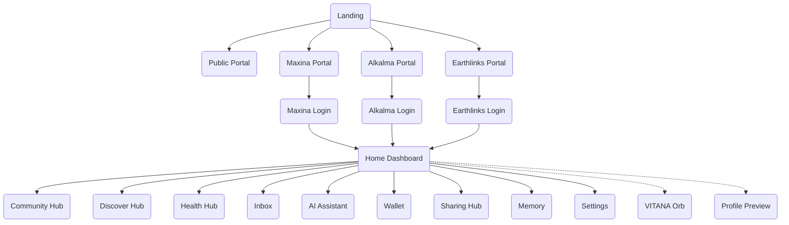

---

## Community Role Flows

**Description**: Navigation paths for users in the Community role, focused on social features, content discovery, and wellness engagement.

### Main Hub Navigation

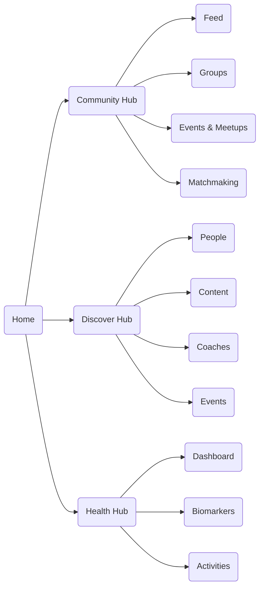

### Community Content Flow

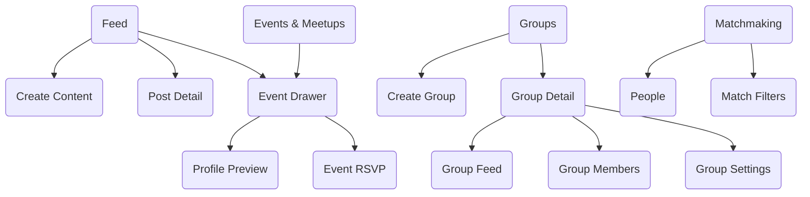

### Health & Tracking Flow

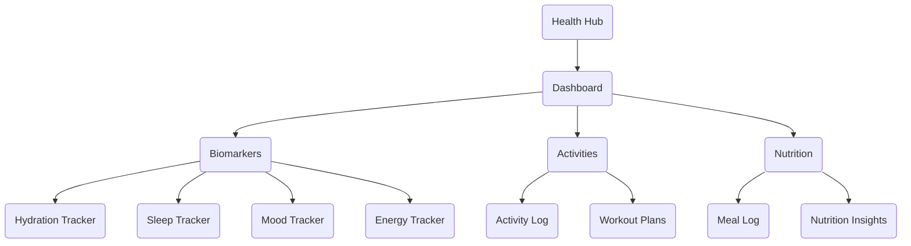

### Discover & Matchmaking Flow

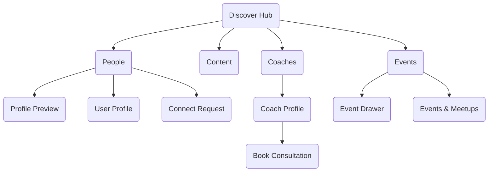

### Communication Flow

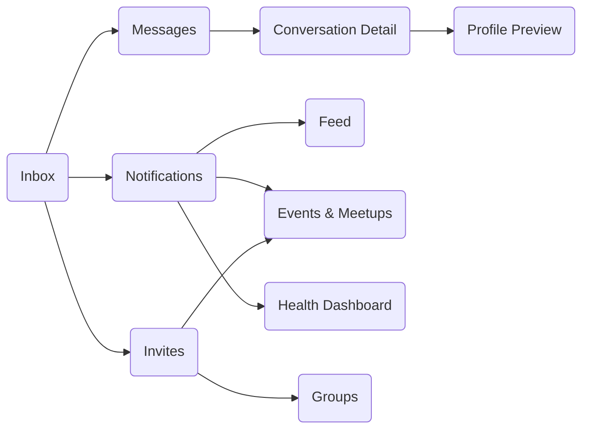

### AI & Automation Flow

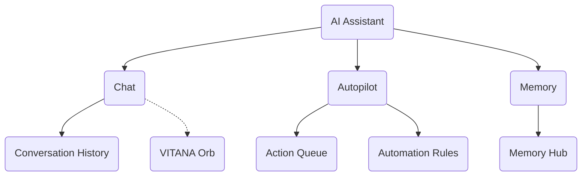

### Wallet & Commerce Flow

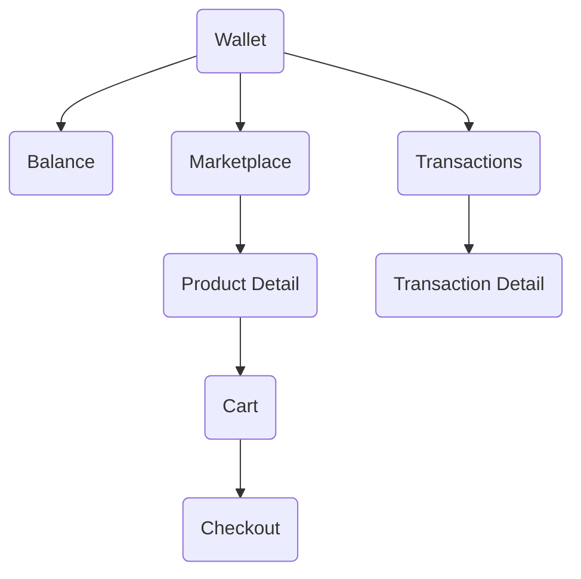

### Settings & Profile Flow

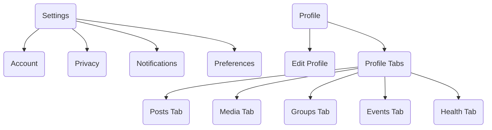

---

## Patient Role Flows

**Description**: Navigation paths for users in the Patient role, focused on healthcare management, appointments, and clinical data.

### Patient Dashboard & Health Management

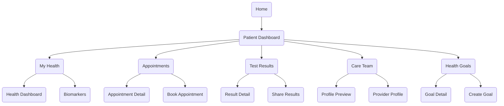

### Patient Appointments & Clinical Flow

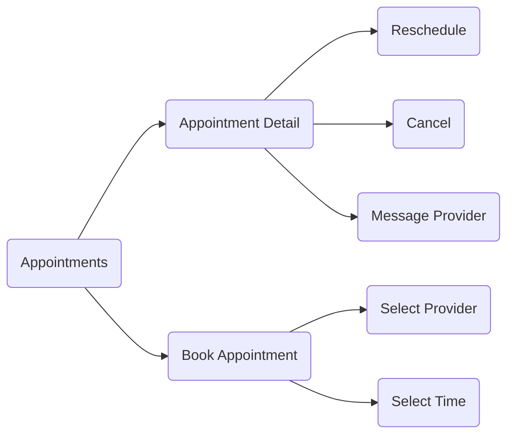

### Patient Insurance & Billing

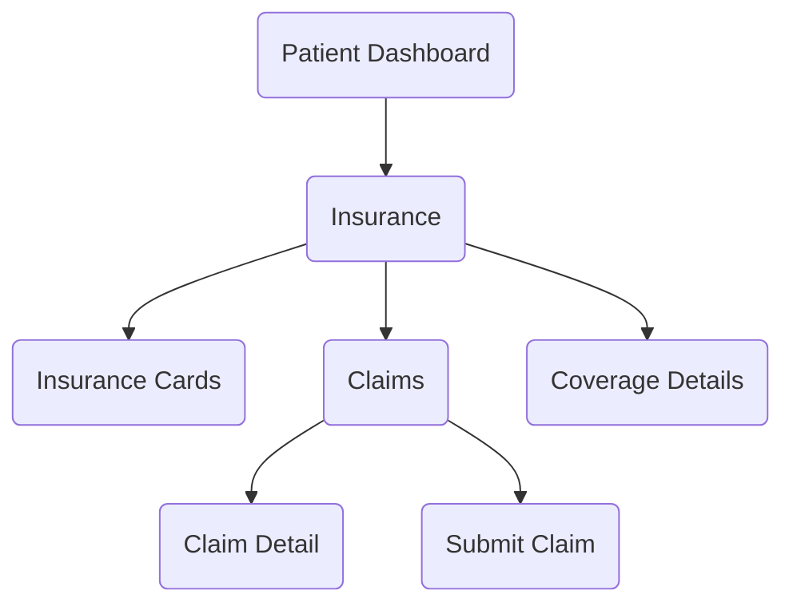

---

## Professional Role Flows

**Description**: Navigation paths for healthcare professionals, focused on patient management, clinical tools, and scheduling.

### Professional Dashboard & Patient Management

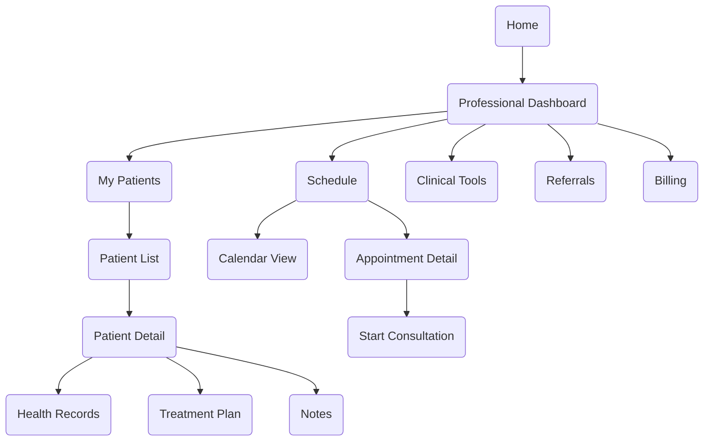

### Professional Clinical Tools

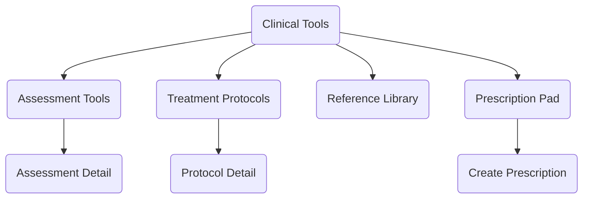

### Professional Referrals & Collaboration

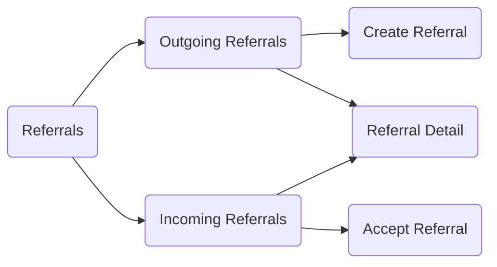

---

## Staff Role Flows

**Description**: Navigation paths for healthcare staff, focused on operational tasks, patient queues, and administrative support.

### Staff Dashboard & Operations

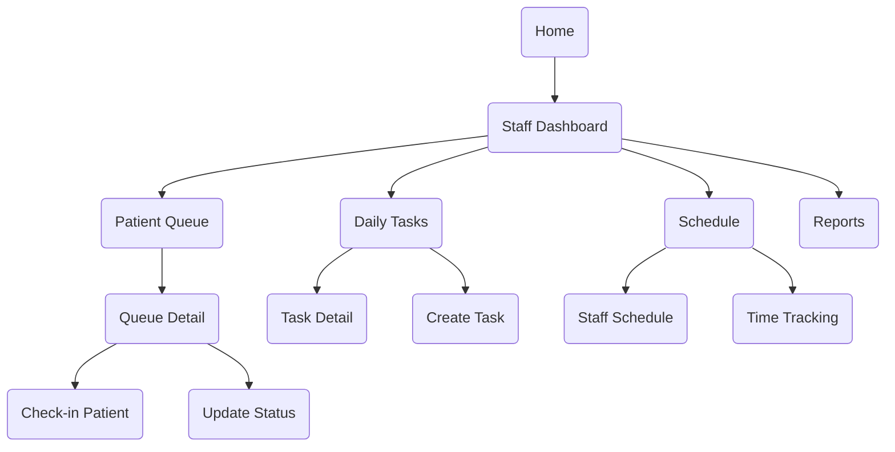

### Staff Communication & Coordination

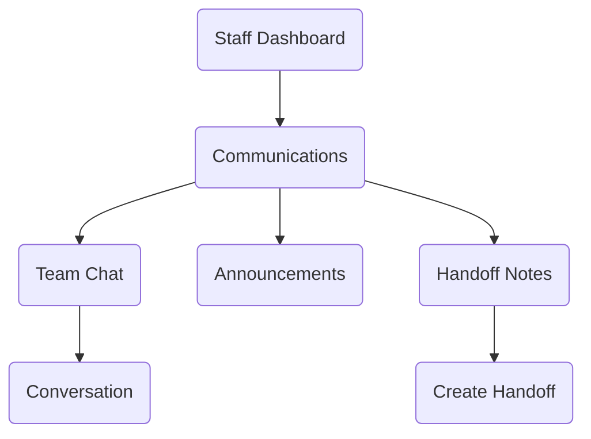

---

## Admin Flows

**Description**: Navigation paths for administrators, covering system management, user administration, community moderation, and platform operations.

### Admin Dashboard & Overview

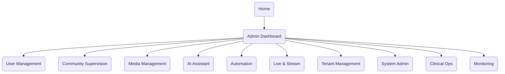

### Admin User Management Flow

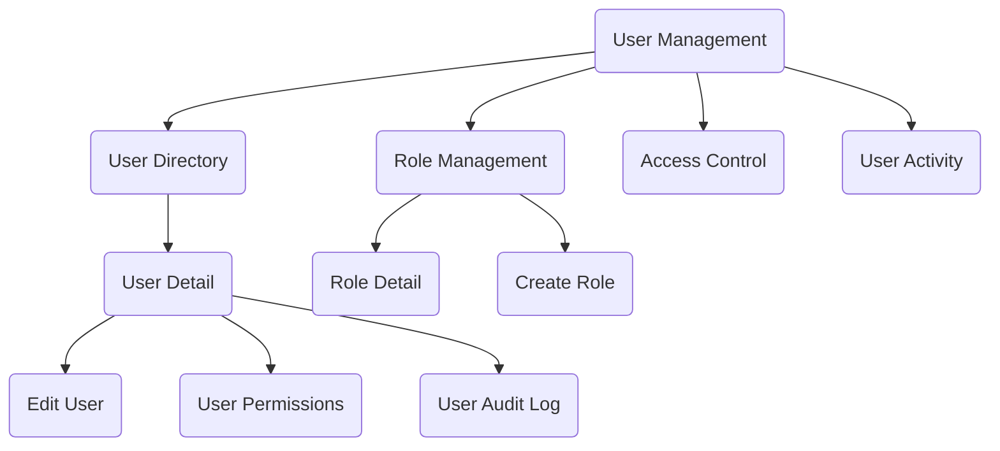

### Admin Community Supervision Flow

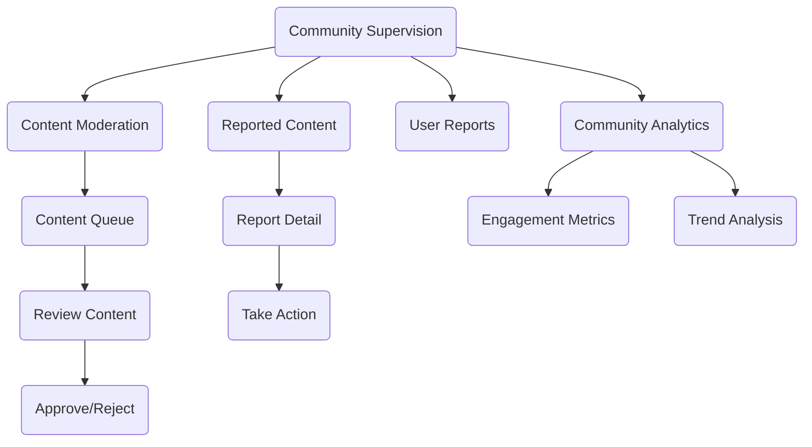

### Admin Automation & AI Flow

```mermaid
graph TB
    ADMN-006(Automation) --> ADMN-031(Automation Rules)
    ADMN-006 --> ADMN-032(AI Recommendations)
    ADMN-006 --> ADMN-033(Situation Analysis)
    ADMN-006 --> ADMN-034(Proactive Settings)
    
    ADMN-031 --> ADMN-035(Rule Builder)
    ADMN-031 --> ADMN-036(Execution Log)
    
    ADMN-032 --> ADMN-037(Recommendation Detail)
    ADMN-037 --> ADMN-038(Deploy Rule)
    ADMN-037 --> ADMN-039(Provide Feedback)
    
    ADMN-033 --> ADMN-040(Create Analysis)
    ADMN-033 --> ADMN-041(Analysis Results)
```

### Admin Tenant Management Flow

```mermaid
graph TB
    ADMN-008(Tenant Management) --> ADMN-042(Tenant Directory)
    ADMN-008 --> ADMN-043(Tenant Analytics)
    ADMN-008 --> ADMN-044(Subscription Plans)
    ADMN-008 --> ADMN-045(Billing)
    
    ADMN-042 --> ADMN-046(Tenant Detail)
    ADMN-046 --> ADMN-047(Tenant Settings)
    ADMN-046 --> ADMN-048(Tenant Users)
    ADMN-046 --> ADMN-049(Tenant Activity)
    
    ADMN-043 --> ADMN-050(Usage Metrics)
    ADMN-043 --> ADMN-051(Health Scores)
```

### Admin System & Monitoring Flow

```mermaid
graph TB
    ADMN-009(System Admin) --> ADMN-052(System Settings)
    ADMN-009 --> ADMN-053(Feature Flags)
    ADMN-009 --> ADMN-054(API Management)
    ADMN-009 --> ADMN-055(Database Admin)
    
    ADMN-011(Monitoring) --> ADMN-056(Performance Dashboard)
    ADMN-011 --> ADMN-057(Error Logs)
    ADMN-011 --> ADMN-058(Audit Trail)
    ADMN-011 --> ADMN-059(Alerts)
    
    ADMN-056 --> ADMN-060(System Health)
    ADMN-056 --> ADMN-061(Resource Usage)
    
    ADMN-057 --> ADMN-062(Error Detail)
    ADMN-058 --> ADMN-063(Event Detail)
```

### Admin Clinical Operations Flow

```mermaid
graph TB
    ADMN-010(Clinical Ops) --> ADMN-064(Patient Records)
    ADMN-010 --> ADMN-065(Provider Management)
    ADMN-010 --> ADMN-066(Appointment System)
    ADMN-010 --> ADMN-067(Compliance)
    
    ADMN-064 --> ADMN-068(Record Search)
    ADMN-064 --> ADMN-069(Data Export)
    
    ADMN-065 --> ADMN-070(Provider Directory)
    ADMN-065 --> ADMN-071(Credentialing)
    
    ADMN-067 --> ADMN-072(Compliance Dashboard)
    ADMN-067 --> ADMN-073(Audit Reports)
```

---

## Cross-Role Overlays

**Description**: Global overlays and components accessible across multiple roles and contexts.

### VITANA Orb & Voice Navigation

```mermaid
graph TB
    OVRL-001(VITANA Orb) --> OVRL-023(Voice Command)
    OVRL-023 --> HOME-001(Navigate: Home)
    OVRL-023 --> COMM-001(Navigate: Community)
    OVRL-023 --> HLTH-001(Navigate: Health)
    OVRL-023 --> INBX-001(Navigate: Inbox)
    
    OVRL-001 --> OVRL-024(Glass Mode)
    OVRL-001 --> OVRL-025(Camera Mode)
    OVRL-001 --> OVRL-026(Screen Share)
    OVRL-001 --> OVRL-027(Diary Entry)
    OVRL-001 --> OVRL-028(Autopilot)
```

### Profile & User Overlays

```mermaid
graph TB
    OVRL-008(Profile Preview) --> PROF-001(Full Profile)
    OVRL-008 --> OVRL-009(Connect Request)
    OVRL-008 --> INBX-005(Send Message)
    OVRL-008 --> OVRL-029(Share Profile)
    
    PROF-001 --> PROF-002(Edit Profile)
    PROF-001 --> PROF-003(Profile Tabs)
```

### Event & Group Overlays

```mermaid
graph TB
    OVRL-004(Event Drawer) --> OVRL-006(RSVP)
    OVRL-004 --> OVRL-008(Host Profile)
    OVRL-004 --> OVRL-030(Share Event)
    OVRL-004 --> COMM-010(Event Detail Page)
    
    OVRL-005(Create Group) --> COMM-003(Groups)
    OVRL-002(Create Content) --> COMM-002(Feed)
```

### Calendar & Scheduling Overlays

```mermaid
graph TB
    OVRL-031(Universal Calendar) --> COMM-004(Events)
    OVRL-031 --> PTNT-003(Appointments)
    OVRL-031 --> AI-003(Autopilot Actions)
    OVRL-031 --> INBX-004(Invites)
    
    OVRL-031 --> OVRL-032(Create Event)
    OVRL-031 --> OVRL-033(Event Detail)
```

### Marketplace & Commerce Overlays

```mermaid
graph TB
    WLLT-005(Product Detail) --> WLLT-006(Add to Cart)
    WLLT-006 --> WLLT-007(Checkout)
    WLLT-007 --> OVRL-034(Payment)
    OVRL-034 --> WLLT-008(Order Confirmation)
    
    WLLT-004(Marketplace) --> OVRL-035(Product Quick View)
    OVRL-035 --> WLLT-005(Full Product Detail)
```

### Health Tracking Overlays

```mermaid
graph TB
    HLTH-003(Biomarkers) --> OVRL-036(Quick Log)
    OVRL-036 --> HLTH-006(Hydration)
    OVRL-036 --> HLTH-007(Sleep)
    OVRL-036 --> HLTH-008(Mood)
    OVRL-036 --> HLTH-009(Energy)
    
    HLTH-002(Dashboard) --> OVRL-037(Goal Progress)
    OVRL-037 --> HLTH-014(Goal Detail)
```

---

## Navigation Patterns Summary

### Entry Points by Role

| Role | Primary Entry | Secondary Hubs |
|------|--------------|----------------|
| Community | HOME-001 | COMM-001, DISC-001, HLTH-001 |
| Patient | PTNT-001 | PTNT-002, PTNT-003, PTNT-005 |
| Professional | PROF-100 | PROF-101, PROF-102, PROF-103 |
| Staff | STAF-001 | STAF-002, STAF-003, STAF-004 |
| Admin | ADMN-001 | All ADMN-002 through ADMN-011 |

### Most Connected Screens

Based on the navigation flows above, the most highly connected screens are:

1. **HOME-001** (Home Dashboard) - Universal entry point for all authenticated users
2. **OVRL-001** (VITANA Orb) - Global voice navigation available everywhere
3. **OVRL-008** (Profile Preview) - Accessible from numerous screens
4. **INBX-005** (Conversation Detail) - Connected from multiple communication flows
5. **COMM-002** (Feed) - Central hub for community content
6. **HLTH-002** (Health Dashboard) - Central hub for health tracking

### Overlay Usage Patterns

- **OVRL-001** (VITANA Orb): Available globally, provides voice navigation to any screen
- **OVRL-008** (Profile Preview): Quick preview from avatars across all modules
- **OVRL-004** (Event Drawer): Slide-in detail view from event cards
- **OVRL-031** (Universal Calendar): Aggregates events, appointments, and scheduled actions

---

## Business Hub Flows

**Description**: Navigation paths for Business Hub, the unified business performance dashboard.

### Business Hub Overview

```mermaid
graph TB
    HOME-001(Home) --> BIZ-001(Business Hub Overview)
    
    BIZ-001 --> BIZ-002(Services)
    BIZ-001 --> BIZ-003(Clients)
    BIZ-001 --> BIZ-004(Sell & Earn)
    BIZ-001 --> BIZ-005(Analytics)
```

### Business Hub Internal Navigation

```mermaid
graph TB
    subgraph "Business Hub Overview (BIZ-001)"
        BIZ-001-Snapshot[Snapshot Tab]
        BIZ-001-History[History Tab]
    end
    
    subgraph "Services (BIZ-002)"
        BIZ-002-Services[My Services Tab]
        BIZ-002-Events[My Events Tab]
        BIZ-002-Packages[Packages Tab]
    end
    
    subgraph "Clients (BIZ-003)"
        BIZ-003-Active[Active Tab]
        BIZ-003-Prospects[Prospects Tab]
        BIZ-003-History[History Tab]
    end
    
    subgraph "Sell & Earn (BIZ-004)"
        BIZ-004-Inventory[Inventory Tab]
        BIZ-004-Promotions[Promotions Tab]
    end
    
    subgraph "Analytics (BIZ-005)"
        BIZ-005-Performance[Performance Tab]
        BIZ-005-Earnings[Earnings Tab]
        BIZ-005-Growth[Growth Tab]
    end
```

### Business Hub Cross-Module Navigation

```mermaid
graph TB
    BIZ-001(Overview) --> WLLT-001(Wallet)
    
    BIZ-002(Services) --> OVRL-040(Create Package Dialog)
    BIZ-002 --> OVRL-017(Create Event Dialog)
    
    BIZ-003(Clients) --> SHAR-001(Sharing Hub)
    
    BIZ-004(Sell & Earn) --> SHAR-002(Campaigns)
    
    BIZ-005(Analytics) --> WLLT-001(Wallet)
    BIZ-005 --> SHAR-001(Sharing Hub)
```

### Business Hub Sidebar Position

```mermaid
graph TB
    subgraph "Sidebar Hierarchy"
        HOME(Home)
        COMM(Community)
        DISC(Discover)
        HLTH(Health)
        BIZ(Business Hub)
        WLLT(Wallet)
        SHAR(Sharing)
        MEMO(Memory)
        SETT(Settings)
    end
    
    HOME --> COMM
    COMM --> DISC
    DISC --> HLTH
    HLTH --> BIZ
    BIZ --> WLLT
    WLLT --> SHAR
    SHAR --> MEMO
    MEMO --> SETT
```

---

**End of Navigation Map**
